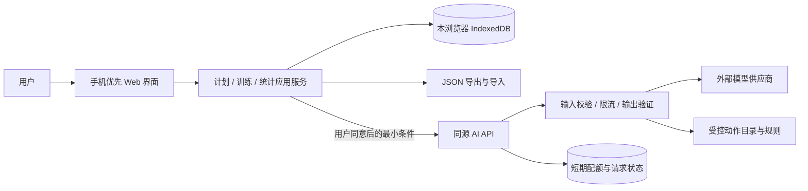

# Fitness 软件设计文档（SDD）

版本：0.11（本地实施稿）；日期：2026-10-07；状态：发布基线为 9a8ca5335d5977d0ed8500975d0870def89144f3。§19～20 的引导、本地生命周期、备份和界面已进入本地实现；新 AI 对话使用隔离合成流程，正式服务及容量参数尚未验收，未发布。发布证据见 verification/pr-9-public-release-2026-10-06.md（位于主仓库）。

§1–12 保留初始设计与当时证据，§13–18 保留后续演进记录；发生冲突时 §19 优先。历史“待实施／未发布”不代表当前状态。CAL 的具体日期、旧事实溯源及占用规则继续有效，但新计划入口、阶段管理和多日目标以 §19 为准；技术组合见 [技术与部署选型](technology-deployment.md)。正式 AI 当前关闭，真实模型质量、平台资源、账单及手机支持不能由文档修订推定通过。

## 1. 项目证据与需求状态

本次读取 README.md、.gitignore、docs/project-kickoff.md，并检查仓库文件和 Git 状态。仓库没有产品代码、依赖清单、接口或测试；没有发现 AGENTS.md。启动文档中的候选功能不能当作已确认需求。

### 1.1 已确认需求

| 编号 | 用户确认的需求 | 设计含义 |
|---|---|---|
| R1 | 面向普通健身用户 | 首版围绕个人训练，不设计教练管理 |
| R2 | 制定计划、执行训练、跟踪进度 | 三个阶段形成完整用户流程 |
| R3 | 手机浏览器为主，兼容电脑的 Web 应用 | 响应式界面，触控输入优先 |
| R4 | 首版无需登录的体验版，后续加入账号和云端保存 | 首版训练数据本地保存，预留迁移边界 |
| R5 | 支持力量、有氧、居家徒手 | 按记录指标分类，不能只支持重量与次数 |
| R6 | 根据目标和条件自动生成计划，希望包含 AI | AI 输出成为可预览的计划候选 |
| R7 | SDD 覆盖架构、模块、数据、接口、流程、安全、权衡、验证 | 本文件建立需求到验证的对应关系 |
| R8 | 首版限定成年人的一般健身场景，暂不支持康复或特殊状况适配 | AI 计划与产品入口须遵守该适用范围 |
| R9 | 计划输入涵盖目标、训练经验、可用器械、每周天数、每次时间、运动偏好、训练场地、身高和体重 | 必填性见 R10、发送范围见 R11、本地保存见 R22 |
| R10 | R9 所列信息全部必填，填写完整后才能自动生成计划 | 约束自动生成入口；手动创建和训练记录入口的范围仍属设计建议 |
| R11 | 自动生成时将 R9 的全部输入发送给外部 AI，包括身高和体重 | 发送前展示范围并由应用用户确认；历史备忘发送另按 R54 展示并确认，不自动上传其他个人信息 |
| R12 | AI 生成计划先供用户预览与编辑，点击确认后保存为当前计划 | 候选不自动生效；编辑后再次校验，保存失败不能替换当前计划 |
| R13 | 每次自动生成计划时，用户自由输入 1–12 周的计划周期 | durationWeeks 为 1–12 的整数；生成与保存均不得静默缩短周期 |
| R14 | 用户指定每周可训练的星期，AI 在这些星期安排训练内容 | 生成表单增加 trainingWeekdays；其去重后的数量必须与 daysPerWeek 一致 |
| R15 | 漏练后保留原日程，允许用户手动补练、跳过或改期 | 不自动顺延其他训练；原定日期、调整日期与实际完成日期分开保存 |
| R16 | 用户选择任意开始日期，从该日期起每 7 天算一个计划周 | 按当地日历日期生成连续周区间，不要求周一开始 |
| R17 | 进度包含完成率、历史、分类运动趋势、体重趋势，以及 AI 阶段总结和下一阶段建议 | 增加体重观测与总结流程；发送范围见 R18，触发与阶段选择见 R19 |
| R18 | AI 阶段总结可发送目标、阶段汇总及该阶段逐次训练和体重记录 | 仅发送选定阶段的数据，发送前展示范围并由应用用户确认；阶段统计仍限选定范围；跨阶段背景备忘按 R54 单独展示并确认 |
| R19 | 用户手动发起 AI 总结，可选择某周、整份计划或自定义日期范围 | 不后台自动生成或发送；日期范围与记录数量在发送前展示 |
| R20 | 可根据阶段总结的下一阶段建议生成新计划，仍先预览、编辑并确认保存 | 不直接修改当前计划的未完成部分；历史记录保持不变 |
| R21 | 首版保留手动创建计划入口，可从动作目录安排训练和目标 | AI 不可用时仍能新建计划；内置模板未列入已确认范围 |
| R22 | 个人训练条件默认保存在本地，下次自动带入，允许修改或清除 | 复用资料不自动授权外部发送；清除资料与删除训练历史分开 |
| R23 | 体重通过独立入口按测量日期录入，支持补录、修改和删除 | 计划表单中的体重不自动创建测量记录；个人资料体重与历史观测分开管理 |
| R24 | 首版支持手动导出 JSON 备份，并通过导入恢复 | 备份包含本地数据；导入策略见 R26 |
| R25 | 保存新计划为当前计划时自动归档旧计划，仅保留一个当前计划，保留历史记录 | 归档与新计划保存原子提交；不删除旧计划、日程或训练事实 |
| R26 | 导入备份采用整库替换，替换前先备份现有数据并由用户确认 | 不合并；导入失败不得部分覆盖现有数据 |
| R27 | 训练完成后不可修改或删除该次记录 | completed session 及所属组只读；完成确认见 R28，训练中编辑见 R44 |
| R28 | 点击完成训练后先展示记录汇总，可返回修改，明确确认后才完成 | 核对页提示完成后不可修改或删除；展示汇总不改变训练状态 |
| R29 | 训练中每组点击“记录”时保存到本地，重新打开可继续 | 仅事务提交成功后显示已保存；未点击记录的输入不承诺恢复 |
| R30 | 有进行中的训练时，先完成或主动放弃才能切换当前计划；新计划保留为草稿 | 不自动放弃训练，不提前归档当前计划；草稿激活需用户再次操作 |
| R31 | 训练目标由用户自由输入，由 AI 理解 | 保留原始目标文本；仍限于 R8 的成年人一般健身场景，不因自由文本扩大适用范围 |
| R32 | AI 先展示目标理解，用户确认或修改后才生成计划 | 目标确认与 R12 的计划预览分开；目标文本修改后原确认失效 |
| R33 | 应用已打开时，断网仍可记录训练并查看本地数据；AI 功能需要联网 | 首版不承诺断网后重新打开应用；本地流程不依赖网络或 AI 服务 |
| R34 | 首版仅使用内置动作目录，支持搜索和筛选，不提供自定义动作 | 手动计划和 AI 计划均引用受控动作 ID；导入不能注册自定义动作 |
| R35 | 动作详情包含名称、器械、文字步骤、注意事项、示意图片和演示视频 | 来源与图片授权见 R36；媒体加载失败不阻塞本地记录 |
| R36 | 视频直接搜索 YouTube 免费公开资源；图片仍使用经授权核验的素材 | 最新指示替代原视频自行托管要求；官方播放器嵌入为工程选择，公开观看不等于可下载再分发 |
| R37 | 首版先供约 10–50 位用户小范围试用，验证后再公开 | 邀请码与浏览器限制见 R38、R40，总预算见 R39；公开条件另行评估 |
| R38 | 每位试用者使用独立邀请码，兑换后当前浏览器可使用 AI | 无需注册账号；所有 AI 接口校验试用资格，不只限制前端入口 |
| R39 | 试用期每月总预算上限为人民币 ¥100，涵盖 AI、应用托管、媒体存储和流量 | 这是预算约束，不是已验证的费用估算；必须先证明候选部署和配额可满足预算 |
| R40 | 一个邀请码仅允许一个浏览器使用 AI，更换浏览器时由项目负责人撤销旧资格并重新发码 | 一次兑换建立一个可撤销会话；不允许重复兑换以新增浏览器 |
| R41 | 首批试用者主要从中国大陆以外访问 | 部署和模型/媒体可达性按实际试用地区验证；不自动推断界面语言或具体国家 |
| R42 | 首版界面、动作说明、AI 计划和总结支持中英文切换 | 动作 ID 和训练事实不随语言变化；两种语言均需验证内容与主流程 |
| R43 | 首版仅支持公制，中文与英文使用相同单位 | 输入/展示使用 kg、cm、公里或米；不提供英制切换 |
| R44 | 训练进行中可调整实际指标、增减组、从内置目录替换或添加动作，仅影响本次训练 | 不改计划模板或其他日程；完成后仍按 R27 只读 |
| R45 | 支持不依赖计划的临时训练，从内置目录选动作，完成后计入历史和分类运动趋势 | planVersionId 与日程引用可为空；不自动抵扣计划训练或提高计划完成率 |
| R46 | 计划完成率按已到期任务计算，漏练和跳过均算未完成，改期按原定日期归属 | 不用未来任务或临时训练改变完成率；补练完成后可更新原归属阶段的完成率 |
| R47 | 不指定 AI 供应商，按 ¥100/月总预算、中英文效果比较后选型 | 通过目标理解、长周期生成和阶段总结案例实测，不以模型宣传或单价独立决定 |
| R48 | 无技术栈偏好，按适配性、易维护与低部署成本比较选择方案 | 具体框架尚未选定；选择依据与候选权衡须记录，不据此跳过设计审阅 |
| R49 | 分阶段交付：先验证本地训练与 AI 计划，再补齐总结和动作媒体后扩大试用 | 已确认功能全部保留；早期试用需清楚标明尚未交付能力 |
| R50 | 界面采用轻松友好的风格，柔和配色，强调计划引导与鼓励 | 不牺牲数字可读性、错误与保存状态的清晰度；具体页面和视觉方案尚未审阅 |
| R51 | 训练页提供运动计时与组间休息倒计时，计时结果经用户确认后记录 | 计时不自动完成组或训练；提醒形式见 R52，后台不保证准时 |
| R52 | 休息倒计时结束时提供页面提示，并可开启声音提醒 | 声音需用户主动启用，播放受浏览器策略限制；不承诺后台或锁屏准时提醒 |
| R53 | 首版优先验证 iPhone Safari、Android Chrome、电脑 Chrome/Edge/Safari | 每类环境验证主流程、存储恢复、计时、声音与媒体；具体版本在实施时固定 |
| R54 | 过往训练完整内容保存一份本地备忘，每次训练后更新；后续 AI 调用读取备忘，持续依据历史调整建议 | 全量事实留存，不用摘要替代；本地更新不自动调用 AI；外发范围展示后由应用用户确认 |

### 1.2 设计假设与建议

以下均未获用户逐项确认，不能写成已确认需求。

| 编号 | 默认假设或建议 | 改变时的影响 |
|---|---|---|
| A1 | 首次使用按浏览器语言选择中文或英文，不支持的语言回退英文；用户可手动切换并本地保存 | 中英文支持已确认为 R42；默认语言和回退策略仍为设计建议 |
| A2 | 运动偏好允许主动选择“无特别偏好”，徒手或无器械允许主动选择“无器械” | R10 已确认全部必填；这些选择的表达方式尚待审阅，不用空值代替用户选择 |
| A3 | 内部以整数克、秒、米存储，界面重量用 kg，时长可用分钟，距离可用公里 | 仅公制已确认为 R43；存储精度与换算方式仍为设计建议 |
| A4 | 手动创建使用与 AI 候选相同的计划结构和保存校验，不要求填写 AI 生成专用的全部个人条件 | 手动入口已确认为 R21；具体表单与最少字段仍为设计建议 |
| A5 | 首版导入文件大小限制建议为 10 MB，超过时拒绝并说明原因 | JSON 备份和整库替换已确认为 R24、R26；容量需用实际记录验证 |
| A6 | 首版仍以单次模型调用生成完整周期候选 | R13 已确认 1–12 周；需实测 12 周输出长度与耗时，若不达标，另行审阅分段生成方案 |
| A7 | 一人或小团队开发；暂不做社交、付费、穿戴集成 | R37 已确认约 10–50 人试用；开发能力与后续大规模运行约束尚未确认 |
| A8 | 推荐 React + TypeScript + Vite、Dexie/IndexedDB、Hono/Workers 同源 API、D1 试用状态、R2 图片及 YouTube 视频 | R48 已授权比较选择技术栈；选型依据见技术文档，版本组合在实施时锁定，当前未安装 |
| A9 | 首版不加入支持离线重启的 Service Worker 资源缓存 | 已打开后的离线操作已确认为 R33；完整离线启动如新增需另行设计更新与回退 |

技术方案已经形成推荐：框架与托管见第 3.1 节，GPT-6 Luna 为优先评估模型，费用与配额假设见技术文档。实施前仍需集中审阅这些建议，锁定版本、核实账号可用性和 R53 浏览器版本；开放试用前落实 AI 实测、预算控制与专业内容审阅证据。不承诺数据零留存。R7 属文档交付要求，其他编号覆盖产品需求和约束；编号数量不表示独立功能数量。

按 R39，选型前拆分固定托管、媒体存储/流量、AI 可变调用和安全余量，合计不得超过 ¥100/月；实际单价、汇率和免费额度须核验。AI 配额应由剩余预算、最坏输出成本与目标试用人数计算，不能先承诺无限使用。目标理解、1–12 周生成与阶段总结分别计入成本。多实例共享预算在调用前预留最坏费用、结束后按实际用量结算；费用不可精确获得时保守扣减。超额停止新 AI 请求，保留本地记录与手动计划能力。媒体和托管也需账单预警及可执行的限制，不能只通过 AI 停用就宣称总费用受控。尚未证明 R35–R39 的全部体验能在该预算内满足，若候选不足应向用户报告取舍。

按 R41，候选部署以中国大陆以外访问为主要场景，实施前确认实际试用地区并验证应用、AI API 和媒体端到端可达性；不能仅凭“海外”假定全球延迟一致、供应商在所有地区可用或特定数据处理规则适用。中英文已确认为 R42，后续如扩大地域需重新评估可达性与运行约束。

按 R47，已核验候选官方能力和价格并形成 GPT-6 Luna 优先评估建议，估算计入目标理解、长计划、总结和费用余量，详情见技术文档。真实中英文/12 周案例、地区与账号可用性以及实际费用尚未验证，不能把资料比较视为模型验收。

### 1.3 集中审阅的默认规则

用户接受集中建议后，D1–D9 作为实施默认规则；D8 按最近建议调整为图片公开访问。这些是接受的设计决策，不新增独立产品需求编号。

| 编号 | 推荐默认规则 | 相关位置 |
|---|---|---|
| D1 | 同一本地资料每天一条体重观测；再次录入同日体重时提示编辑既有记录，不悄悄新增或覆盖 | R23；第 5 节 |
| D2 | 原定日期在计划时区当日结束后算到期；补练更新原归属阶段，实时完成率不把今天未到期任务算漏练 | R46；第 5.3 节 |
| D3 | 未兑换邀请码 7 天有效，兑换后试用会话 30 天有效；到期须由负责人续期或重新发码，不自动收费 | R38–R40；第 6.2 节 |
| D4 | 开始、暂停、继续、停止计时时保存计时状态；刷新后恢复并按时间点重算，不自动记录训练事实或承诺锁屏响铃 | R29、R51–R52；第 7.2 节 |
| D5 | 语言按浏览器初始选择，未知语言回退英文；用户选择本地保存，已有 AI 文本保持生成时语言，不后台自动翻译 | A1、R42；第 4 节 |
| D6 | 无偏好、无器械是主动选择；手动计划只填写名称、日程与动作目标，不要求 AI 专用的身体条件 | A2、A4；R10、R21 |
| D7 | 首轮资源用量遵循技术文档：每人每月目标理解 8 次、计划 4 次、总结 4 次，且受全局 AI ¥35 预算限制；不是满额用量保证 | R39；技术选型第 5 节 |
| D8 | 图片公开访问，YouTube 视频不增加邀请码限制；仅 AI 使用邀请码控制资格 | 技术选型第 6 节；图片仍受目录白名单和资源限额保护 |
| D9 | 首页以今日训练与继续训练为主；底部主要入口为今日、计划、进度、动作库、设置 | R3、R50；第 4.1 节 |

其他阈值如 10 MB 导入、AI 输入输出长度、CPU 余量、浏览器版本属于实现与实测配置，保留建议状态。若无法通过实测，不默默改变已确认的周期、记录语义或数据发送范围。

## 2. 范围、用例与质量目标

首版流程：填写条件 → AI 理解目标 → 用户确认或修改目标理解 → 自动生成候选 → 预览/编辑/保存 → 选择训练日 → 记录执行 → 完成训练 → 查看历史和趋势。AI 不可用时，用户仍可编辑已有计划及记录训练，并可手动新建计划。

不在首版实施范围的建议：账号、跨设备同步、教练、收费、社交、设备自动采集、营养处方、开放式 AI 聊天。R17 的 AI 阶段总结属于首版需求，不是开放式聊天。账号和云端保存是已确认的后续方向，不等于首版交付。

| 场景 | 建议可测目标（未确认的验收目标） |
|---|---|
| 手机编辑一组训练数据 | 指定参考设备、1 万条记录下，本地提交反馈 p95 < 300 ms |
| 用户重复点击完成训练 | 同一 sessionId 只生成一份完成事实 |
| 刷新或关闭标签页 | 已确认提交的数据可重新读取；未提交输入不承诺保留 |
| AI 服务慢或不可用 | 建议目标理解 20 秒、计划 120 秒、总结 60 秒截止；失败明确，不破坏已有计划，数值待实测 |
| 导入备份失败 | 原数据库保持原样；成功后数量和校验结果可见 |
| 320 px 手机与桌面 | 主流程无横向溢出，键盘可操作，有明确标签和错误提示 |

这些性能目标是产品工程假设，需在实施计划中固定设备、浏览器、数据规模和测量方法。

## 3. 架构与信任边界

采用“本地优先 Web 客户端 + 无状态 AI 请求服务”的候选架构。无需登录不意味着不能有后端：后端只代理 AI 调用和执行安全、成本约束，不保存个人训练库。

浏览器库是首版权威数据；统计由训练事实计算；AI 生成结果在用户保存前只是候选。外部模型位于独立信任边界，不能读写本地库、调用工具或触发任何训练状态变化。

限流状态使用具备原子计数能力的服务端共享存储；单进程内存仅用于开发，不满足多实例成本限制。API 后端可与 Web 资源同一项目部署，模块边界不要求拆成微服务。

方法依据：先从质量属性比较风格（S01，PDF 72、85、98）；简单可固定的任务优先工作流而非自主 Agent（S00，PDF 26、31、112、116）。本方案是对 Fitness 的综合设计，不是书中案例。

### 3.1 技术选型建议与部署

推荐 React + TypeScript + Vite SPA，Hono API 部署到 Cloudflare Workers，页面由 Workers Static Assets 提供，/api 和 /media 保持同源。个人事实使用 Dexie 封装 IndexedDB；D1 仅保存邀请码、会话、请求状态与预算，R2 私有存储桶保存授权图片；视频采用 YouTube 官方播放器。首版不使用 SSR 或远程训练数据库。

推荐 GitHub Actions 执行类型/静态检查、Vitest、Worker 集成与 Playwright，再由 Wrangler 发布到固定试用网址；预览资源与正式试用资源隔离，未配置实际流水线。开始时验证 Workers Free，CPU 达不到要求时再审阅 Paid 备选，不自动付费。

AI 优先评估 GPT-6 Luna，采用服务端 Fetch、显式无推理模式与结构化输出，后端仍执行完整领域校验。预算建议为 Worker/D1 预留 ¥40、AI ¥35、媒体 ¥5、余量 ¥20；这是月度规划而非已验证账单。模型能力、价格、替代方案、CPU 门槛、费用公式和发布约束见 [技术与部署选型](technology-deployment.md)。

## 4. 模块职责与依赖

| 模块 | 职责与主要接口 | 依赖与禁止事项 |
|---|---|---|
| presentation | 条件表单、计划预览、训练记录、历史、统计、备份 | 只调用应用服务，不直接操作 IndexedDB |
| planning | 创建/编辑计划、保存候选、管理计划版本 | 依赖目录、生成端口、仓储；不改历史记录 |
| workout | 开始、记录、完成或放弃训练，校验状态 | 依赖仓储和计划快照，不依赖 AI |
| timer | 运动计时、休息倒计时、暂停与恢复、候选时长 | 结果交给训练表单并由用户确认；不直接改变训练完成状态 |
| training-memory | 全量训练备忘的事务更新、版本、重建与 AI 上下文快照 | 从训练事实确定性生成，不依赖模型；不覆盖历史事实 |
| progress | 按日期及动作计算次数、时长、距离和重量指标 | 只读完成事实，结果可重建 |
| catalog | 动作 ID、名称、器械、记录类型与可支持指标 | 前后端版本化发布同一目录 |
| persistence | IndexedDB 事务、版本升级、并发修订检查 | 实现仓储端口，不含 UI 逻辑 |
| backup | 导出、解析、校验、事务恢复 | 复用领域规则；不信任导入字段 |
| ai-client | 网络调用、超时、错误映射、用户数据发送提示 | 不保存供应商密钥 |
| ai-server | 输入限制、配额、模型适配、输出契约及内容规则 | 不提供浏览器训练库的远程 CRUD |

核心规则独立于 UI、存储和模型 SDK。建议目录为 src/domain、src/application、src/infrastructure、src/ui、server/ai、tests；这是设计建议，尚未创建骨架。

按 R50，视觉方向为柔和配色、友好的分步引导和鼓励文案；鼓励基于真实已完成行为，不虚构进步或用羞辱性文案评价漏练。训练输入与数字保持高可读性，保存失败、不可逆提交及 AI 拒绝不以装饰性提示掩盖。中文与英文保留同等清晰的错误说明和操作标签。具体布局、色值、排版和组件方案在页面设计时细化。

按 R34，目录提供按名称搜索和按运动类型、器械筛选（具体筛选项为设计建议），不提供用户新增动作入口。手动创建、生成输出及备份导入均验证内置动作 ID；已知旧目录 ID 通过版本兼容映射或历史快照读取，未知 ID 不自动注册成动作。目录更新不应让已完成历史失去可读性。

按 R42，UI 文案及目录名称、步骤、注意事项、媒体替代文字使用 zh/en 语言资源，业务实体使用稳定 ID。目录搜索至少支持当前语言名称，不因切换语言重建训练数据。AI 请求传入当前输出语言并校验返回内容；自由目标可保留用户原语言。已有 AI 文本保存生成时语言，切换界面不自动调用模型翻译或重新生成；如需历史 AI 文本即时翻译须另行确认。备份保留原始内容与语言元数据，两种语言均纳入功能与内容验证。

### 4.1 首版页面与流程建议

| 页面或流程 | 核心操作与状态 |
|---|---|
| 今日 | 当前日程、继续进行中训练、漏练的补练/跳过/改期、开始临时训练；无计划时引导创建 |
| 计划 | 当前、草稿与归档列表；手动创建或 AI 创建；草稿激活受进行中训练约束 |
| AI 创建 | 条件表单 → 目标外部发送说明 → 目标理解确认 → 全部条件发送确认 → 生成候选 → 编辑/确认保存；等待和错误明确 |
| 训练 | 展示原目标与实际记录、逐组记录、动作调整、运动计时和休息倒计时；已保存与未保存状态分明 |
| 完成核对 | 展示实际组数据、未完成项目、不可修改删除提示；返回修改或明确提交，提交冲突须重新核对 |
| 进度 | 完成率、分类运动趋势、独立体重记录；训练历史详情只读；手动选阶段生成总结 |
| 阶段总结 | 范围与明细发送确认 → 生成解释与建议 → 主动据建议创建新计划；不后台调用 |
| 动作库 | 内置动作搜索/筛选与详情；文字优先，图片/视频加载失败不阻塞记录 |
| 设置 | 语言、个人训练条件编辑/清除、邀请码兑换与状态、手动备份与恢复；恢复前导出现库并确认 |

流程建议与已确认需求一致，具体色值、间距、卡片和图表表现由实现阶段迭代，不要求开工前再逐页确认视觉细节。小屏和桌面保持同样业务规则，桌面可改变导航布局；功能未交付时明确标示，不用演示数据伪装真实统计或 AI 结果。

## 5. 数据模型与不变量

### 5.1 本地模型

所有可迁移实体使用客户端生成 UUID，包含 createdAt、updatedAt、revision。时间点用 UTC，训练归属日保留 localDate 和 IANA timeZone，避免切换时区重写历史分组。首次创建 localProfileId，它标识本地库而非账号或身份凭证。

| 实体 / store | 关键字段与关系 |
|---|---|
| LocalProfile | id、locale、timeZone、units、trainingPreferences（R9 条件及更新时间）；按 R22 默认本地保存，可修改或清除 |
| Exercise | id、catalogVersion、name、equipment、metricType、allowedMetrics、steps[]、cautions[]、imageAssetId、videoAssetId |
| Plan | id、name、source(ai/manual)、status(draft/active/archived)、currentVersionId、startDate、scheduleTimeZone |
| PlanVersion | id、planId、versionNumber、goalSnapshot、durationWeeks、days[]（每项有稳定 dayId、weekIndex、dayOfWeek）、generationMetadata；保存后不可变 |
| PlannedExercise | 嵌于 days：exerciseId、顺序、targetSets[]、可选备注 |
| WorkoutSession | id、planVersionId?、plannedDayId?、status、startedAt、completedAt?、localDate、timeZone、exerciseSnapshots[]、revision |
| SetRecord | id、sessionId、exerciseInstanceId、order、metricType、reps?、loadGrams?、durationSeconds?、distanceMeters?、completed |
| Metadata | schemaVersion、localProfileId、catalogVersion、导入与升级标记 |
| TrainingMemo | schemaVersion、revision、updatedAt、sourceRevision、sessions[]（完整动作/逐组实际记录/时长/距离/重量/备注及计划快照引用）；本地全量事实副本，按 sessionId 去重 |
| AiMemoryNote | id、memoRevision、generatorVersion、locale、createdAt、建议/解释；可追溯但不作为训练事实 |
| MediaAsset（目录资源） | id、type(image/video)、provider(r2/youtube)、url、youtubeVideoId、creator、language、altText、caption、source、license、attribution、checkedAt、embeddingStatus、version；许可未知时如实标记；清单随目录发布，不属于用户训练事实 |
| ScheduledWorkout | id、planVersionId、plannedDayId、originalDate、scheduledDate、status(pending/skipped)、completedSessionId?、revision；日程与训练事实分开保存 |
| BodyWeightObservation | id、localDate、timeZone、weightGrams、createdAt、updatedAt、revision；用于体重趋势，不用当前表单体重覆盖历史观测 |

计划是模板，训练 session 保存开始时的动作和目标快照。修改计划创建新 PlanVersion，既有 session 不随计划修改。动作历史保存名称与类型快照，目录改名不影响历史解释。

按 R44，session 保留 originalExerciseSnapshots 作为原计划基线，exerciseSnapshots 表示本次实际执行结构，各动作实例使用稳定 exerciseInstanceId。新增动作引用内置目录并保存类型与名称快照；替换保留原动作引用用于区分计划与实际。不同指标类型替换时不能自动沿用原组数值，界面明确提示清除受影响数据并由用户确认，在同一事务内提交。删除已有记录的组须提示数据会移除；这些操作仅适用于 in_progress session，不能改写 PlanVersion 或其他 session。

按 R22，已提交的个人训练条件写入本地资料，下次预填；本地保存失败须明确提示，不能表示“已记住”。修改资料不改写已有计划的目标快照或历史体重观测。清除资料只删除可复用条件，不删除本地资料 ID、训练事实、计划、日程或独立体重观测；删除全部数据须使用独立确认操作。计划快照中已保存的条件是否也要移除，应在清除界面明确范围，不承诺清除资料就清除了所有历史副本。

按 R23，体重观测由独立入口提交测量日期与体重，不因填写或提交计划生成表单而自动创建。补录使用测量日而非录入日；修改和删除观测后重新计算趋势，不改写计划快照。是否将新测量值同步到个人资料体重尚未确认，首版建议保持分开并允许用户主动更新。重复日期按 D1 提示编辑既有记录，不静默覆盖。

按 R35–R36，开发阶段直接搜索 YouTube 免费公开视频，人工筛选与内置动作匹配的演示，优先原始作者或机构频道。工程选择为官方嵌入播放器，保留作者与观看链接，不下载、转码或重新托管；公开观看不等于获准再分发。候选见 [视频来源清单](video-sources.md)。图片独立核验授权并托管，不从未知授权的视频截帧。图片保留许可、来源、授权证据、署名与替代文字。

用户点击后加载 youtube-nocookie.com 官方播放器，默认不自动播放，告知将连接 YouTube；隐私增强模式不承诺无第三方请求或广告。不向播放器传递目标、体重或训练明细。只从受控视频 ID 构造地址，不接受任意 iframe HTML 或 AI 编造链接。删除、私有、禁止嵌入或地区不可用时保留文字步骤、记录入口和原链接；原链接也可能无法播放。上线前验证动作匹配、嵌入、字幕及实际地区播放，不把搜索结果当成验收通过。首版不接运行时视频搜索 API，不需要 YouTube Data API 密钥。视频播放需要网络，备份保留引用而不含视频文件。[嵌入说明](https://support.google.com/youtube/answer/171780?hl=en)、[许可类型](https://support.google.com/youtube/answer/2797468?hl=en)。

力量、有氧、徒手是使用场景；metricType 按实际记录分类：reps_load、reps、duration、duration_distance。徒手平板等按 duration，徒手重复动作按 reps；并非所有徒手动作都有次数。训练可混合多个类型。

默认输入规则（工程建议）：reps 为正整数；时长为正整数秒；距离为非负整数米；负重非负整数克，0 表示无外加负重。空值表示未提供，不能当成 0。duration_distance 要求时长有效，距离可为空。目录声明每种动作必填指标，未完成组可留空，完成组必须满足其类型规则。数值上限应由受控配置设置，用于防止异常输入，不声称这些上限是医学安全范围。

按 R43，表单明确标注公制单位，界面语言切换不换算单位；输入 kg 在存储边界转换为整数克，距离公里转换为米，展示保持可逆的既定精度，不反复修改已存数据。身高用 cm，体重用 kg；提示、AI 输入输出、趋势和备份解释遵守同一单位契约。

### 5.2 一致性与状态

- session：in_progress → completed 或 abandoned；完成与放弃均需主动操作。完成要求至少一组有效完成数据，并提示未完成项目。
- 按 R28，点击完成先展示本次动作、组数据、未完成项目及完成后不可修改或删除的提示；用户可返回修改。仅明确确认后调用 completeWorkout。提交使用核对时的 expectedRevision，若其他标签页已改变数据则拒绝并要求重新核对，不能确认旧汇总后提交新内容。
- 完成操作在单个事务中验证 revision、写入状态和完成时间；同 ID 重复完成返回既有完成结果，不复制记录。
- 按 R27，completed session 及所属组禁止修改或删除，应用服务和仓储写入边界均检查状态，界面不提供修正或删除入口。放弃记录不进入完成统计。
- 完成前允许修改组数据（设计建议），提交失败仍保持 in_progress；导入失败不得部分写入。首版实体不需要事件溯源。R26 的整库恢复属于独立操作，可能替换完成记录，不等于提供单条修改入口；浏览器本地存储也不构成防篡改证据。
- 多标签页写入在同一 readwrite 事务读取并比较 expectedRevision；不匹配返回冲突，提示重载。广播只帮助刷新 UI，不替代事务约束。
- 一个本地资料同时最多一个 in_progress session；开始事务检查活动记录，重试相同 sessionId 返回既有对象。
- 按 R15，漏练是未完成日程已过期的派生状态，不自动生成训练记录或移动后续日程。补练保留 originalDate，实际训练日写入 session.localDate；跳过仅标记日程，不计为完成。改期仅修改指定日程的 scheduledDate，不修改原定日期、历史 session 或其他日程。
- 已完成日程不能直接改期或跳过；每个日程默认只关联一份有效完成 session，此限制为设计建议。日程关联与 session 完成须在同一事务内提交，不允许通过日程操作修改已完成事实。
- 按 R25，本地资料最多一个 active Plan。没有进行中训练时，保存新当前计划须在同一事务内写入新计划与版本并归档旧 active Plan；事务失败时旧计划仍为当前计划。保留旧日程和 session，归档不等于完成或跳过旧日程。
- 按 R30，有 in_progress session 时，新计划仅保存为 draft，不归档旧计划或自动放弃训练。用户完成或主动放弃后，可再次核对草稿开始日期并选择激活；激活事务再次检查无进行中训练并原子归档旧 active Plan。草稿保存成功与已切换当前计划在结果和界面中明确区分，不自动延后激活。

聚合作为事务不变量边界的方法来自 S10，PDF 111–112；这里的具体状态与规则属于项目假设。

### 5.3 查询、存储与恢复

索引：Session(status, localDate)、Session(planVersionId)、SetRecord(sessionId)、PlanVersion(planId, versionNumber)；只为实际查询增加索引。IndexedDB 由仓储封装，跨 store 变更使用事务。

趋势分别显示完成训练次数、按同一动作的外加重量与次数、有氧距离/时长；不能把 kg、秒、米相加，也不能把未记录距离当成零。训练量可提供外加负重 × 次数的统计，清楚标注口径，不用于跨动作能力评分。空历史显示空状态。

按 R46，完成率分母为统计范围内按 originalDate 归属且已到期的计划日程数，分子为其中关联有效 completed session 的日程数。skipped 和漏练均保留在分母，不计入分子；改期不移动归属，补练完成后更新原阶段完成率。分母为零时显示“暂无到期任务”，不显示 0% 或 100%。首版建议某日任务在 scheduleTimeZone 的当日结束后到期，实时完成率只含已结束日期；日期报表按所选截止日结束时计，补练后重算需标注数据截止时间。此日内截止策略是待审阅的设计建议，不让界面将当天尚未到期任务误称漏练。完成训练次数和运动趋势仍按实际 session.localDate 分组，两种时间口径明确标注。AI 总结的阶段完成率可引用原日期归属的补练结果，范围外 session 明细只有在 R54 的历史背景发送范围被明确确认后才上传，不改变阶段统计口径。

导出格式包含 formatVersion、exportedAt、catalogVersion 和全部本地实体。导入先限制文件大小（建议 10 MB）、校验版本、字段、ID 唯一性、引用、状态、指标及数量；首版采用整库替换，不自动合并。替换前要求导出现库，用户确认后在事务中写入；写失败保留原库。未知新版本拒绝，已知旧版本通过确定性迁移；校验不通过不“尽量恢复”。

浏览器存储可能被清除或因空间压力淘汰；持久化申请也不是备份保证。提供导出入口与本地保存说明，捕获配额不足，只有事务完成后提示保存成功。依据：[MDN 存储配额与淘汰](https://developer.mozilla.org/en-US/docs/Web/API/Storage_API/Storage_quotas_and_eviction_criteria)、[IndexedDB 术语与同步边界](https://developer.mozilla.org/en-US/docs/Web/API/IndexedDB_API/Basic_Terminology)。

## 6. 接口契约

### 本地训练备忘与持续 AI 上下文（R54）

已确认：完整训练内容保留本地备忘，每次训练后更新，后续 AI 根据备忘持续提供建议。以下存储与调用细节为工程建议：IndexedDB 保存结构化 TrainingMemo，并提供可读视图；不要求另存到电脑文件系统。完成的计划训练、补练与临时训练全部纳入，保留动作快照、每组实际指标、单位、时间、实际调整和用户备注；没有记录的数据不补造。已有历史首次启用时重建备忘，不能只收集新增训练。

逐组确认和训练调整时更新对应条目，完成或放弃时同步最终状态；进行中、已完成和已放弃明确标记。训练事实与备忘在同一 IndexedDB 事务中提交，失败一起回滚；sessionId 去重，重复完成不追加重复条目，多标签页按 revision 检查冲突。训练事实仍是权威来源，备忘损坏可重建，不允许 AI 修改它。离线更新不消耗模型配额，每次训练后更新本地备忘不等于后台调用 AI。

计划生成和总结读取已提交的备忘快照，发送确认展示版本、训练数量、日期及字段范围。阶段总结仍按选定范围计算事实数字；跨阶段备忘单独标为历史背景，不计入本阶段统计。目标理解默认只发送目标文本，避免每个 AI 步骤重复传输全量历史。实际调用无服务端持久记忆依赖，每次显式携带本次获准的上下文。返回的历史解释及下一阶段建议保存为独立 AiMemoryNote，标明对应 memoRevision，不覆盖备忘事实，不自动修改计划。

本地始终全量保存；外发上下文受输入容量与预算限制，不能承诺无限历史都能一次发送。超限采用已接受的“近期完整记录＋较早历史摘要”，本地原始内容不缩减。工程默认近期为调用截止日前最近 28 天；较早历史按月、动作与训练状态确定性汇总次数、逐组指标、缺失值及备注引用，保存覆盖范围、源 sessionId、sourceRevision 和摘要版本，原文可回查。自由备注或输入仍超限时明确提示缩小本次外发范围，不静默丢弃或新增付费调用。近期窗口是可调整工程默认，不伪装成已逐项确认需求。摘要失效时本地重建，AI 解释不能替换这些事实汇总。保存备忘纳入第一阶段本地闭环，读取上下文纳入第二阶段 AI 接入。

JSON 备份包含备忘和 AI 建议；导入校验来源 revision 与事实一致性，不信任导入备忘，必要时由导入后的训练事实重建并在整库事务中替换。清除训练数据时同步清除备忘和相关建议，清除资料表单本身不删除历史。备忘受浏览器清理影响，仍需用户手动导出备份。

### 6.1 浏览器应用接口

| 方法 | 参数 | 结果 / 关键错误 |
|---|---|---|
| generatePlan | GenerationInput、requestId | CandidatePlan / 超时、配额、安全拒绝、无效输出 |
| savePlan | CandidatePlan、expectedRevision? | Plan + PlanVersion / INVALID、CONFLICT、STORAGE_FULL |
| activateDraftPlan | planId、expectedRevision、startDate | 当前计划 / WORKOUT_IN_PROGRESS、CONFLICT、INVALID |
| startWorkout | sessionId、planVersionId、dayId | Session / ACTIVE_SESSION_EXISTS |
| startAdHocWorkout | sessionId、内置动作 ID 列表 | 无计划关联的 Session / INVALID、ACTIVE_SESSION_EXISTS |
| recordSet | sessionId、SetInput、expectedRevision | 新 revision / INVALID、CONFLICT |
| adjustWorkout | sessionId、增减组或添加/替换内置动作命令、expectedRevision、必要的丢弃数据确认 | 新 revision / SESSION_READ_ONLY、INVALID、CONFLICT |
| completeWorkout | sessionId、expectedRevision | 已完成 Session + 同事务更新备忘 / EMPTY_WORKOUT、CONFLICT、STORAGE_FULL |
| readTrainingMemo / rebuildTrainingMemo | 可选日期范围 / expectedRevision | 完整备忘快照 / CONFLICT、STORAGE_FULL |
| queryProgress | 日期范围、可选 exerciseId | 分类型统计，不修改事实 |
| exportBackup / importBackup | 无 / 文件及 replace 确认 | 文件 / 导入结果或结构化错误 |
| saveBodyWeight / deleteBodyWeight | 测量日期、weightGrams、可选 observationId、expectedRevision / observationId、expectedRevision | 观测结果或删除结果 / INVALID、CONFLICT、STORAGE_FULL |
| summarizeProgress | stageSelection、requestId、发送确认 | StageSummary / EMPTY_STAGE、INVALID_RANGE、配额、超时或输出拒绝 |

仓储 save(entity, expectedRevision) 必须原子比较与更新。存储错误向上返回，应用层不吞掉异常并显示成功。

### 6.2 首版 HTTP AI 接口

`POST /api/v1/goal-interpretations`：发送 requestId、goalText、locale、consentVersion；发送前告知该步骤会向外部模型提供目标文本。成功返回 interpretationId、goalText、interpretedGoal、scopeStatus、generatorVersion。interpretedGoal 为展示与编辑的目标说明，不能包含未提供的身体事实。超出 R8 范围时不允许进入生成流程。沿用会话、配额、错误和输出验证规则。

按 R32，用户确认或修改 interpretedGoal 后，计划生成请求包含原始 goalText、confirmedGoal 与显式目标确认标记。服务端仍重新检查范围和长度，不把客户端确认当作可信指令。修改原始目标文本时须重新理解和确认；编辑理解说明后须再次确认。无需在服务端长期保存目标文本，浏览器保存确认上下文；目标理解与计划生成分别消耗模型预算，界面分别显示状态。

`POST /api/v1/plan-generations`，同源 HTTPS、JSON。

生成表单按 R9–R10 要求目标、经验、器械、每周天数、每次时间、运动偏好、场地、身高和体重全部填写，并按 R13 输入整数 durationWeeks（1–12），缺失时不能提交自动生成，不猜测身体数据。运动偏好与器械使用显式选项表达“无特别偏好”或“无器械”（表达方式仍为 A2 假设）。durationWeeks 随训练条件发送给模型；服务端与本地保存均检查周序和周期范围，不静默截短候选。

按 R14 增加必填 trainingWeekdays（星期 1–7 的不重复整数列表），随其他条件发送给模型；列表长度必须等于 daysPerWeek。生成结果的每周训练日期必须与该列表一致，不允许模型自行增加或替换星期。界面可由星期选择自动计算每周天数，避免两处输入不一致；具体交互仍为设计建议。用户按 R15 主动改期是生成后的日程调整，可改变单次训练的星期。

按 R16，保存前选择 startDate，本地按 scheduleTimeZone 的日历日期展开日程：第 k 周为 startDate + 7×(k−1) 日至 startDate + 7×k−1 日（含首尾）。各区间均包含每个星期一次，据此匹配 dayOfWeek，不按 UTC 秒数累加，避免夏令时偏差。例如周三开始、选择周一/三/五，第 1 周按日期顺序安排该周三、周五、下周一。AI 返回相对周序和星期，本地确定性生成具体日期，不让模型计算日历。

建议 HTTP 请求字段：requestId(UUID)、catalogVersion、locale、goalText（R31 自由文本）、experience（受控枚举）、equipmentIds[]、daysPerWeek、minutesPerSession、preferredMetricTypes[]、preferenceMode、preferredExerciseIds[]、excludedExerciseIds[]、trainingLocation（受控枚举）、heightCm、bodyWeightGrams、consentVersion。goalText 非空并限制长度（建议最多 500 字符），以不可信用户数据传递，不作为系统指令；超范围目标不能直接生成。按 R11，生成时全部训练条件（包括身高与体重）经后端传给外部模型，界面须事先展示发送范围并取得应用用户确认。身高、体重必须为正数，不能用零替代缺失。建议初始工程限制：请求 ≤ 16 KiB、天数 1–7、每次时间 10–120 分钟；这是容量与产品限制，不是训练处方。

计划生成接口不上传姓名、联系方式或自由填写的病史。按 R54 增加经应用用户确认的训练备忘快照（memoRevision、数据截止时间和历史字段）；阶段总结按 R18 发送选定阶段事实，并可按 R54 单独确认历史背景备忘。未获本次确认不得外发备忘。若用户表示需要特殊状况适配，首版不生成个性化医疗建议，返回明确的“不支持该场景”。哪些条件可接受由内容规则审查确定。

成功 200：requestId、candidateId、catalogVersion、generatorVersion、promptVersion、createdAt、durationWeeks、days[]、explanation、warnings[]。days 每项包含 dayId、weekIndex（从 1 开始）、dayOfWeek（1–7），周序不得超出所选周期；动作只能引用目录 ID，targetSets 使用第 5 节指标结构。响应包含来源与生成元数据，不包含模型内部推理或密钥。

错误格式：error.code、message、requestId、retryable。状态：400 参数错误、409 requestId 内容冲突或目录不兼容、422 无法满足条件/输出拒绝、429 超额（Retry-After）、502 模型失败、503 服务不可用、504 超时。错误不返回供应商内部响应。

按 R38，`POST /api/v1/trial-redemptions` 接收邀请码，服务端兑换成功后签发浏览器试用会话 cookie（HttpOnly、Secure、SameSite）。每个 AI 接口均检查有效试用会话；无资格返回 403，不调用模型。邀请码只控制 AI 使用资格，不建立账号，也不改变本地资料归属或提供跨设备同步。

建议邀请码使用不可预测随机值，服务端仅存安全散列及试用状态、有效期和配额；兑换限速，错误不透露未兑换码。按 R40，兑换与占用原子提交，同一码只兑换一次并建立一个可撤销会话，重复兑换不能生成新会话。有效 cookie 证明试用资格，不用设备指纹推断浏览器身份。响应丢失导致资格无法使用、清除 cookie 或更换浏览器时，由项目负责人撤销旧资格并重新发码；再次发码不恢复或迁移训练数据。cookie 对应可撤销的服务端会话，不把邀请码存入 URL、浏览器持久化资料或日志。有效期尚待确认。试用管理需通过受保护的管理操作发放和撤销，不能提供公开管理接口。

试用会话同时用于配额分组，并非用户账号认证。技术选型建议仅保存 requestId、输入 hash、状态和计费元数据，不保存结果正文，替代原 5 分钟完整结果缓存建议。相同 ID 内容不同返回 409 REQUEST_CONFLICT，在途返回 409 REQUEST_IN_PROGRESS；前端可复用已收到的候选。已结束请求的正文若丢失，返回 409 RESULT_UNAVAILABLE，不能自动再调用模型。用户用新 ID 明确重试时占用新配额；不确定已计费请求保留预留并待对账，必须受总预算限制。具体建议见技术文档第 3.2 节。

外部模型通过 generate(input, catalog, budget) → validatedCandidate 的适配器调用；推荐先以 Fetch 接入 GPT-6 Luna 并真实评估，不自动切换供应商。首版不设计远程训练记录 API，后续云端接口另行出设计修订。

`POST /api/v1/progress-summaries`：用户按 R19 手动发起，输入 requestId、consentVersion、stageSelection（planWeek / wholePlan / dateRange）、目标快照、日期范围、汇总、训练明细和体重观测。选择某周或整份计划时用对应 planId 限定训练；自定义日期范围按本地资料选取范围内记录。日期边界按本地日历日包含首尾，展示时区与选中记录数量，不发送范围外数据。多个目标时分别标明对应计划来源，不猜测共同目标；无目标可为空。

汇总从实际事实计算，区分“无记录”与零；服务端对收到的明细重新核对可计算统计，不让模型编造数字。没有完成训练且没有体重观测时返回 EMPTY_STAGE，不消耗模型调用。体重观测是资料级数据，按选中日期范围发送，不能误称属于某个计划。

成功结果含 requestId、stageSelection、数据截止时间、generatorVersion、总结、进展判断、数据局限与下一阶段建议。展示的事实数字来自应用计算，模型负责解释；返回内容不得包含未提供的训练或身体事实。下一阶段建议不直接覆盖计划或训练数据。

按 R20，用户可主动选择“据建议生成新计划”：先复核 R9–R14 的全部生成条件与周期、训练星期，再显示将发送的建议上下文，确认后调用计划生成接口。建议作为不可信输入重新校验，不能绕过目录、器械、输出或内容约束。按 R54 同时读取最新训练备忘，展示建议和历史上下文范围并确认后发送，不自动上传。新候选沿用 R12 的预览、编辑、确认流程，保存为新的 Plan 与 PlanVersion；无进行中训练时按 R25 切换，有进行中训练时按 R30 保存为草稿，不改写旧日程和历史 session。

总结沿用生成接口的会话、限流、预算、请求状态去重和错误结构，不持久化结果正文，但单独配置输入容量。大范围记录不得静默截断：超限返回 RANGE_TOO_LARGE，提示用户缩小日期范围；建议输入 24K/输出 4K token、截止 60 秒，需用真实记录验证。发送确认前展示目标、汇总和明细范围，失败保留本地记录。

## 7. 关键流程与失败恢复

### 7.1 AI 计划生成

1. 用户填完 R9 的全部条件（目标按 R31 自由输入），先确认目标文本的外部发送并请求 AI 理解；按 R32 展示理解，用户确认或修改后才进入计划生成。随后展示将发送的全部条件（含身高、体重及已确认的目标理解），同意后提交；任一步未确认不发送对应请求。
2. 服务端验证输入、会话、来源和目录版本，检查会话/IP/全局限额并原子预留预算。
3. 计划生成步骤只向模型提供受控目录、条件和已确认目标，要求结构化候选；该步骤采用单次调用，与前置目标理解调用分开，首版不自动无限重试或自主调用工具。
4. 服务端验证 schema、目录 ID、可用器械、天数/时间适配、指标单位、重复项及内容规则；无效输出拒绝，不靠隐藏修补掩盖错误。
5. 浏览器展示候选、理由与限制，用户编辑后保存至本地；保存前再次领域校验。

模型生成失败不会自动覆盖计划。用户可重试或手动创建；无效候选不显示为可执行计划。技术选型建议目标理解截止 20 秒，完整计划截止 120 秒，总结截止 60 秒；计划输出暂限 32K token，预算调用前预留。这些替代统一 30 秒的原始假设，需长输出实测验证。超时前端取消等待，服务端尽可能取消供应商请求，但不能承诺取消即不计费。

针对 R13，评估须覆盖 1 周、12 周和每周 7 天的长输出边界。完整性检查必须确认每周训练日数量符合输入，不能接受截断 JSON、缺周或超周期内容。若单次调用在既定预算内无法可靠生成最长周期，应先修订 A6 的调用与接口方案，不以缩短用户选择作为降级。

### 7.2 执行与查看进度

开始训练时生成 sessionId 并保存快照；按 R29，每组点击“记录”后校验并事务保存，提交成功才显示已保存。重新打开时读取 in_progress session 与已保存组数据，提供继续训练入口；未记录输入不承诺恢复，离开时有未保存输入可提示用户。完成时按 R28 核对后提交，完成后按 R27 只读。趋势只读取 completed 数据，不维持首版异步统计投影。重复点击、标签页冲突、配额不足均有可识别结果。体重观测仍按 R23 可修改和删除，不受训练记录只读规则限制。

按 R51，运动计时支持开始、暂停、继续和停止，停止后把时长作为待确认输入，仍须点击“记录”才成为训练事实；休息倒计时仅辅助训练，不算作运动时长。计时依据开始时间、累计暂停时长及截止时间计算，而不是假定每个浏览器 tick 准时执行。页面恢复前台时重新计算并显示状态；浏览器后台节流、锁屏和设备时间变化可能影响提示或精度，不承诺后台提醒一定准时。建议刷新后恢复已保存的计时状态，支持能力及状态持久化时机在实现计划中验证。

按 R52，倒计时结束显示页面状态，声音由用户主动开启；声音播放失败仍保留视觉提示，不阻塞记录。启用方式与偏好存储为待审阅交互细节，不新增系统通知、震动或后台推送要求。浏览器策略与兼容性在选定支持环境中实测。

按 R45，临时训练无需先创建计划，启动时从内置目录选择动作，并沿用进行中最多一份、逐组保存、汇总确认、完成后只读的规则。完成后进入训练历史和分类运动趋势；无计划或日程关联，不自动视作计划补练。按日期范围的 AI 总结可包括临时训练，并标明其来源；按某周或整份计划选择的总结仍只包含对应计划训练。

### 7.3 升级与将来云端迁移

首版本地 schema 用版本化迁移，打开旧版本库时逐级升级；升级失败停止写入并保留原数据。已有页面遇到版本变化提示重载，避免旧页面继续写不兼容结构。

后续增加账号时，默认不自动上传。登录 → 解释迁移范围 → 本地备份 → 用户同意 → 按 UUID 和内容 hash 分批导入 → 服务端按用户+批次 ID 幂等提交 → 对账数量和引用 → 返回结果 → 用户决定是否保留本地副本。相同 UUID 内容冲突须明确选择，不静默覆盖。不能先删除本地再上传。

这只是迁移方向，不等于设计了实时同步。多设备离线同步、删除墓碑、并发冲突策略、账号恢复、授权与云端备份必须在下一阶段补充后才能实施。

## 8. 安全、隐私与 AI 输出边界

| 风险 | 首版设计控制 | 验证证据 |
|---|---|---|
| 客户端暴露模型密钥 | 密钥仅服务端配置，构建产物不得含密钥 | 产物扫描、浏览器网络检查 |
| 匿名 AI 接口被滥用 | 会话与 IP 限流、全局预算、并发上限、超额停机；有需要再增加挑战 | 多实例并发压测、预算耗尽演练 |
| 试用资格被绕过 | 所有 AI 接口校验 R38 试用会话；邀请码散列保存、兑换限速、原子占用、支持撤销 | 未兑换/过期/撤销资格直接请求均拒绝，不消耗模型调用 |
| 提示注入 | 除 R31 目标外尽量使用受控选项；自由目标限长并按不可信数据隔离；模型无工具权限；输出以数据处理、目录校验 | 对抗自由目标、未知动作、越权行为评估 |
| XSS 与恶意导入 | 输出纯文本、安全渲染、CSP、结构与长度校验 | HTML/脚本 payload 无执行，导入不部分写入 |
| 本地数据泄露 | 同源边界、最少第三方脚本；生成传 R11 条件及 R54 已确认的备忘，总结区分 R18 阶段事实与 R54 历史背景，外发由应用用户确认；说明共享设备风险 | 网络审计、依赖与脚本审查 |
| AI 建议不适合用户 | 限定一般健身范围、受控内容规则、用户预览；发布前由具备能力的审阅者评估 | 固定案例的内容审阅记录 |
| 敏感日志 | 只记录请求 ID、耗时、错误码、模型版本、token/成本；不记提示或计划正文 | 日志样本检查 |

CORS/Origin 校验帮助限制浏览器请求，但无法阻止非浏览器攻击，不能替代限流与预算。服务端校验的试用会话是 AI 访问资格边界，不是账号或个人身份凭证；共享设备上的本地资料也不具备账号级隔离。

AI 输出通过结构校验不代表训练建议已被证明安全；本文不规定医学安全负荷或处方。候选数据政策已初步核验，OpenAI API 默认不训练仍可能有监控留存；实际调用配置、地区与用户告知见技术文档，开放试用前核实。未经审阅的安全规则不能把面向普通用户的公开上线视为已获验证。

技术参考：[OWASP 提示注入防护](https://cheatsheetseries.owasp.org/cheatsheets/LLM_Prompt_Injection_Prevention_Cheat_Sheet.html)、[OWASP REST 安全](https://cheatsheetseries.owasp.org/cheatsheets/REST_Security_Cheat_Sheet.html)。采用数据与动作隔离、最小权限、服务端检查；这些控制不保证消除所有模型风险。

## 9. 设计权衡与演进条件

| 决策 | 推荐与代价 | 可行替代 / 重新评估条件 |
|---|---|---|
| 首版存储 | IndexedDB：无账号、低运行成本；有清理与迁移风险 | 云端数据库：跨设备更直接，但提前引入账号与后端数据责任 |
| 自动计划 | 受控 AI 生成候选：解释灵活，有质量、隐私和调用成本 | 规则+审阅模板：确定性强、内容维护成本高；AI 评估不达标时可作为降级，但属于需求变更须告知 |
| 部署边界 | Web 与轻量 AI 服务：单项目维护，服务端保护凭据 | 纯静态+浏览器供应商密钥不推荐；本地模型可行但首版下载、兼容与性能负担更高 |
| 查询统计 | 本地同步计算：简单、一致、可重建 | 测得历史查询超标后增加缓存/增量统计，不预先添加队列 |
| 系统拆分 | 模块边界、单一服务部署 | 独立团队、扩容或安全边界实际出现后再评估服务拆分 |
| 在线能力 | 按 R33，已打开后的本地记录和查询可断网继续；AI 需要网络 | 如新增离线重新打开需求，再增加 PWA 缓存、更新与回退策略 |

不使用微服务、事件溯源、RAG、微调或多 Agent 是当前复杂度选择；如果新增知识来源或实际评估失败，再根据失败原因比较方法，而不是先引入平台。方法参考 S07，PDF 342；S00，PDF 225。技术品牌与版本不是这些书籍结论。

## 10. 验证方案与需求追踪

以下是拟执行检查，本次只编写文档，未实现或运行应用测试。

| 需求 / 风险 | 验证方法 | 通过标准 |
|---|---|---|
| R1–R2 核心闭环 | 手机端端到端：条件→候选→保存→混合训练→完成→趋势 | 计划、记录、统计与用户输入一致 |
| R3 手机/桌面 | 320/390 px 和桌面视口，触控与键盘、标签和焦点 | 主流程无阻塞，无横向溢出 |
| R4 本地与恢复 | 刷新、关闭重开、空间不足、导出导入、旧 schema | 已提交记录可恢复；失败不显示成功、不部分覆盖 |
| R54 训练备忘 | 旧历史重建、逐组/完成/放弃、重复提交、多标签页、事务失败、离线、备份恢复、超限上下文 | 全量无遗漏且无重复；事实与备忘一致；AI 建议不改事实；外发需确认；超限不静默截断 |
| R33 已打开后离线 | 加载应用后断网，执行组记录、继续训练、历史与统计查询 | 本地流程正常保存和读取；AI 请求提示需联网，不影响本地数据 |
| R5 三类训练 | reps_load / reps / duration / duration_distance 领域及持久化测试 | 类型所需字段有效，单位转换正确，空值不当零 |
| R14–R16 日程 | 任意开始日、跨月/年、夏令时、补练/跳过/改期 | 每个 7 日区间匹配所选星期；调整不移动其他日程，实际日期与原定日期可追踪 |
| R6 AI 条件适配 | 固定案例涵盖目标/经验/器械/时间组合 | 返回合法目录动作、器械适配、可执行结构；失败明确 |
| R8–R13、R31–R32 生成与确认 | 自由目标、范围拒绝、必填校验、目标编辑失效、1/12 周、候选编辑与保存失败 | 未确认不生成；范围与完整性满足约束；失败不覆盖当前计划 |
| R17–R20、R46 总结与统计 | 三种阶段选择、无数据、补练、跳过、范围外记录、从建议生成计划 | 完成率符合口径；明细不越范围；事实数字可复算；建议不直接改计划 |
| R21–R26 本地资料与备份 | 手动计划、资料预填与清除、体重补录、单当前计划、损坏文件与整库恢复 | 资料与历史分开；恢复前备份并确认；失败原库完整 |
| R27–R30、R44–R45 训练状态 | 完成前核对、未记录输入、重开继续、只读写入拦截、换计划草稿、替换指标类型、临时训练 | 已完成不可改删；不丢弃进行中训练；调整不改计划；临时训练不抵扣日程 |
| R34–R36 目录与媒体 | 搜索筛选、未知 ID、旧目录兼容、图片授权、视频来源、禁止嵌入/删除/地区限制、图片/视频加载失败 | 不注册自定义动作；图片授权依据齐全；视频来源及嵌入检查可追溯；历史可读；媒体失败不阻塞记录 |
| R37–R41、R47–R49 试用与成本 | 未兑换资格、并发兑换、撤销、预算预留、媒体流量成本、阶段验收 | 一码一浏览器；无资格不调用模型；费用方案可验证；未交付能力明确标示 |
| R42–R43、R50–R53 体验与兼容 | 两种语言、公制换算、友好文案、计时暂停恢复、声音受限、目标浏览器矩阵 | 切换不改事实；单位一致；视觉提示始终可用；各平台主流程通过 |
| AI 内容风险 | 一般场景、极端条件、特殊状况、注入与未知动作等案例人工审阅 | 阻断类案例均不可保存；一般案例满足审阅量表 |
| 重复与并发 | 同 ID 双击、两标签页 revision 冲突、重复 API 请求 | 单份完成事实，不静默丢更新；限额无超卖 |
| 输入与安全 | 恶意 JSON、脚本内容、超大请求、密钥/日志检查 | 不执行内容，不泄露凭据，不出现部分导入 |
| 性能与费用 | 固定设备 1 万记录、AI 并发与总预算耗尽 | 满足第 2 节目标，超额拒绝而非继续计费 |
| 后续迁移方向 | 设计阶段走查断网、重复上传、UUID 冲突与对账 | 本地数据不先删除；冲突和恢复有明确路径 |

AI 回归集建议至少 30 个固定案例（数量是工程建议），分别记录 schema 合法率、条件满足率、内容审阅结果、拒绝行为、耗时及成本。结构与硬约束在被接受结果中必须全部通过；不能将“模型返回了文本”当成功。内容质量阈值由审阅量表确定，未建立前不宣称已验收。

真实事务和升级测试使用真实 IndexedDB 浏览器环境；领域测试验证不变量；端到端验证主要用户路径。AI 可用替身复现超时及坏输出，同时用选定真实模型做独立评估。测试匹配实现结构的方法参考 S10，PDF 196–197；按真实结果、过程与表达分别评估参考 S00，PDF 193、225、264。

## 11. 审阅与下一步

本轮已汇总 R1–R54，并完成 [技术与部署选型建议](technology-deployment.md)、第 1.3 节默认规则和第 4.1 节页面流程。用户已接受集中建议；第一阶段计划见 [实施计划](superpowers/plans/2026-10-03-fitness-local-mvp.md)，审阅并选择执行方式后开始编码。不把建议改写成用户已逐项确认；账号云端属于后续独立设计修订。

按 R49，建议阶段划分如下，具体任务与验收依赖在实施计划中细化：

1. 本地闭环：内置动作目录、手动计划、日程、逐组记录、完成确认、临时训练、历史与基础统计、全量本地训练备忘、体重记录、JSON 备份恢复、中英文和公制。
2. 小范围验证：目标理解及确认、AI 计划、训练备忘上下文、邀请码、预算控制、生成评估；通过核心流程与失败恢复验证后邀请部分试用者。不对尚未交付的总结和媒体显示虚假可用入口。
3. 扩大试用：完成 AI 阶段总结、据建议生成新计划、经授权核验的图片与经过内容匹配及嵌入验证的 YouTube 视频，补齐对应内容审阅、费用和中英文回归，再扩大至约 10–50 人。

这决定交付顺序，不取消 R17、R35 等已确认需求；完整首版验收仍覆盖全部已确认功能。

## 12. 来源与证据边界

SuperBo 本次相关章节：01 架构决策、03 战术 DDD、05 数据存储、16 LLM 方法选择、18 Agent 工程、19 验证、22 综合实践。文中的 S01/S10/S00/S07 页码来自技能章节索引，本次未回查原始 PDF，不声称引用原文。具体 Fitness 数据模型、API、阈值和模块均为本次综合设计。

Web 技术与安全资料已于 2026-10-03 查询 MDN、OWASP 及选型文档所列厂商官方资料，链接附于相关章节。推荐技术组合已形成，实际依赖版本、模型效果、账号可用性和部署行为尚待验证。

## 13. CAL 与 ABCD 实现差异（2026-10-05）

CAL 已交付具体日期、一日一逻辑计划、新旧计划并存；新日计划不再强制1–12周、每周天数或固定星期（调整R13/R14）。旧周模型及原统计归属保留（R16），多个日计划共存，不再把R25的单当前周计划约束用于新模型。完成身份优先于hidden；未完成hidden/skipped释放槽；旧真实碰撞须明确确认且保留双方身份，新日创建/改期仍拒绝占用冲突。单次只保存1天，多日原子保存B未开放，无自动转换或cancelled状态。

用户于2026-10-05批准四包并行实施。A为完整JSON备份安全出口，本地容量候选16,777,216 UTF8字节，同版格式化导出可导入，JSON2/3严格校验与恢复原子性不变；超过候选仍保留原库。5/6MiB大备注和100×100组样本真实下载、校验、隔离恢复已验证，未作手机容量承诺。旧应用可能拒绝更大文件或不理解新日模型。

B为纯函数训练历史上下文构建，显式接收已提交一致快照和选择范围，输出确定性明细、来源/状态/版本/字节清单；不读写数据库、不联网。完整本地备忘仍完整保留。该选定历史DTO不是整库备份，不自动上传，不代替UI发送确认或原子快照捕获。

C仅实现本地/mock资格和预算控制、严格HTTP契约、SQLite真实事务及D1候选CAS适配。真实模型默认关闭，D1仅协议模拟；无生产Worker入口/绑定、云资源或模型调用。邀请码7天兑换/30天试用/一浏览器及补发继承原剩余期限与额度；费用不确定保留预留，提交前再核对待核算/跨月状态。账本仅控制元数据和摘要，无目标/身体/训练/备注/结果正文。参数K=1、UTC、8/4额度、¥35月模型预算仅测试基线；模型、生产参数、TTL和资源另批。汇总单行账本有本地容量保护，不是生产扩展/留存设计批准。

D仅把本次已保存训练快照目标和现有备注清楚呈现，四指标及缺失/零、原动作参考、已保存/未提交明确区分；今日页与训练页共用组件，不新增预填、自动保存或备注层级。

四包采用现有Dexie/Zod/React和Node原生SQLite，无新增依赖。112单元、类型/构建、158整合浏览器通过；容量32及反馈修正8项另有证据，数量不相加为独立覆盖。真实两机暂缓；真实D1、供应商质量/账单/保留、生产认证与平台容量仍未验证。R6/R31/R32的真实AI及前端候选闭环、R17–20总结、R35–36媒体仍后续。扩大真实数据AI试用前P0支持环境验收条件保留。

实施与共同契约见[ABCD验收](verification/abcd-integration.md)。后端首期不加入账号、训练云存储或同步；真实资源、模型/费用、PR合并与production发布分别授权。

## 14. 日期 AI 候选与控制接口补充（2026-10-05）

AI 日期页面复用 AiRequest v1、CAL 单日模型及现有动作目录，当前 K=1、B=1。目标理解、具体日期/条件、外发范围分别确认。历史背景可拒绝；未选择历史时明确标示未参考历史。输入变化使对应确认失效；返回候选不写库，明确保存才原子新增计划/版本/任务，无训练完成事实。

上下文由单个只读事务捕获已提交资料和实体；历史整理不重建备忘、不联网。候选保存使用不透明令牌、恢复代次、相关条件与历史、当前日槽以及进行中保护。普通无关 revision 更新不无条件销毁候选；恢复代次变化必拒绝旧令牌。失败保留候选，成功请求防重复。

前端默认关闭真实 AI，显式本地演示使用内存资格、预算规则及合成输出。网络客户端未默认启用。独立控制 Worker 提供配置校验和 Fetch 传输入口，默认 disabled、无 D1 绑定/公开路由；没有选定供应商编解码器。模拟事务与 dry-run 不证明真实 D1、模型质量、留存、账单或免费生产容量。不确定费用保留预留；取消和本地保存回滚不意味着费用回滚。

动作目录新增四幅原创本地示意图和来源链接，两项可选 YouTube 候选资源只在点击后加载；另外两项保留明确缺失视频回退。动作内容专业审阅、视频内容与真实播放均未通过验证，不能作为 R35/36 完整交付依据。媒体失败不阻塞文字和本地训练。无新增依赖、训练云保存或同步。

此前第13节的“无生产Worker入口”描述由本节的源代码入口取代；源代码入口尚未部署，实际公网状态以发布记录为准。验证记录见 verification/next-integration.md。

## 15. 资格状态、阶段事实准备与提示诊断

R38/R40：AI 页默认关闭。用户显式连接后端才查询同源控制接口；目标与历史仍分别预览及确认。查询或资格失败清除旧状态显示，保留已返回候选及本地编辑。次数表示占用，包含在途；pending 单独显示，缺字段为未知。个人次数、项目预算、费用待核算和结果丢失有区别反馈。没有部署控制接口时不得伪造资格；连接成功也不等于模型已启用。

R17–R19：进度页新增阶段事实的本地准备。自选日期包含首尾；某周指所选起始日后的连续七个日历日，并限定一个 planId；整份计划覆盖同一身份的所有版本原始周期。新日与旧周模型并存，不引入固定星期前置。实际训练按原 localDate 选择；任务完成率继续按 originalDate、来源时区及稳定身份计算。范围外补练可回计完成率，但不静默加入本次训练明细。体重为资料级观测，目标标明版本来源。一个只读事务捕获事实与元数据，不重建备忘、不写库、不联网。此能力不生成 AI 总结，也不构建下一阶段建议。

R6/R8–R12/R31/R32：独立提示构造复用 AiRequest v1 校验及 K=1；系统指令与自由文本 JSON 数据分离。理解只发送目标与语言；生成仅使用已确认条件、精确日期及可选历史。离线诊断复用候选验证，可识别受控器械不满足与显式计时下界超限，但不构成保存门禁或完整内容验收。所有内容质量仍未评估。范围拒绝、供应商政策、真实质量、费用与延迟需要后续独立评估。

R35/R36：目录来源、原创示意图权属、专业审阅、视频内容、实际播放与再分发许可分别记录。固定身份及视频白名单拒绝未知资源；视频失败可显式重试或关闭，文字步骤保持可用。四动作及两个既有视频候选不变，保留原来源核对日期；网络模拟不证明实际播放或内容合格。

本阶段不改变持久化模型、备份格式、16MiB边界、日槽占用、训练草稿、完成事实或恢复原子性。复用现有 React、Dexie、Zod、统计和客户端，无新增依赖。真实控制资源、供应商、模型、总结调用与真机仍未验收。具体证据见 verification/stage2-integration.md。
## 16. DeepSeek接入与响应边界

2026-10-06：模型供应由Fitness后台统一调用DeepSeek API，用户不提供订阅或密钥。供应商API标识deepseek-flash（官方对应V4.1-Flash），非思考JSON模式、2048输出token；目前固定合成目标理解和单日生成已取得中英文通过证据。供应商JSON模式不保证业务契约；输出通过原有validateCandidate校验后才能作为候选，逐组targetSets必须为数组，不自动纠正无效输出为已保存事实。

显式后端装配使用服务端DEEPSEEK_API_KEY，固定HTTPS供应商目的地。默认入口保持关闭；控制资源与供应商适配源代码存在不代表正式AI已上线。训练事实、完整备忘、计划和备份不上传到D1或日志。请求/候选契约仍为v1、K=1；候选只有经用户本地确认后保存。

网络客户端验证成功响应的requestId与本次请求一致，再校验候选内容；无效响应、未知错误和重定向拒绝，保留同源凭据及无自动重试。资格状态读取失败显示未知，不编造零余额。

费用必须区分预留、token估算和已核验结算。本轮合成测试不另设累计金额上限，不取消生产月预算、次数和并发规则。供应商适配未返回有依据的actualCost时，当前控制服务保留ACCOUNTING_PENDING，拒绝把未知费用作为0。正常控制链路的结果交付及自动费用估算另需契约收敛，不能以合成入口成功替代。

独立工作范围及验证见superpowers/plans/2026-10-06-deepseek-integration.md。真实手机、供应商账单、内容质量、正式origin与生产发布不随本轮本地实现宣称通过。

## 17. 候选交付与费用核算分离

有效候选与费用结算是独立状态。缺少 actualCost 时，候选通过既有业务校验后可返回 accounting=pending；完整预算预留、次数占用及去重仍保留，后续新请求由对账门禁拒绝。返回数据仅在请求响应与当前浏览器中存在，不写入控制账本。管理员依据独立账单结算后方可继续新的模型请求；token 估算不自动成为 actualCost。

成功响应携带 requestId、result、context（restoreGeneration 与本次 sendConfirmation）以及 accounting=settled/pending。网络客户端验证上述关联再接受候选。取消后的响应不交付；未知费用且候选非法不返回成功。已有有效费用的结算路径保持。并发人工结算不得被后返回的未知费用回退为 pending。

界面区分已收到候选、待核算、状态未知与已保存本地计划。核算前可以查看编辑候选及明确保存，但不能启动下一模型请求；理解结果也遵循相同规则。状态查询失败不删除候选，不进行自动重试或重新生成。

管理员报告复用现有鉴权与同源边界，只返回资格、请求、额度和预算元数据；不返回凭据、目标、训练、输入摘要或结果正文。管理命令读取服务端管理凭据的环境变量，不把密钥放在参数或文件中。结算操作要求独立账单核对，账本恢复仍先暂停、对账，再明确恢复。

本轮不变更本地数据模型、备份、日槽、完成事实与训练草稿；默认关闭正式模型入口，验证使用隔离合成数据及 mock。实施计划见 superpowers/plans/2026-10-06-ai-pending-delivery.md。

## 18. 同源控制服务与可选阶段总结

静态资产和控制API可由同一Worker提供。`wrangler.fullstack.jsonc`是独立装配配置，ASSETS处理页面，`/api`与`/api/*`优先进入控制处理器，API失败不返回SPA。默认CONTROL_MODE=disabled；没有D1或供应商配置时不能产生模型调用。原静态配置继续保留。

阶段总结使用`POST /api/v1/stages/summarize`。operation=summary，请求包含选择、明确日期/时区、来源修订与恢复代次、已保存事实、目标快照和最小完成关联。范围外补练只发送task/session/version/day身份关联，不发送范围外组记录或备注。完整发送JSON在本次确认前展示；本地准备和查询资格不发送训练事实。

服务端校验严格实体、受控指标、范围和引用，再从传入事实重算统计；不能据此证明未外发的整库内容完整。结果仅为summary和nextStageAdvice文本，不创建计划或完成事实。费用未知时沿用pending交付及完整预留；结算与内容接收分离，不进行自动重试。总结额度独立，旧策略缺总结配置时关闭；旧账本缺计数仅在状态读取中按零展示，不改其他次数。启用总结后，账本恢复对账必须明确提供相关总结用量，不能把缺证据视为零。

发送前和响应后重读相关事实；无关修订允许继续，事实变化清除旧确认，恢复代次变化必拒绝旧令牌。恢复沿用整页重载，页面内总结不跨恢复或刷新保留。取消只取消本地接收，不承诺撤销供应商计费。状态查询失败保留当前生命周期内已返回结果。

纯进度与阶段计算独立于浏览器数据库封装，以供后端复用；本地读取仍使用只读事务。新增总结尚以mock验收，真实质量、延迟、账单、正式配额和真实手机支持需单独验证。四个现有动作的媒体继续明确区分来源核实、实际播放与专业内容审核；步行防跌综合视频仅有限参考，不作为普通健身步行教学已完整验收的证据。

## 19. 欢迎引导、阶段计划与可追溯调整（2026-10-06）

### 19.1 状态、优先级及需求追踪

本章包含设计与本地实施边界，不代表能力已上线。发布基线为 `9a8ca5335d5977d0ed8500975d0870def89144f3`；当前实现位于 `D:/Project/xxgospel/Fitness/.worktrees/fitness-guided`。主仓库与其他 worktree 不自动同步，正式 AI 仍关闭。具体验证见本工作区的实施计划及验证记录。

完整产品规则见 `D:/Project/xxgospel/Fitness/docs/productdesign/fitness-guided-experience-requirements-2026-10-06.md`（UX-01～22）；任务列表见 `D:/Project/xxgospel/Fitness/docs/architecture/guided-experience-development-tasks-2026-10-06.md`。本章覆盖此前相冲突的默认。

| 历史规则 | 本轮变更 |
|---|---|
| R9/R10 全部信息必填 | 引导尽量收集，非必要可跳过，缺信息时仅追问影响制定方案的内容；未知不等于没有 |
| R11 自动发送全部资料 | 外发范围逐项预览确认；历史可拒绝，身体信息不能因存在于本地就自动外发 |
| R12 候选编辑 | 通过对话调整候选，完整预览及最终确认；不提供手动自定义计划表单 |
| R13/R14 旧周前置及 §14/16 的 K=B=1 | 阶段起止时间和每日安排由用户与 AI 协商；具体日期仍明确。现有单日协议需扩展，有限参数另验收，不能静默缩短或承诺无限 |
| R21 手动创建、A4/D6 手动默认 | 移除手动创建／编辑计划入口；AI 故障保留引导和候选，本地训练继续，不以手动计划代替 |
| R25/§13 多个日计划与当前阶段 | 日任务可共存；交互只有一个当前执行阶段，新阶段确认后旧当前阶段终止存档。旧独立日计划保留，不自动转成阶段 |
| R30 进行中阻止激活 | 新计划确认可切换当前阶段，旧进行中 session 独立保留；最多一个未结束训练，不自动完成或放弃 |
| R33 离线 | 已加载后的离线继续记录／暂停／恢复／结束；无云同步，不附加离线冷启动承诺 |
| R44 本次训练调整 | 保留原范围和完成只读；阶段调整不能重写正在进行的训练快照或已保存事实 |
| R46 完成率 | 保留原任务归属及旧统计口径；暂停／终止不删除任务，不将停止安排等同完成。阶段显示另分时间与训练进度 |

### 19.2 模块与信任边界

继续使用 React、Dexie、Zod、现有服务与 Cloudflare 控制接口。优先复用已验证的事务、备份、候选校验、快照、草稿和预算；滚轮／日历组件若需新增依赖，先审查许可证、维护、无障碍、遥测和适配成本。不得为对话引入完整账号或 Agent 平台。

| 模块 | 职责 |
|---|---|
| 引导与本地资料 | 单题进度、返回、跳过、滚轮值确认、本地保存；必要安全问题不扩大成人一般健身范围 |
| 对话与候选服务 | 明确收集、追问、建议及待确认状态；校验模型动作与日期；把建议、用户接受和持久化成功分开 |
| 阶段生命周期 | 管理当前阶段、暂停／恢复／终止、版本与精确任务关联；原子替换及冲突保护 |
| 训练服务与事件 | 离线记录和训练状态，保留 session 身份、计时及逐组保存；追加可追溯事件 |
| 面板与回顾 | 今日主入口、时间／训练进度、测量趋势、事件及理由；不增加完成事实 |
| 数据与备份 | 新实体 schema、迁移、完整 JSON、引用校验、恢复代次及容量；无静默裁剪 |
| 后端控制／供应商 | 资格、配额、预算、去重、模型调用；正文只走经确认的请求响应，不写控制库或日志 |

### 19.3 数据契约（设计候选，尚未迁移）

1. `OnboardingDraft`：稳定 id、当前步骤、回答项、answered/skipped/unknown 状态、资料修订、时间及语言。示例值不是答案；返回修改使受影响确认失效。重新开始只替换本轮引导草稿，不能清空训练库。
2. `BodyObservation`：测量类型 weight/waist/bodyFat、值、单位、测量日期／时区、录入时间、方法／来源及可选设备。已有体重实体通过显式适配保留身份；资料体重不自动变成历史测量。腰围及腰高比仅参考，体脂率可选，缺测不推算。BMI 若显示，标为计算参考，不直接作为负荷依据。数值精度和范围在 schema 评审冻结。
3. `Program`：阶段 id、名称、目标、来源、起止日期、IANA 时区、当前版本、active/paused/terminated/finished 状态及 revision。`ProgramVersion` 显式关联每天的内容与 taskId；旧计划／版本／任务作为只读溯源继续存在。finished 必须有规则和用户操作依据，不能仅由日期到期或时间进度100%推断训练完成。
4. `Conversation`／`Message`：本地会话、角色、内容、时间、作用范围、请求及候选关联、发送与结果状态。保存已实际得到的候选，不能把丢失供应商结果编造为可恢复正文。保存失败明确反馈，不宣称可刷新恢复。
5. `PlanCandidate`／`CandidateRevision`：阶段提议、精确日期集合、逐日受控动作与逐组目标、理由、来源、用户接受的修改、确认依赖及 restoreGeneration。候选修订不可冒充生效版本；失败不覆盖原阶段，当前页候选可继续使用。
6. `LifecycleEvent`：eventId、UTC 发生时间、相关本地日期／时区、实体身份、动作、前后状态／版本、可选原因及候选／请求来源。事件与对应状态同事务提交；失败不产生成功事件。未完成以任务及状态解释，不伪造一条训练事实；未知原因显示未说明。
7. `FollowUpInvitation`：关联事件、待邀请／稍后／拒绝／已处理状态。联网不等于供应商可用；恢复后提示不能自动外发，拒绝同一事件不重复邀请。

健康限制、对话和测量数据继续本地保存，不进入 D1／服务端日志。不记录密钥、cookie 或资格余额到备份。新 schema／备份版本号在实施前统一确定，不在各包分别递增。

### 19.4 生命周期、日期占用与并发

| 操作 | 本地行为与边界 |
|---|---|
| 暂停计划 | 立即暂停后续安排并记录事件，然后打开对话；AI 失败／关闭不撤销暂停；进行中训练不自动暂停或结束 |
| 恢复计划 | 本地即可，仅恢复原计划尚未过去的安排；错过日期不补排、统计不改；到期仅提示协商，不自动延长 |
| 取消计划 | 二次确认后终止／存档未来安排，记录原因或未说明；再打开 AI；只有主动制定且确认新计划才再次启用 |
| 新计划确认 | 一次事务校验候选及相关占用、保存完整新阶段／版本／任务、终止旧当前阶段并存档、切换当前指针、追加事件；失败全部回滚 |
| 旧训练仍在进行 | 继续原 sessionId 与快照，由用户选择继续／暂停／结束；新阶段可启用但不得启动第二场训练 |
| 训练结束 | 沿用明确完成核对或主动放弃两条路径，已保存组保留；不能把停止计划当成完成训练 |
| AI 调整 | 提议与用户接受均有来源；完整候选核对后才生效；新日期／频率须明确同意；历史事实和旧版本不覆盖 |

新增阶段状态不通过修改 task 的历史日期、hidden 或 skipped 来模拟。技术方案是：未完成且所属阶段暂停／终止的未来安排不进入可执行入口；暂停安排预留恢复所需日槽，终止安排可释放执行日槽，但原任务及统计保留。此占用方案需在契约评审与旧 CAL 兼容矩阵中验证；已完成任务仍占槽，不能被新阶段覆盖。旧 hidden/skipped 释放槽、completed+hidden 占槽及 legacy 明确确认例外继续有效。原日统计归属与当前 scheduledDate 占用分开。

新计划替换可在同一事务中释放旧当前阶段的未完成未来槽并检查新阶段，不能绕过其他计划的真实占用。恢复计划发生真实冲突时停止该次状态变更并说明，不静默覆盖。旧独立日计划的多计划数据不能擅自全部视为“旧当前阶段”而一并终止；映射和预览必须列出准确身份。

所有变更使用相关 revision 与 restoreGeneration；恢复代次改变使旧候选保存、AI 响应、旧取消／替换确认失效。普通无关写入重新检查相关依赖，不无条件丢弃候选。跨标签并发只能有一个有效当前阶段和一个未结束 session；有界多日保存全成全败。本地回滚、取消或响应丢失不等于 AI 费用回滚。

### 19.5 对话、确认与接口演进

前端流程为：欢迎／继续引导 → 本地回答整理 → 预览本次发送字段 → 明确发送 → 理解及必要追问 → 确认目标／条件／精确日期与时区 → 预览本次发送范围 → 生成 → 对话修改候选 → 完整核对 → 确认保存。每次新增外发都以确认的字段快照和用途为准，不从旧同意扩展范围。

本地应用接口设计为 `saveOnboardingDraft`、`captureDialogueContext`（只读事务）、`applyProgramCandidate`（原子替换）、`pauseProgram`、`resumeProgram`、`terminateProgram`、`pauseWorkout`、`resumeWorkout`、`endWorkout`、`setFollowUpDecision`。命名为设计建议，不代表代码已有对应导出。暂停训练须明确计时暂停与训练状态的区别；同页未提交输入和已保存组仍区分。

AI 公共契约从现有 v1 单日能力演进为显式版本化的理解／追问／阶段候选 DTO。包含 requestId、locale、purpose、确认摘要、必要上下文版本、阶段日期范围及精确训练日期、时区和 K；响应严格匹配用途、身份、日期与受控动作。追问不能诱导提供未授权身体信息。旧 v1 调用不能被悄悄解释成新阶段协议。协议／提示／成本预留由同一公共契约负责人冻结。

没有资格、费用待核算、模型关闭、超出支持范围或离线时，不发起调用；保留本地引导、候选和已生效事实。无计划允许进入面板但不捏造训练建议。取消接收不保证取消供应商费用。状态查询失败显示未知，不补成零。新增追问／修改的计次与最坏费用必须进入预算设计，不能仅把首次生成计次。

### 19.6 面板、解释与无障碍

首页顺序：今日训练／继续训练及当前计划状态 → 时间进度与训练进度 → 安排理由 → 身体变化 → 历史回顾。时间进度只表示阶段经过时间；原任务完成率继续展示原口径；“剩余可执行安排”“未完成”“暂停／终止”分开展示，不改分母制造进步。

数字以滚轮、动作条件以快捷选项、日期以月历／拖动为主，同时支持键盘、点击及辅助技术。滚轮需要明确值确认，不自动采用示例。引导必需信息由方案约束决定，不将所有身体指标设为必填；不追加训练后用力问答。

动作先呈现名称、组数及次数／时长／重量与必要安全提醒，展开步骤、常见错误及安排理由。理由关联实际使用的条件或事实及对应候选版本，不声称未提供数据已被参考。腰围／体脂率是参考，不能单独决定训练强度。伤病／不适信息仅作安全边界，不使产品成为康复诊断工具；动作正确性、真实视频与模型内容质量仍需独立审阅。

### 19.7 备份、迁移与资源边界

完整 JSON 增加引导、对话／候选、阶段／版本、事件、邀请与测量实体，验证身份和关联。同版导出须能导入；新数据不能先上线、后补备份。保留旧合法 JSON 和原 task/session 事实，缺少新实体的旧文件不伪造 AI 对话或阶段。阶段归属适配不能重算已完成历史。

恢复前现库完整导出并确认保管；确认后的并发变化必须重新检查，不部分替换；恢复后旧页面令牌失效。现有 16,777,216 UTF-8 字节支持边界不是无限对话容量；新实体计入同一边界。若内容超过限制，保留原库、明确失败；不能自动删对话／备忘。对话长度、候选版本数量、阶段日期范围与资源预算先验证再批准。

旧应用可能拒绝新备份、忽略新实体或不理解阶段状态，不能承诺降级后完整恢复。应用回退需兼容构建或明确的导出／恢复方案，不能直接复用旧应用打开升级后的数据库。云同步、账号、PWA 和新压缩／分块格式均不随本章加入。

### 19.8 验收与剩余参数

| 验收编号 | 需求映射 | 关键检查 |
|---|---|---|
| GUIDE-A01 | UX-01～04/21 | 中英文首次／返回／无计划／暂停／进行中入口；单题返回、跳过及示例值；刷新续答及重新开始确认；AI 故障保留 |
| GUIDE-A02 | UX-05/06/09/22 | 身体值和测量来源、未知与没有；不收集用力反馈；安全范围；外发字段严格一致，历史拒绝仍可生成 |
| PLAN-A01 | UX-07～11 | 单日／不连续跨月／多日阶段；日期频率建议未经接受不生效；对话修订、严格候选校验、失败保留；边界 K/B 及日期冲突 |
| LIFE-A01 | UX-11～14/20 | 暂停／恢复／取消／替换，旧进行中训练独立保留；跨标签竞争和重复确认；已完成／hidden／skipped／legacy 与恢复冲突 |
| OFF-A01 | UX-14/15/21 | 已加载后断网继续记录、训练暂停／恢复／结束、计时及草稿；拒绝邀请同事件不重现；无自动外发及假完成 |
| VIEW-A01 | UX-16～18/22 | 时间与完成进度分开、停止安排不等于完成；双语动作展开、来源理由、身体参考；回顾前后版本与未采纳候选 |
| BACK-A01 | UX-03/18/19/20 | 旧备份及全部新实体逐字段导入→导出→恢复；当前库备份；5/6MiB旧样本、一万组及新增对话容量；坏引用／配额／事务失败原库不变 |
| SAFE-A01 | UX-09/10/18/19 | 恢复代次与确认依赖、无关写入、requestId、防重、预算预留、结果待核算；前端／日志／D1不泄漏正文或密钥 |

以上都是待实施验收，不是已通过证据。复用现有有效回归，改动相关契约后重跑受影响部分；模拟不代替真实模型质量、费用或两台手机。已有 iPhone 16 Pro Max/Safari、一加 Ace5 至尊版/Chrome 继续沿用，真机暂缓时如实记录；不追加付费调用来凑次数。

产品流程没有必须重新访谈的阻断。技术实施前依次评审：阶段/旧数据占用适配和 schema；K/B及阶段范围、token/预算和新对话计次；本地存储与完整备份资源；生产 AI 配置、配额、TTL、供应商政策与发布条件。上述参数未批准前可进行已获授权的纯契约和 mock 工作，但本章本身不新增代码、资源或调用授权。

## 20. Warm Nordic Editorial UI 视觉规范（2026-10-07 修订）

完整规范为 [ui-ux-max-design.md](../ui-ux-max-design.md)，入口为 [DESIGN.md](../DESIGN.md)，机器可读摘要为 [design-model.yaml](../design-model.yaml)。主维护文件位于 D:/Project/xxgospel/Fitness/ui-ux-max-design.md，产品工作区保留同内容镜像。

该规范替代本节此前的固定 200/300 字重、2px 圆角、禁止阴影、500/700ms 过渡、英文标签小写及旧禁止项优先规则。玻璃外壳、纸内容层、结构性描边、橙色功能态和黄色手帐强调构成现行视觉语言。具体边框、圆角、密度和动效按组件与页面职责分层，不固定混合比例。

参考图是页面构图、几何、密度、描边、排版和视觉平衡的基准。现有 CSS 与 DOM 可以为新视觉目标调整，但业务规则、事实、权限、存储、AI 确认与备份安全保持有效。

视觉验收必须包含截图与参考图对比、层级及响应式检查，至少覆盖 320/375/390/430/768/1024/1280/1440px。十项对比中三项以上明显偏离时至少追加一次精修，不能仅凭构建或业务测试通过宣布视觉完成。

本次仅更新规范和规则入口，不代表新规范已经在全部页面实现，也不代表公网已更新。

## 21. 引导式 AI 接线与预算规则（2026-10-07）

本节替代 D7 中 AI ¥35 的预算假设，以及“每次返回后必须先人工核算才能继续对话”的旧限制。项目总资源预算 R39 仍单独约束托管、媒体等费用；本节没有增加这些资源额度。

- AI 项目预算按服务端自然月累计，月上限 **¥30（3000 分）**。每次供应商调用预留 **¥3（300 分）**，不是每份完整计划只预留一次。理解、追问、生成、修改各自经过准入。
- 返回结果不代表账单已核算。没有人工结算的请求继续占用完整预留；不按 token 估计值释放，不自动标记已结算，也不退回已使用的个人次数。
- 费用上界可验证、账本正常且余额足够时，允许继续请求；仍受个人次数、并发、撤销及请求去重限制。预算可用额为当月上限减去当月已结算费用、当月预留及以前月份未释放的预留。换月不会清除旧预留。
- 费用证明缺失或过期时，不调用供应商。响应缺少必要用量、模型不符、超时等不确定结果保留预留并阻止新增调用。发现超额或账本异常也停止新增调用；人工核算和账本恢复沿用受保护管理流程。
- 人工核算以供应商证据替换对应预留，幂等执行。取消等待不承诺免费；本地计划、训练及已返回候选不因核算状态丢失。
- 额度不足提示“本期 AI 可用额度不足，请等待费用核算或额度恢复”，不显示“明日再试”，也不称为用户欠费。状态查询失败显示未知。

首发理解/追问共享 8 次/月，生成/修改共享 4 次/月；总结额度不转换为其他次数。每次最多 7 个精确训练日期，起止范围最多 31 天，有界多日全成全败。正式预算时区为 Asia/Shanghai；隔离环境保留 UTC，七日期验证采用 K=7。参数已确定，支持证据与发布结果仍分别记录。

真实传输将 guided-dialogue-v1 负载送入既有 v1 理解/生成接口，继续使用同源试用 cookie、发送确认和恢复代次。服务器只把明确预览的范围交给供应商；身份、恢复代次和受控动作在服务端校验。保存候选不再次调用模型；资格查询失败不删除已收到的内容。

DeepSeek 费用证明及实测边界见 [引导式 AI 预算与验证](verification/guided-ai-budget-2026-10-07.md)。正式环境启用前须核对旧测试费用、控制资源、供应商配置、容量参数及完整流程；本地测试不构成已发布证据。

## 22. 试用申请、延期与管理入口

首次引导先查询 AI 资格：有效资格继续资料问答；无资格可申请、兑换或先查看本地面板。应用内设置和 AI 页提供常驻申请入口。离线、待审核及资格失效均不阻断已有训练、暂停、恢复或历史查看。

申请不收集邮箱，只接收称呼及可选说明；说明不应包含健康或敏感内容。浏览器保存随机私密凭证，服务器仅存 HMAC 摘要。申请编号不是查询凭据。领取链接使用片段传递凭证，读取后移除片段，不将其放入查询参数或日志。

单管理员人工批准或拒绝。批准后七天内领取，新资格兑换后有效三十天。签发及兑换作为领取事务完成，重复申请、批准、领取或丢失响应后的重试不能产生额外资格。后台保留申请、审核与领取的不同状态。

延期需申请和批准，每次从原到期日与批准时刻中较晚者延长三十天；不重置自然月次数、预算或待核算费用。补发沿用原期限和主体，审批及领取均保护旧会话撤销；撤销的资格不能通过旧领取链接复活。有有效资格时提供延期和补发，不重复申请新资格。

管理入口采用 Cloudflare Access 身份与单邮箱白名单校验；浏览器不接收管理密钥。管理 UI 和接口都先经过 Worker。管理页读取控制元数据、审核申请、撤销资格、人工核算及查看操作记录，不读取用户本地训练数据库。缺失认证或安全验证配置时关闭相应能力。

未获批申请关闭后三十天清理申请资料；获批申请在试用结束且相关费用处理完毕后三十天清理。资格、次数、费用及必要审计不随申请资料删除。首期提供受保护的保留期清理操作，尚无定时执行资源。

当前采用有界应用记录与既有账本同一 CAS 事务，避免跨存储签发不一致；本地候选保护为最多二百条申请、同一凭证二十四小时内最多一条新申请。保留现有账本字节上限，不扩容、不删账。该实现不是公网容量验收，正式启用前需核对防滥用资源、负载、管理员配置与实际平台认证。技术与验证见 verification/trial-applications-2026-10-07.md。
# 管理员恢复本月额度（2026-10-07 补充）

管理员在试用资格页选择有效用户，填写原因并确认，将该用户当月剩余目标理解、计划生成次数恢复至配置默认上限（当前为 8、4 次）。按服务端 Asia/Shanghai 月份生效；不恢复总结额度，不延长资格，不减少历史使用次数，不释放费用预留，不突破每月 ¥30 项目预算或并发限制。

服务端在同一个控制账本事务中追加恢复记录，以当时累计使用量作为额度补偿基准，不累计相加。每次操作携带唯一 ID、用户、月份和原因；同 ID 重试返回原结果，修改输入则冲突。过期月份、无效资格和账本恢复状态拒绝新增恢复。原用量、费用、请求与资格记录保持不变。恢复记录包含时间、原因及用户，可在后台查看；管理接口继续经过 Access 身份和同源校验。
