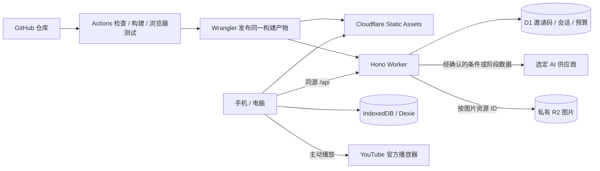

# Fitness 技术与部署选型

日期：2026-10-03；状态：集中建议已接受；效果与费用待实施验证。依据：[SDD v0.7](software-design.md)。

本次完成官方资料核验、方案比较和费用算术检查；没有创建云资源、启用付费订阅、安装产品依赖、调用真实 AI 或发布应用。技术选型不代表效果与账单已实测。

## 1. 选择依据与结论

已确认约束：手机优先 Web、浏览器本地数据、三类训练、中英文、公制、AI 计划与总结、独立邀请码、10–50 人海外试用、总预算不超过 ¥100/月、分阶段交付、通过 GitHub 管理并测试发布。

推荐单仓库、静态 SPA 前端与同源 API，不引入 SSR、独立常驻服务器或首版云端训练数据库。模块化与低成本选择依据 SuperBo：S01，PDF 72、85、98；S02，PDF 41–43；配置、截止时间与可恢复发布参考 S09，PDF 91、208、328、376。页码来自技能索引，本次未回查原 PDF；具体方案为项目综合设计。

| 层次 | 推荐选择 | 在 Fitness 中的用途 |
|---|---|---|
| 前端 | React + TypeScript + Vite，React Router 库模式 | 本地交互式应用；共享类型；客户端页面导航 |
| 样式 | CSS Modules + CSS 变量 | 柔和配色、响应式、可读表单；首阶段不用大型 UI 框架 |
| 本地数据库 | IndexedDB + Dexie | 逐组保存、跨 store 事务、版本升级与恢复 |
| 契约与校验 | Zod | 本地输入、备份、请求及 AI 输出的运行时校验 |
| 国际化 | i18next + react-i18next | 中英文文案与目录资源，语言不改训练事实 |
| 日期与单位 | 独立日历/单位模块，Intl 展示 | 本地日历日期与公制换算；不以 UTC 秒数生成周日程 |
| 后端 | Hono + Cloudflare Workers | 目标理解、计划、总结、邀请码、媒体代理 |
| 前端托管 | Workers Static Assets | 与 API 同一源；静态资源直接提供 |
| 服务端状态 | Cloudflare D1 | 邀请码、试用会话、预算预留、请求元数据；不作为训练库 |
| 媒体 | 私有 R2 Standard bucket，Worker 按目录资源 ID 读取 | 托管授权图片；视频使用 YouTube 官方播放器 |
| AI | 优先评估 OpenAI GPT-6 Luna | 目标理解、结构化计划、阶段解释；尚未验证真实效果 |
| 测试 | Vitest、Cloudflare Vitest 插件、Playwright | 领域规则、Worker/D1、真实浏览器持久化及端到端流程 |
| 构建发布 | npm + GitHub Actions + Wrangler | 锁文件安装、检查、构建、发布到试用环境 |

除 Node 环境以外，具体依赖版本在实施时核验兼容性并写入锁文件，不在设计阶段凭记忆固定版本。本机已核实 Node v24.14.0、npm 11.9.0；未安装新运行时。Vite 官方列出 Node 20.19+/22.12+ 基础要求，但模板与插件可能更严格，应以实际锁定版本的 engines 为准。[Vite 文档](https://vite.dev/guide/)

Cloudflare 有官方 React + Vite 集成方案，Hono 原生支持 Worker 请求与绑定；无需为了运行 API 增加 Node 常驻服务。[React + Vite](https://developers.cloudflare.com/workers/framework-guides/web-apps/react/)、[Hono Workers](https://hono.dev/docs/getting-started/cloudflare-workers)

## 2. 可行替代与取舍

### 2.1 前端架构

| 候选 | 优点 | 项目代价与选择 |
|---|---|---|
| React + Vite SPA | 适合浏览器数据和交互；有对应 Cloudflare 官方路径 | 推荐；仍需认真设计表单、状态与可访问性 |
| Vue + Vite SPA | 同样能实现本地优先；依赖与部署相近 | 真正可行替代，没有被需求排除；当前选择 React 以沿用所核验的整套路径 |
| Next.js 全栈 | 服务端页面与路由能力完整 | 当前主要数据在浏览器，SSR 收益有限；引入服务端/客户端边界，首版不采用 |

选择 React 不是断言 Vue 不适合，也不意味着后续必须引入 Redux、微前端或组件平台。应用服务与领域模块不依赖 React。

### 2.2 托管与发布

| 候选 | GitHub 发布与后端 | 主要约束 | 结论 |
|---|---|---|---|
| Cloudflare Workers + Static Assets + D1 | Actions 可发布；页面与 API 同源 | 免费 CPU 限额需实测；边缘运行时不是完整 Node；按量收费需控制 | 推荐 |
| Vercel + 静态前端/Functions | Git 集成方便；也可同源 | Hobby 限个人非商业使用；Pro 基础平台费约 $20/月即超出本预算的预留规模 | 非商业个人体验可行，但不作为本项目默认 |
| GitHub Pages + 独立 API 托管 | 静态页面可直接发布，API 另部署 | 两套来源和发布配置，跨站 cookie/CSRF/CORS 更复杂；不能只用 Pages 跑后端 | 适合作为无 AI 的静态演示备选 |

Workers 静态请求与动态请求分开计费，付费起价 $5/月；Vercel Hobby 的使用范围和 Pro 费用以当前文档为准。[Workers 价格](https://developers.cloudflare.com/workers/platform/pricing/)、[Vercel Hobby](https://vercel.com/docs/plans/hobby)、[Vercel Pro](https://vercel.com/docs/plans/pro-plan)。GitHub Pages 只托管静态站点：[GitHub Pages](https://docs.github.com/en/pages/getting-started-with-github-pages/creating-a-github-pages-site)。

## 3. 部署拓扑与数据边界

- 同一稳定 HTTPS 地址提供页面、/api/*、/media/*。免费试用阶段先使用固定 workers.dev 主机名，不把购买域名作为本地开发前提。
- /api/* 和 /media/* 必须进入 Worker，不能落入 SPA 的 HTML fallback；未识别 API 路径返回 JSON 404。页面与带内容 hash 的静态资源走 Assets，避免每次页面读取都运行 API。[SPA 路由规则](https://developers.cloudflare.com/workers/static-assets/routing/single-page-application/)
- IndexedDB 是个人训练、计划、日程、体重事实的唯一首版权威存储。D1 的存在不等于首版已经云端保存训练数据。
- D1 使用 TrialInvite、TrialSession、BudgetPeriod、UsageReservation、RequestState 等基础表；密码学摘要、随机令牌和服务端会话校验取代设备指纹。
- D1 batch 可作为事务，但“条件 UPDATE 影响零行”不是 SQL 异常。兑换和预算预留须使用唯一约束、条件写与显式结果检查，不能把多条成功执行的 SQL 当作业务预留成功。调用模型前必须有已提交的预留证明，避免先读余额再无条件扣减。[D1 batch](https://developers.cloudflare.com/d1/worker-api/d1-database/)
- 本地事务中不等待 AI/网络；Dexie 提醒非数据库异步等待可能使 IndexedDB 事务失效。网络候选先验证，再开启保存事务。[Dexie 事务](https://dexie.org/docs/Dexie/Dexie.transaction())
- 预览、试用使用不同 Worker 名称及 D1/R2 绑定；生产/试用密钥不得出现在浏览器或 PR 测试任务中。

### 3.1 域名与本地资料

IndexedDB 受 origin 隔离。换主机名、自定义域名或从预览地址切到试用地址时，不自动带入本地资料。试用开始前固定地址；以后换域名先导出 JSON，再在新地址导入，不默默切换域名造成“数据消失”的体验。

### 3.2 服务端结果短期保存

默认建议 D1 只保留请求 ID、会话、输入 hash、状态、预算和 usage，不落地原始目标、身体信息、训练明细或 AI 结果正文。前端按 requestId 留存已收到的候选。

相同会话与 requestId 在途返回 REQUEST_IN_PROGRESS；内容不同返回 REQUEST_CONFLICT；已完成且前端仍有结果时复用本地候选。若结果丢失，返回 RESULT_UNAVAILABLE，不承诺服务端能重放正文，不自动重复调用计费。用户可用新 requestId 明确重试并占用新配额。这替代原 SDD 中尚未确认的“5 分钟缓存完整结果”建议，减少服务端保存个人信息的范围。

模型超时或进程终止后的预算预留不得直接退款：只有明确 usage 或能证明未发出调用时结算；不确定调用保守计费并标记 reconciliation_required。服务端原始明细仍只在请求内存中处理；供应商日志政策另行告知，不能宣称零留存。

## 4. AI 候选、数据政策与评估

### 4.1 当前价格与能力核验

下表为 2026-10-03 核查的标准同步文本 API 价格，单位为美元/百万 token；不使用 Batch、限时优惠或缓存命中折扣作为预算成立前提。

| 候选 | 输入 | 输出 | 已核实能力与限制 | 选择状态 |
|---|---:|---:|---|---|
| GPT-6 Luna | 0.10 | 0.50 | 支持结构化输出，输出上限 128K；默认 reasoning 不是 none | 优先评估，调用时显式设 none 并限制输出 |
| DeepSeek Flash | 0.30 | 1.20 | 按峰值估算，JSON 输出与 384K 最大输出；默认思考模式须明确配置 | 替代候选，数据政策与实际能力另行核验 |
| GPT-5.4 mini | 0.75 | 4.50 | 支持结构化输出，输出上限 128K | 成本较高，不作为默认；仅在效果证据需要时比较 |

依据：[GPT-6 Luna](https://developers.openai.com/api/docs/models/gpt-6-luna)、[GPT-5.4 mini](https://developers.openai.com/api/docs/models/gpt-5.4-mini)、[DeepSeek 价格](https://api-docs.deepseek.com/quick_start/pricing/)。支持 JSON/schema 不等于内容正确，DeepSeek 文档也提示 JSON 模式可能返回空内容：[JSON 输出](https://api-docs.deepseek.com/guides/json_mode/)。

GPT-6 Luna 当前模型页只列别名，不能虚构可锁定的日期快照。保存模型 ID、供应商响应中的版本信息、promptVersion、schemaVersion 与评估版本；版本变化后做回归。[GPT-6 Luna 模型页](https://developers.openai.com/api/docs/models/gpt-6-luna)

### 4.2 调用方式与隐私

推荐服务端 Fetch 调用 Responses API，明确 store:false、reasoning.effort:none、结构化 schema、输出预算和 AbortController 截止时间，不启用模型工具、搜索、文件存储或自主循环。先处理 refusal、incomplete、超时及供应商错误，再做 schema、目录和业务校验；不能把任何 HTTP 200 都当成有效计划。

OpenAI API 默认不以输入训练模型，但默认滥用监控可能保留内容至多 30 日，并存在文档列出的例外；store:false 不等于没有监控留存。没有申请或验证 Zero Data Retention，不承诺零留存。[OpenAI 数据控制](https://developers.openai.com/api/docs/guides/your-data)

供应商账号、支付与实际使用地区必须符合其服务支持范围，部署海外不自动满足账号使用条件。[API 支持地区](https://help.openai.com/en/articles/5347006-openai-api-supported-countries-and-territories)。DeepSeek 的通用隐私政策不能直接当成与 OpenAI 相同的 API 数据承诺；若改用，应核验实际 API 条款并更新告知。[DeepSeek 隐私政策](https://cdn.deepseek.com/policies/en-US/deepseek-privacy-policy.html)

当前没有真实模型凭据，未发起评估请求。优先模型是基于能力与费用资料的选择，不是已证明它具有最佳健身建议质量。运行时不自动切换供应商，避免用户数据流向未告知的服务。

### 4.3 输出长度与等待时间

推荐初始上限（工程建议，待实测）：目标理解输入 2K/输出 1K token、20 秒；计划输入 12K/输出 32K、120 秒；总结输入 24K/输出 4K、60 秒。计费预算考虑全部输出 token，包括可能的 reasoning；none 用来减少不必要的推理成本，不作为安全保证。

这将原 SDD 的统一 30 秒假设改为分操作截止时间，避免宣称 12 周完整计划必定在 30 秒内成功。UI 展示等待、取消与超时，不展示未校验片段为正式计划。模型上限高不等于上述项目上限足够，需覆盖 12 周×7 日的最坏输出形态；不能截断、缩短周期或遗漏周。若单调用不可靠，再评估有明确总预算、总截止时间和最终完整性校验的分段方案，作为设计修订，不先加入 Agent/队列。

### 4.4 最小真实评估

建立至少 30 个固定案例并分别验证中文和英文：自由目标理解、一般目标组合、无器械、混合训练、1/12 周、指定星期、相冲突或超范围目标、提示注入、无记录与混合历史总结。统计 schema/目录/日程/条件硬约束、内容审阅、错误拒绝、耗时与成本。

被接受输出的结构与硬约束必须全部通过；领域内容需有可解释的审阅量表及审阅记录，不能以模型自评替代。先用优先模型测试，失败定位后再用替代候选比较。真实评估费用初期建议限 ¥5，计入当月 AI ¥35，不通过则停止扩大试用；不限额反复试模型不符合 R39。谁负责专业内容审阅在试用开放前落实，不阻塞纯本地功能编码。

## 5. ¥100/月预算与额度

### 5.1 可核实的平台事实

- Workers Free：每天 100,000 动态请求，每请求 10 ms CPU；等待外部网络不是相同含义的 CPU 时间。Paid 最低 $5/月。静态资源请求免费，动态调用需按规则计算。[Workers 计费](https://developers.cloudflare.com/workers/platform/pricing/)
- D1 Free：每天 5M 读取行、100K 写入行、合计 5 GB 存储；付费方案也有包含额度。[D1 计费](https://developers.cloudflare.com/d1/platform/pricing/)
- R2 Standard 有 10 GB-month、1M Class A、10M Class B 月免费额度，互联网出站流量免收出站费；操作和存储超额仍计费，不代表无限免费。[R2 计费](https://developers.cloudflare.com/r2/pricing/)
- GitHub 公共仓库标准 runner 免费；私有仓库依账号套餐包含额度计算。首版使用标准 Linux runner、控制 CI 时长与制品保留，不默认仓库公开，也不承诺所有 Actions 费用为零。[Actions 计费](https://docs.github.com/en/billing/concepts/product-billing/github-actions)

这些配额可能在账号内与其他项目共享，上线时核对实际剩余额度。R2、付费 Workers 的账单预警不是总费用硬停机保证。

### 5.2 推荐预算分配

| 项目 | 月预留 | 说明 |
|---|---:|---|
| Workers/D1 | ¥40 | 优先 Free 验证；预留约 $5 Paid 的升级费用，不自动订阅 |
| AI（含开发评估） | ¥35 | 应用服务端硬预算，调用前原子预留最坏费用 |
| 媒体存储/操作 | ¥5 | 目标在免费额度内；预留少量费用，不承诺账单硬上限 |
| 费用波动与余量 | ¥20 | 支付税费、换算波动、必要运维余量；不能把余量当作无限调用 |
| 合计 | ¥100 | 尚未购买域名；现有网址满足首轮试用 |

测算采用 $1=¥8 的保守规划换算，并非实时汇率。开发者的已有 Codex/ChatGPT 订阅不是 Fitness API 额度，不纳入应用费用，也不假定其能抵扣 API。

### 5.3 明确用量场景

以 50 人，每人每月 8 次目标理解、4 次计划生成、4 次总结估算。这是初始限额建议，不是用户已确认配额，也不是保证每人都能用尽额度。

| 操作 | 月请求 | 单次输入 token 假设 | 单次输出 token 假设 |
|---|---:|---:|---:|
| 目标理解 | 400 | 800 | 400 |
| 计划生成 | 200 | 8,000 | 16,000 |
| 阶段总结 | 200 | 12,000 | 2,000 |
| 合计 | 800 | 4.32M/月 | 3.76M/月 |

费用公式：输入百万数×输入单价 + 输出百万数×输出单价；再乘规划换算及 1.3 的失败/波动余量。算术已检查：

| 候选 | 基础美元费用 | 人民币含 30% 余量 |
|---|---:|---:|
| GPT-6 Luna | $2.312 | ¥24.04 |
| DeepSeek Flash 峰值 | $5.808 | ¥60.40 |
| GPT-5.4 mini | $20.16 | ¥209.66 |

GPT-6 Luna 若输入全部按 $0.125/M 缓存写入费率保守计算，该场景约 ¥25.17（含上述余量），仍可留出 ¥5 评估预算。依据当前价格与该用量假设，优先方案可落在预算内；这不是 12 周实测用量或供应商账单保证。

若所有请求都达到 2K/1K、12K/32,768、24K/4K 上限，输入共 8M、输出 7.7536M，按 $0.125/$0.50 已约 ¥39.01，尚未加 30% 余量，超过 AI ¥35。必须用全局预算拦截，不能只靠“每人可调用几次”；不能承诺 50 人均享满额最坏请求。

### 5.4 执行与失效方式

推荐 Free 先部署可控验证环境。对长输出解析、Zod 校验、D1 与密码学操作测真实 CPU，建议 p95 <5 ms、最坏场景留在 10 ms 以下且有余量；本地计时不代替线上 Worker CPU 证据。达不到就优化或采用 Paid，不自动购买；Paid 在正常试用流量下的基准费用可利用 ¥40 预留，但突发流量仍可能超额。

应用预算使用整数计价单位，按实际模型价格、输入上限、输出上限及换算预留；扣费同时受邀请码/月、日、会话/IP 和全局并发限制，失败请求亦计入尝试额度。价格变化先更新预算配置，无法计算最坏费用时不调用。到限后保留手动计划与本地训练，明确解释 AI 暂不可用；不缩短用户选择周期来隐藏费用不足。

建议 API 月总调用上限 1,000 次，包含正常试用与评估；媒体 R2 实际读取上限 200,000 次/月，存储控制在 2 GB 内，无用户上传或转码。限额为审阅建议，独立于费用预算；后台操作、重试、HEAD/Range 请求都需计入相应资源计数，不能只统计播放次数。预算周期默认建议按项目时区的自然月，供应商账单周期差异需核对。

## 6. 图片托管与 YouTube 视频

已确认视频直接搜索 YouTube 免费公开资源。推荐官方播放器嵌入，保留作者和原链接，不下载或经 Worker 代理，不进入 R2。候选见 [视频来源清单](video-sources.md)。公开视频不自动允许下载再分发：[嵌入说明](https://support.google.com/youtube/answer/171780?hl=en)、[许可类型](https://support.google.com/youtube/answer/2797468?hl=en)。

开发阶段人工筛选单动作演示，记录受控视频 ID、频道、语言、检查日期及嵌入状态。上线前验证内容匹配、实际嵌入播放、字幕及试用地区可达性。首版不提供运行时全网搜索，因此不需要 YouTube Data API 密钥或相应配额。

用户点击后加载 youtube-nocookie.com 播放器，不自动播放，不遮挡平台署名或控件；隐私增强模式不承诺没有第三方请求或广告。不向播放器传递身体或训练信息，不接受任意 iframe HTML。删除、私有、禁止嵌入、地区限制或断网时保留文字步骤、记录入口与原链接，链接也可能无法播放。真实 Safari/Android 验证播放和错误恢复。

图片继续经授权核验后存入私有 R2，通过 /media/{assetId} 提供，仅接受目录资源 ID。建议首批 30–50 个动作、图片 ≤300 KB/张，按需加载并提供替代文字；不从未知授权视频截帧托管。保留 ¥5 图片存储与读取预留，删除原视频编码、转码与 Range/206 要求。视频不产生本项目 R2 存储或 Worker 播放代理流量。

图片公开访问，YouTube 视频不增加邀请码限制；图片读取使用目录白名单、额度和缓存控制，不用 r2.dev 开发地址作为试用来源。[公开存储桶说明](https://developers.cloudflare.com/r2/buckets/public-buckets/)

## 7. GitHub 自动测试与发布

单仓库，不引入多仓或大型 workspace 编排。建议保留 src/domain、src/application、src/infrastructure、src/ui、server、shared/contracts、content/catalog、tests 与 docs；前后端复用 schema，Worker 构建不带 Dexie/React。

| 阶段 | 设计行为 |
|---|---|
| Pull Request | npm ci → 类型/静态检查 → Vitest → Worker/D1 集成测试 → Playwright → build；不使用正式云密钥 |
| 可信分支的预览 | 使用隔离的试用凭据/资源，明确是预览地址；不向不可信 PR 提供部署权限 |
| main 发布 | 所有必要检查通过，再由 Actions + Wrangler 发布同一产物到稳定试用网址 |
| 发布后 | 检查首页、深层页面、API JSON 404、无资格 AI 403、媒体读取；不以冒烟测试默认调用计费模型 |
| 回退 | 保留前一个可部署版本；D1 和 IndexedDB 使用向后兼容迁移，应用回退不等于数据库回退 |

自动发布流程尚未配置。首次连接账号、创建资源或对外发布须在具体结果可审阅后进行；当前工作只有设计文档。GitHub Secrets 存 Cloudflare 部署 token 与账号 ID；模型密钥放 Worker secret，不注入 Vite 前端环境变量。Actions 最小权限、第三方 action 固定提交、限制并发部署；fork PR 和 pull_request_target 不执行带正式凭据的不可信代码。[Cloudflare Actions 部署](https://developers.cloudflare.com/workers/ci-cd/external-cicd/github-actions/)

运行时测试使用当前官方 `@cloudflare/vitest-plugin`，不直接照搬旧 `@cloudflare/vitest-pool-workers` 示例；与 Vitest/Vite 的版本组合实施时锁定。[Workers Vitest](https://developers.cloudflare.com/workers/testing/vitest-integration/)

CI 至少运行 Chromium 和 WebKit，必要时补充 Firefox；Chrome/Edge 的发行版及真实 iPhone/Android 由验收矩阵覆盖。Playwright WebKit 不是原生 Safari，桌面视口模拟也不是实际手机，声音、媒体、锁屏和存储恢复须真实设备验证。[Playwright 浏览器](https://playwright.dev/docs/browsers)

## 8. 选择状态、外部准备与下一步

| 项目 | 本次状态 | 后续必须完成的证据 |
|---|---|---|
| React/Vite、Hono、Dexie、D1/R2 | 已形成推荐，有可行替代 | 设计审阅、依赖锁定、开发与 Worker 构建通过 |
| GPT-6 Luna | 优先评估候选，不是已验收模型 | 可用账号、地区与支付确认；真实中英文/长输出评估 |
| Free → Paid Worker | Free 起步，Paid 为有预算的备选 | 真实 CPU/耗时证据；需要升级时审阅具体费用，不自动订阅 |
| ¥100/月 | 有明确假设的估算可行 | 实际 token、账单与税费、额度共享、媒体操作量、流量保护验证 |
| GitHub 发布 | 已有流程设计，未配置或运行 | 仓库权限、Actions 额度、部署 token、资源隔离及冒烟测试 |
| 媒体 | 图片 R2、视频 YouTube，已有初始候选 | 图片许可、视频内容匹配及嵌入/地区播放测试 |

开始本地编码不需要先购买域名、升级 Worker、备齐视频或提供模型密钥。接入 AI 与部署时才准备用户拥有的 Cloudflare/API 账号及适当权限；凭据通过本地忽略文件、GitHub Secrets 或 Worker secret 设置，不粘贴到文档或聊天。

已接受的集中建议：推荐技术栈和托管组合、GPT-6 Luna 优先评估、Free 起步与 Paid 备选、¥35 AI 预算与次数上限、长计划 120 秒截止时间、服务端不缓存结果正文、图片公开访问与资源限额。这些是接受的技术与运行决策；价格、效果与限额可行性仍需实测，不新增独立 R 条目。

默认业务规则与页面流程已汇总到 SDD 第 1.3、4.1 节，集中建议已接受，第一阶段实施计划已编写，待审阅并选择执行方式。第一阶段先交付本地数据闭环；AI 真实评估和媒体授权分别在对应阶段成为开放试用的门槛。未来账号与云端训练数据须另开设计修订，不能复用试用 cookie 冒充身份体系。

## 9. 训练备忘增补（R54）

完整训练内容留存 IndexedDB TrainingMemo，本地确定性更新与训练事实同事务提交，不在每次训练后自动调用付费 AI。后续计划与总结显式读取备忘快照，由应用用户确认外发；服务端不保存备忘正文，AI 建议单独本地保存，不覆盖事实。具体版本、重建和恢复规则见 SDD 第 6 节训练备忘小节。

原费用估算未包含新增的跨阶段历史上下文，不能直接视作 R54 已通过预算验证。保持现有全局预算与输入容量限制，按 1/12 周及长期多计划完整训练样本重新测量 token、延迟和费用；超限提示而非静默截断。本地保存完整历史不受单次 AI 输入上限缩减，采用近期完整记录＋较早历史的本地可追溯摘要，默认近期 28 天，仍超限时明确提示。摘要本地计算不新增模型调用；后续分段模型调用须另行设计和预算验证。
