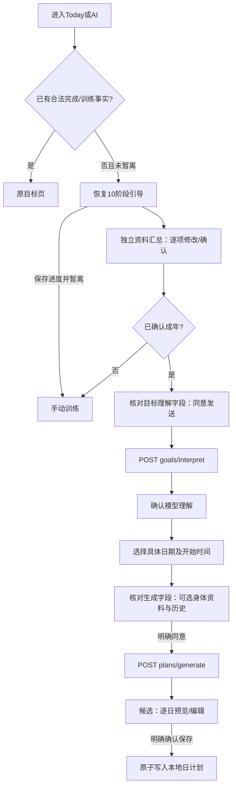

# Fitness UI/UX 设计规范 · UIUX20261008

**这是 Fitness 唯一的 UI/UX 设计规范入口。** 视觉、交互、文案、动效、主题、组件与训练闭环的设计规则都在本文件中维护（维护规则见第 4 部分）。

当前版本：**V8.0.3**（2026-10-10）　状态：已定稿，待实施

## 版本记录

| 日期 | 版本 | 改动摘要 | PR |
|---|---|---|---|
| 2026-10-10 | V8.0.3 | 回顾时段、追加备注、动作级反馈与数据边界数组；CI复用话术规则；令牌补齐；旧UI删除映射与设备提醒升级验收；交接规范改指针 | 本次共享接口 PR |
| 2026-10-10 | V8.0.2 | 备份验收改为旧版本真实UI导出：V5/V6.2/V7.1隔离录入、导出、恢复再导出；上线前如有外部用户补真实用户备份 | 待提交 |
| 2026-10-10 | V8.0.1 | 用户确认：0组保存为 not_started；引导时长仅映射既有档位，计划保留原话与15–120分钟实际时长；启动时间 skipped | Wave 0 |
| 2026-10-08 | V5 | 三主题（Atlas/Serene/Orbit）、Soft Ceramic 图标、10 阶段引导 | #19 |
| 2026-10-09 | V6.2 | 全局芽芽、三模式对话、本地提醒 | — |
| 2026-10-09 | V7.1 | AI Coach Intelligence：任务化 Prompt、上下文与响应契约、评测 | #23/#24 |
| 2026-10-09 | **V8.0.0** | 四套新主题（青瓷默认、留白、静奢、撞色）与"令牌 + 签名组件"架构；材质与三个签名动效规范化；三问对话式初见；计划去日期化；自主节奏训练；如实记录与计划外活动；周/月回顾与芽芽话术；保留 Soft Ceramic 图标并重新上釉；轻量外发同意；无 AI 资格时的基础计划；提醒只保留用户设置的提醒；应用内不设 AI 架构评审等开发入口 | 待提交 |

## 取代关系

- 本文 V8 取代：本文件 V5 / V6.2 / V7.1 中的视觉、引导流程、按日期排计划与相关交互（原文保留在附录 A）；`ui-ux-max-design.md`；`DESIGN.md` 中的视觉规则；`design-model.yaml`；`docs/design/主题系统规范.md`；Atlas / Serene / Orbit 三套版式。
- 仍然有效的旧约束已提炼进**第 3 部分**。

## 配套文件

| 文件 | 作用 |
|---|---|
| `docs/handoff-v8/02-design-tokens.json` | 设计变量取值的唯一来源 |
| `docs/handoff-v8/Fitness_UX_V8_Prototype.html` | 交互与视觉参照原型 |
| `docs/handoff-v8/06-验收清单.md` | 验收项与截图矩阵 |
| `docs/uiux/icon-inventory-v5.md` | 图标清单（第 3 部分 C.4） |
| `docs/research/健身APP用户十大痛点.md` | 设计依据：用户反馈调研 |
| `docs/research/ui-audit-2026-10-09/` | 设计依据：V7.1 诊断 |

## 目录

- 第 1 部分　视觉规范
- 第 2 部分　交互与训练闭环
- 第 3 部分　继承约束（V5 / V6.2 / V7.1 中继续有效的规则）
- 第 4 部分　本文件的维护规则
- 附录 A　历史版本原文

---

# 第 1 部分　视觉规范

## 1. 设计原则

用户是想通过健身改变自己的人，大多是新手或重新开始的人，带着不自信，甚至一点羞耻感。设计的任务是让他们愿意回来。

1. **尊重，不评判。** 不用红色表达"没做到"，不出现"失败""落后"这类词。进度讲"你做了什么"，不讲"你还差什么"。
2. **降低心理负荷。** 每屏只有一个主操作，大量留白，信息按需展开（胶囊点开才看细节）。
3. **增强自我效能。** 先让用户成功一次：首次对话只问三件事，60 秒内看到属于自己的计划。
4. **训练时少看手机。** 训练界面一眼看懂、一下完成，不倒计时、不打断。
5. **峰终体验。** 结束一次训练和看周回顾，是最值得精心设计的两个时刻。
6. **克制的高级感。** 东方的留白与气韵，西方的秩序与材质。动效和材质只用在该用的地方。

---

## 2. 主题体系

### 2.1 四套主题

| id | 名称 | 气质 | 色彩模式 |
|---|---|---|---|
| `qingci` | 青瓷（**默认**） | 涟漪与呼吸，温润安静；釉面高光 | 浅色 |
| `liubai` | 留白 | 宋体竖排、墨线与朱印；宣纸纹理 | 浅色 |
| `jingshe` | 静奢 | 炭黑、骨白与香槟；金属光泽 | 深色 |
| `zhuangse` | 撞色 | 新野兽派，象牙底、粗黑线、硬投影、色块 | 浅色 |

**结构一致，气质不同。** 四套主题共享同一套页面、信息架构、交互流程和文案。主题只改变令牌、材质、动效参数和 9 个签名组件的表现。

### 2.2 切换与入口

- 新用户默认青瓷；引导流程中不出现主题选择。
- 入口：设置 › 外观。展示每套主题的缩略图、名称、一句描述，点选即时生效。正在进行的训练、草稿、当前页面不受影响。
- 外观页底部固定"更多模板"入口。列表由主题注册表自动生成，新增主题后不用改这一页；现阶段显示"新模板正在酝酿"。
- 持久化：`localStorage` 键 `fitness-theme`，值为主题 id。读取失败或 id 不在注册表时回退青瓷。
- 旧偏好迁移：读到旧键 `fitness-appearance-v31`（atlas / serene / orbit）时，一律迁移到 `qingci` 并删除旧键。
- 应用方式：`<html data-theme="<id>">`，同时更新 `<meta name="theme-color">` 和 `color-scheme`。

### 2.3 代码结构（必须遵守）

```
src/themes/
  contract.ts        # 令牌名单、签名组件接口、ThemeManifest 类型
  registry.ts        # 已注册主题列表（唯一入口）与 defaultThemeId
  ThemeProvider.tsx  # 读取偏好、设置 data-theme、提供签名组件
  base/              # 签名组件的默认实现
  qingci/ liubai/ jingshe/ zhuangse/
    manifest.ts      # id、名称、描述、colorScheme、字体、slots
    tokens.css       # :root[data-theme="<id>"] { --c-...: ... }
    slots/           # 本主题覆盖的签名组件
    preview.webp     # 外观页缩略图 360×480
```

新增一套模板 = 新建一个文件夹 + 在 `registry.ts` 里加一行，**不改任何页面代码**。

---

## 3. 设计变量

全部取值见 `docs/handoff-v8/02-design-tokens.json`。CSS 中统一用以下语义名：

| 类别 | 变量 |
|---|---|
| 颜色 | `--c-bg` `--c-bg-grad` `--c-surface` `--c-surface-2` `--c-ink` `--c-ink-muted` `--c-line` `--c-primary` `--c-on-primary` `--c-signature` `--c-signature-2` `--c-done` `--c-on-done` `--c-attention` `--c-ai` `--c-focus` `--c-scrim` |
| 字体 | `--f-display` `--f-body` `--f-num`，字重 `--w-body` `--w-display` `--w-num` `--w-strong` |
| 字号（共享 8 级） | `--t1` 12 / `--t2` 13 / `--t3` 15 / `--t4` 17 / `--t5` 22 / `--t6` 28 / `--t7` 40 / `--t8` 72（px） |
| 间距（共享） | `--s1` 到 `--s8`：4 8 12 16 24 32 48 64 |
| 形状 | `--r-control` `--r-panel` `--r-chip` `--bw`（描边宽度） |
| 字距 | `--tr-display` `--tr-body` |
| 材质 | `--mat-surface` `--mat-primary` `--mat-hl` `--el-1` `--el-2` `--el-3` `--press-inset` |
| 效果 | `--ring` `--ring-w` `--glow` `--glow-blur` |
| 布局与触控（共享） | `--touch-min/primary/workout/secondary/row` 为44/56/72/48/52px；`--lh-tight/body/reading` 为1.2/1.7/1.85；`--layout-mobile-max/desktop-rail/desktop-main/desktop-breakpoint` 为480/88/560/960px |
| 按压语义 | `--press-transform` 与 `--press-shadow` 从令牌源的pressStyle和材质派生；撞色为translate(3px,3px) scale(.98)，其他为scale(.96)；strong字重青瓷/留白/静奢400，撞色700 |
| 动效（共享） | `--press-scale` `--press-dur` `--spring` `--morph-dur` `--morph-ease` `--fade` `--breath` `--ring-cycle` |

规则：

1. 页面和通用组件里**不得**出现十六进制颜色、`font-family`、具体字号、圆角和阴影值，只能用变量。
2. 只有 `src/themes/<id>/tokens.css` 可以出现 `[data-theme=...]` 选择器。
3. 签名大数字（如静奢的"35"、撞色的字母"A"）可以超出 8 级字号，但只允许写在签名组件里。
4. 色彩对比：正文 ≥ 4.5:1，大字（≥24px 或 ≥18.66px 粗体）≥ 3:1。四套主题的取值已核验；新增主题必须通过自动检查。

---

## 4. 材质与纵深

V7.1 的问题之一是"太平"。V8 给每套主题定义了自己的材质，让界面有纵深，但不靠堆叠阴影：

| 主题 | 材质 | 实现 |
|---|---|---|
| 青瓷 | 釉面 | 面板上浅下深的渐变（`--mat-surface`），按钮三段釉色渐变（`--mat-primary`），上缘 1px 内高光（`--mat-hl`），背景淡径向渐变 |
| 留白 | 宣纸与墨 | 背景铺极淡 SVG 噪点纹理（透明度 0.035）；面板无投影，用发丝线分隔；投影只在弹层出现，像墨晕 |
| 静奢 | 金属与夜色 | 香槟拉丝渐变主按钮；面板 1px 弱内高光；背景顶部微亮、四周渐暗 |
| 撞色 | 实体 | 2.5px 纯黑描边，硬投影 3/4/8px 三级；按压时投影归零，像实体按键 |

纵深分三级：`--el-1` 卡片与胶囊，`--el-2` 主卡与主按钮，`--el-3` 弹层与对话面板。

---

## 5. 动效语言

保留 V7.1 的三个签名动效，并统一参数。

### 5.1 按压回弹（所有可点击控件）

- 按下：`transform: scale(0.96)` + 深度内阴影 `--press-inset`。
- 释放：420ms，`cubic-bezier(.18,1.36,.3,1)`，带轻微超调回弹。
- 撞色例外：按下时 `translate(3px,3px) scale(.98)`，硬投影归零；释放时同样超调回弹。
- 实现：统一工具类 `.press`（或 React 组件 `<Pressable>`），不在各组件里重复写。

### 5.2 主卡：旋转流光描边 + 呼吸背光

- 描边：`conic-gradient` 遮罩成 `--ring-w` 宽的边框，`@property --ring-a` 驱动 14s 匀速旋转。
- 背光：卡片底部一条模糊椭圆，6s 呼吸（透明度 0.35↔0.85，横向缩放 0.82↔1.06）。
- 各主题：青瓷釉绿到金；留白墨色带一点朱红；静奢香槟；撞色为黑黄红硬色块描边（6s），背光改成硬投影 5↔9px 往复（2.8s），不做模糊。
- **使用限制：每屏最多一张主卡。** 只用于：首页"下一次"主卡、训练结束卡、周/月回顾开场卡。其他卡片一律不加。
- **训练中所有持续动画关闭。**

### 5.3 胶囊 → 面板流体变形

- 动作项一律做成胶囊（`.capsule`）：首页、计划页、计划草案、动作库、训练中修改数值。
- 点开时，从胶囊的实际位置和尺寸，变形为居中的详情面板：位置、宽高、圆角同步过渡，520ms，`cubic-bezier(.14,.82,.24,1)`；面板内容在 200ms 后淡入。
- 关闭时反向收回到胶囊当前位置，420ms，`cubic-bezier(.4,0,.2,1)`；收回后焦点回到原胶囊。
- 实现建议：Web Animations API（FLIP），原型 `openMorph/closeMorph` 可直接参考；支持 View Transitions 的浏览器可以替换实现，视觉结果必须一致。

### 5.4 其他

- 页面切换：220ms 淡入并上移 6px。
- 芽芽对话面板：从底部滑入，520ms，同变形曲线。
- **减少动态效果**（`prefers-reduced-motion: reduce`）：所有持续动画停止；按压不缩放；变形改为 120ms 透明度过渡。

---

## 6. 签名组件（主题差异只能出现在这里）

| 组件 | 职责 | 青瓷 | 留白 | 静奢 | 撞色 |
|---|---|---|---|---|---|
| `BrandMark` | 品牌标记 | 涟漪中心的芽 | 朱红方印"芽" | 文字"芽芽" | 倾斜黄色贴纸"芽芽" |
| `WeekProgress` | 本周已练/目标 | 小圆点 | 墨线山脊 + 朱点 | 小圆点 | 方块 |
| `StartHero` | 下一次训练的主视觉与开始按钮 | 涟漪圆形按钮 | 宋体横排 + 竖排"下一次" + 墨色矩形按钮 | 超大细数字分钟数 + 香槟胶囊按钮 | 训练单字母 + 分钟贴纸 + 黄色按钮 |
| `Suggestions` | 芽芽的"你也许想说" | 居中瓷白胶囊 | 下划线文字列表 | 发丝线行 + 香槟点 | 彩色粗线块 |
| `AiLine` | 芽芽说的话 | 居中宋体 | 宋体，无底 | 细黑大字 | 淡紫粗线气泡 |
| `SetValue` | 本组重量×次数（点按修改） | 衬线大数字 | 极细黑体数字 | 极细几何数字 | 加宽粗体数字 + 白底粗线框 |
| `RestClock` | 组间已歇时长（正计时） | 小涟漪 + 文字 | 同左，墨色 | 同左，香槟 | 白底粗线胶囊 |
| `FeatureCard` | 主卡容器（5.2 的效果） | 见 5.2 | 见 5.2 | 见 5.2 | 见 5.2 |
| `NavIcon` | Soft Ceramic 陶瓷导航图标（第 3 部分 C.4） | 青瓷釉：瓷白到釉绿渐变，墨绿釉边 | 白瓷：纯白到浅灰，墨色描边与图形 | 黑釉（建盏感）：深灰到炭黑，香槟釉边 | 平涂白瓷 + 2.5px 黑边 + 硬投影，选中填黄 |

签名组件的 props 在 `contract.ts` 中统一定义，`base/` 提供默认实现。需要新增签名组件时，先在 PR 中说明理由，等设计确认。

---

## 7. 字体

| 主题 | 标题 | 正文 | 数字 |
|---|---|---|---|
| 青瓷 | 思源宋体 400 | 思源黑体 300 | Cormorant Garamond 300 |
| 留白 | 思源宋体 400 | 思源黑体 300 | 思源黑体 200 |
| 静奢 | 思源黑体 300 | 思源黑体 300 | Jost 200/300 |
| 撞色 | 思源黑体 900 | 思源黑体 500 | Archivo 900（宽度 118%） |

- 应用本地优先、可离线：**字体必须打包进应用**，不依赖 Google Fonts（原型为了方便才在线加载）。
- 中文字体子集化：常用 3500 字 + 应用内全部文案用字；按主题分包，只加载当前主题需要的字体。每套主题字体包压缩后建议 ≤ 1.5 MB，超出在 PR 里说明。
- 回退：宋体 `"Songti SC","STSong","SimSun",serif`；黑体 `"PingFang SC","Microsoft YaHei",sans-serif`；`font-display: swap`。
- 不使用 Inter、Roboto、Arial 作为任何主题的主字体。

---

## 8. 通用组件

全部由令牌驱动，只有一份实现：

| 组件 | 要点 |
|---|---|
| 主按钮 `btn-primary` | 高 56px（训练中 72px），每屏最多一个 |
| 次按钮 `btn` | 描边，高 48px |
| 文字链接 `link` | 最小点击区 44px |
| 图标按钮 `icon-btn` | 44×44，必须有 `aria-label` |
| 选择胶囊 `chip` | `aria-pressed` 表示选中 |
| 动作胶囊 `capsule` | 名称 + 器械 + 重量组数，可变形为面板 |
| 面板 `sheet` | 普通内容容器（留白主题下为发丝线分隔） |
| 主卡 `FeatureCard` | 见 5.2，每屏最多一张 |
| 变形面板 `MorphPanel` | 见 5.3，`role="dialog"`、焦点管理、Esc 关闭 |
| 输入条 `Composer` | "跟芽芽说"输入框 + 发送按钮 |
| 开关 `Toggle` | `role="switch"`，回弹动效 |
| 分段控件 `Segmented` | 周/月切换 |
| 数据块 `Stat` | 标签 + 大数字 + 说明 |
| 列表行 `Row` | 最小高度 52px，发丝线分隔 |
| 导航 | 手机：底部 3 个标签（训练 / 计划 / 回顾），每个标签为 Soft Ceramic 陶瓷图标 + 文字，整个标签可点击；桌面 ≥960px：左侧竖向导航；设置从页面右上角齿轮进入 |
| 芽芽浮动形象 | 见第 11 节 |
| 提示 `Toast` | 顶部居中，2.4s 自动消失，`role="status"` |

不再使用：面包屑、版式下拉框、"演示数据"标签、大写英文眉标（如 `FITNESS / PLANS`）、按版本命名的样式文件。

---

## 9. 布局与响应式

- 手机优先，内容最大宽度 480px；桌面 ≥960px 时内容区 560px，左侧导航 88px。
- 页面左右内边距 24px；区块间距 24px；同组元素间距 8–16px。
- 底部导航在引导、计划草案、训练中、训练结束页隐藏（沉浸场景）。
- 需验证的宽度：320 / 375 / 390 / 430 / 768 / 1024 / 1280 / 1440px。320px 下不得出现横向滚动。

---

## 10. 界面文案

完整话术规范见 第 2 部分第 7 节。界面层规则：

1. 用户读不懂的话不出现在主界面。安全与数据规则通过交互实现（默认值、确认步骤），不写成提示语。
2. 动词开头、说清结果：按钮写"记下来""就用这份计划""完成这一组"，不写"提交""确定"。
3. 同一个动作全流程同一个叫法。
4. 句末不加感叹号；不用 emoji；不用全大写英文标签。
5. **中英双语**：所有新文案同时提供英文；英文短标签在 320px 下不换行错位；用户自定义文本不擅自翻译（沿用 V5 规则）。

**禁止出现在界面上的工程化表达**（旧版实例）：

| 旧文案 | 处理 |
|---|---|
| 未确认的示例数字不会保存为事实。 | 删除 |
| 查看不会建立计划。 | 删除 |
| 旧计划兼容 | 删除该入口 |
| 核对外发 / 同意发送并理解目标 | 改为"确认后，芽芽会根据这些信息帮你排计划" |
| 资格及额度未知，请查询或前往试用资格。 | 改为"还没开通 AI 教练 · 输入邀请码" |
| Etc/GMT-8 等原始时区 | 不显示 |
| 只有点击记录后，实际值才会保存。 | 删除（改为默认值 + 一键完成） |

---

## 11. 芽芽形象

按产品决定，**保持现有 3D 芽芽形象**（白色圆头、绿芽、表情；空闲、思考、回复、完成四种状态图沿用 V7.1 资源）：

- 位置：右下角浮动按钮，在底部导航上方；桌面端放在内容区右侧外沿。
- 不得遮挡主操作：页面底部预留足够留白（原型为 150px），保证滚到底时任何按钮都不被遮住。
- 隐藏场景：首次对话、计划草案、训练结束反馈、记录活动。
- 训练中不浮动：改为训练页顶部右侧的 44px 小头像按钮（点开同一个对话面板），保证"完成这一组"在任何屏幕尺寸下都不被遮挡。
- 对话面板头像使用同一组图，状态随对话切换（思考中 / 回复中 / 完成）。
- 各主题的 `BrandMark` 用在页面内（标题旁、对话首屏），与浮动形象并存。
- 对话面板的行为沿用 V6.2 / V7.1（第 3 部分 C.5）：桌面为不阻断的侧抽屉，手机为模态抽屉；可左右停靠、收起到边缘；关闭只隐藏、保留输入与候选；四种状态的语义不变。

---

## 12. 无障碍

- 触控目标 ≥ 44×44px；训练主按钮 ≥ 72px 高。
- 键盘：所有可点击元素可聚焦，焦点环 2px `--c-focus`，偏移 3px；变形面板和对话面板打开时焦点移入，关闭时回到触发元素；Esc 关闭。
- 读屏：图标按钮有 `aria-label`；选择状态用 `aria-pressed` / `aria-checked`；计时器文字更新不放在 `aria-live` 中，避免打断。
- 颜色不是唯一信息来源：已完成同时有勾选图标。
- 减少动态效果：见 5.4。

---

## 13. 后台 `/admin`（重构最后一步）

- 不参与主题切换，使用一套独立的紧凑令牌（基于青瓷的颜色，密度更高：行高 44px，字号 13/15）。
- 默认中文。
- 申请列表改为表格：称呼 / 类型 / 状态 / 时间 / 备注 / 操作；ID 只显示前 8 位，可点击复制。
- 状态用中文标签和颜色：待处理、已批准、已拒绝、已领取。
- **风险层级**："批准"是主按钮；"免邀请码直接开通"降为次级文字按钮，并需要二次确认。
- 术语改写："Reserved, not settled" → 已预留未结算；"Request bound" → 单次上限。

---

## 14. 视觉验收

完整清单见 `docs/handoff-v8/06-验收清单.md`。核心：

1. 与原型、画布逐屏对比：构图、层级、留白、字号、材质、动效，偏离 3 处以上不算完成。
2. 每个 UI 改动附四套主题在 390px 和 1440px 下的截图。
3. 功能测试和构建通过不能替代截图验证。

---

# 第 2 部分　交互与训练闭环

## 1. 产品定位与闭环

为想通过健身改变自己的人提供一个入口：**通过和 AI 交流，灵活地得到一套真正适合自己、并且做得下去的训练计划。**

产品围绕一个闭环运转：

```
初见（3 个问题）→ 第一版计划
        ↓
  随时开始训练 / 记录计划外活动
        ↓
     如实记录（含少练的原因）
        ↓
  周 / 月回顾：事实 → 规律 → 建议
        ↓
  用户确认 → 计划新版本 → 回到"随时开始"
```

核心原则：

1. **计划不绑日期。** 计划只规定"练什么"和"每周几次"，用户什么时候有空就什么时候练。
2. **一切如实记录。** 做完、少做、换动作、跳过、计划外活动，都按实际情况记下，不补全、不美化。
3. **AI 只提建议。** 芽芽的任何改动都必须由用户确认后才生效，并存成新版本。
4. **正向引导，中立陈述。** 鼓励适度，差距只讲事实，每个问题都配一个可执行的方案。

---

## 2. 信息架构

| 位置 | 页面 | 说明 |
|---|---|---|
| 底部导航 · 训练 | 下一次 | 首页：建议的下一份训练单、本周进度、开始、换训练单、记录其他活动、跟芽芽说 |
| | 训练中 | 沉浸页，隐藏导航 |
| | 训练结束 | 结果与反馈，隐藏导航 |
| | 记录一次活动 | 计划外的活动 |
| 底部导航 · 计划 | 我的计划 | 目标、节奏、训练单、提醒、和芽芽聊调整 |
| | 计划版本 | 历史版本与每次改动 |
| | 动作库 | 原"动作"一级页面降级到这里 |
| 底部导航 · 回顾 | 本周 / 本月回顾 | 原"进度"页面并入这里 |
| 右上角齿轮 | 设置 | 外观、休息轻震、提醒入口、备份恢复、芽芽会看到什么、重新制定计划 |
| | 外观、更多模板 | 见第 1 部分第 2 节 |
| 首次进入 | 初见 → 计划草案 | 无导航 |
| 浮动按钮 | 芽芽对话面板 | 任何页面可唤起（引导、草案、结束反馈、记录活动除外） |

旧版"今日"、"进度"、"动作"、"设置"四个一级入口，以及日历排期视图，全部按上表重新归位。

**应用内不设任何开发或评审入口。** "AI 架构评审"、契约示例、Prompt 结构、评测面板等开发者内容只存在于文档（本节第 8 节与 `docs/architecture/`），不得出现在用户端任何页面、设置、更多菜单、调试开关或隐藏手势中，也不随生产包发布；后台 `/admin` 也不提供该面板。

---

## 3. 核心流程

### 3.1 初见：三个问题 + 安全确认

替代原 10 屏引导表单。整个过程是和芽芽的对话，每个问题下方给出"你也许想说"的建议回答（辅助回答），用户点一下即可，也可以自己打字。

| 步骤 | 芽芽问 | 建议回答 | 用途 |
|---|---|---|---|
| 1 | 你好，我是芽芽。这一次，想为自己改变些什么？ | 想瘦下来，身体轻一点 / 想有些力量，不再容易累 / 久坐，想让身体舒展开 / 说不上来，想先动起来 | 训练方向；从回答中顺带识别经验、身体线索 |
| 2 | （先复述目标）每周大概能练几次，每次多久合适？ | 每周 2 次，每次 30 分钟 / 每周 3 次，每次 30–45 分钟 / 每周 4 次以上 / 还不确定，你帮我定 | 计划结构与每周目标 |
| 3 | 一般在哪练？手边有什么器械？ | 在家，有一对哑铃 / 在家，只有瑜伽垫 / 去健身房 / 户外为主 | 可选动作 |
| 确认 | 最后确认两件事，安全第一。 | 勾选"我已年满 18 岁"；选择需要注意的部位：没有 / 膝盖 / 腰背 / 肩 / 手腕 / 其他 | 安全底线 |

规则：

- 未勾选年满 18 岁时，"生成我的第一版计划"不可用；未成年人不生成成人计划，引导其在家长或专业人士指导下训练。
- 用户回答不清时，芽芽最多追问一次（例如经验无法判断时）。不循环追问。
- 原引导中的性别、年龄具体值、身高、体重、腰围、补充说明，**首次都不问**：
  - 年龄：只确认是否年满 18 岁；
  - 身高体重：第一次训练结束后提示"记录一下起点，方便看变化"，或用户需要控制热量时再问；
  - 补充说明：对话框本身随时可以说。
- 已有的引导数据（V7 及以前）保留，可作为 AI 的已确认条件使用，不要求用户重填。三个问题的答案写入现有 12 字段引导契约，映射见第 3 部分 C.2。
- **外发同意（轻量）**："生成我的第一版计划"按钮本身即发送授权；按钮上方有可展开的"点'生成'即同意发送以下内容给芽芽"清单，逐项列出实际发送字段。身高体重、训练历史默认不发送，需单独勾选。
- **没有 AI 资格时**：用三个回答按本地规则生成"基础计划"（同样是训练单 + 每周次数，标注"基础计划"），用户立即可以开始训练；开通 AI 后，芽芽可以在此基础上个性化调整（MODIFY_PLAN）。未满 18 岁不生成任何计划，只开放手动训练。

### 3.2 计划草案与保存

- 芽芽返回 2–3 份训练单 + 每周目标次数 + 3 条"为什么这样排"。不含任何日期。
- 每个动作做成胶囊，点开看器械、重量、组数和要领。
- "就用这份计划"保存为第 1 版；"想改改，和芽芽聊聊"进入对话。保存之前不写入任何计划。

### 3.3 首页：下一次

- 建议规则：按训练单顺序轮换，取最近一次计划训练的下一份；用户可点"换成全身 B"直接开始另一份。
- 若上一次该训练单只练了一部分，理由文案提示"上次练了一半，这次从头来"。
- 显示本周已练次数 / 每周目标（只算计划训练，计划外活动单独统计）。
- 有进行中的训练时，顶部显示"正在进行，点这里回到训练"。
- "跟芽芽说"输入框：输入后打开对话面板并发送。

### 3.4 训练中：自主节奏

| 规则 | 说明 |
|---|---|
| 不倒计时、不自动开始 | 完成一组后只显示"已歇 m:ss，准备好就开始"的正计时 |
| 顺序自由 | 下方列出本次全部动作，点一下切换；已完成的带勾 |
| 默认值 | 重量和次数默认带入计划值（或上次实际值）；不同才点数字修改 |
| 一键完成 | "完成这一组"按钮高 72px |
| 动作完成 | 当前动作的组数做完后，按钮变为"这个动作完成了，换下一个"，不自动跳转 |
| 全部完成 | 按钮变为"全部完成，结束训练" |
| 暂停 | 左上角：继续训练 / 结束并记下 / 放弃这次（不记录） |
| 提醒 | 可选"休息到 90 秒时轻震一下"，默认关闭；不弹窗、不响铃 |
| 屏幕 | 训练中请求 Wake Lock 保持常亮；关闭所有持续动画 |
| 唯一性 | 同时只能有一次进行中的训练；离开页面后可从首页回到训练 |

### 3.5 训练结束与反馈

- 显示事实：完成组数 / 计划组数、用时、本周第几次。
- 开场一句按情况选择：
  - 全部完成："完成了。这是你本周第 N 次训练。"
  - 部分完成："练了 X 组，也算数。如实记下来，之后才知道怎么调。"
  - 0 组："这次没练上也没关系。记下原因，芽芽会帮你调整。"
- 感觉（可不选）：轻松 / 刚好 / 有点累 / 很累。
- 少练原因（仅部分完成时出现，可多选，可不选）：时间不够 / 太累了 / 哪里不舒服 / 器械被占 / 今天不想练 / 其他。
- 补充一句（可不填）。
- "记下来"保存。之后不能修改实际值，但可以追加备注（沿用现有"完成记录只读"规则）。

### 3.6 记录一次活动（计划外）

- 类型：散步 / 跑步 / 骑行 / 游泳 / 瑜伽 / 爬楼 / 其他（其他可填名称）。
- 时长：分钟，±10 调节，最少 5 分钟。
- 时间：刚刚 / 今天早些时候 / 昨天 / 选日期。
- 感觉：可不选。
- 计入回顾的"其他活动"，不计入每周计划训练次数。

### 3.7 计划页与版本

- 显示：版本号与最近一次调整（"第 2 版，10 月 6 日和芽芽一起调整"）、目标、节奏、每份训练单的动作胶囊。
- 修改途径：
  1. 和芽芽聊（推荐）→ change_proposal → 用户确认 → 新版本；
  2. 动作详情面板里"问问芽芽"；
  3. 采纳周回顾的建议。
- 版本页列出每个版本的日期、来源（和芽芽一起制定 / 调整 / 采纳本周建议）、改动明细。
- 已完成的训练记录始终关联当时的版本，不随新版本改变。

### 3.8 可选提醒

- 复用 V6.2 已实现的前台提醒引擎（第 3 部分 C.3），提醒来源改为用户设置的星期与时间；V6.2 的"训练完成后提醒"和"闲置关怀提醒"全部移除。
- 默认关闭。打开后选择星期几（多选），时间默认晚上 7:30，可改。
- 文案明确："只是提醒，不代表那天必须练"。
- 提醒日没练，不产生任何"错过"记录，也不出现在回顾的"差距"里。
- 提醒由用户在应用内设置，不经过 AI。
- 提醒只在应用打开且在前台时出现（沿用 V6.2），不发送系统推送；系统通知以后单独评估。

---

## 4. 数据模型

以下为逻辑模型。字段命名请适配现有 `src/domain/schemas.ts` 的 zod 定义和单位约定（重量以克存储、时长以秒存储），保持本地优先与备份契约。

```ts
type ThemeId = 'qingci' | 'liubai' | 'jingshe' | 'zhuangse';

interface CoachProfile {                // 初见的已确认条件
  goalText: string;                     // 用户原话
  goalKind?: 'fat_loss' | 'strength' | 'posture' | 'habit';
  weeklyTarget: number;                 // 1–7
  sessionMinutes: number;               // 15–120
  place: 'home' | 'gym' | 'outdoor' | 'mixed';
  equipment: string[];                  // 受控器械 ID
  adultConfirmed: boolean;
  cautions: Array<'knee' | 'back' | 'shoulder' | 'wrist' | 'other'>;
  cautionNote?: string;
  confirmedAt: string;                  // ISO
}

interface PlanVersion {
  id: string; planId: string; versionNumber: number;
  goalText: string; weeklyTarget: number;
  scheduleOriginalText: string; sessionMinutes: number; // 用户原话与实际15–120分钟时长
  templates: SessionTemplate[];         // 训练单，不含日期
  createdAt: string;
  origin: 'onboard' | 'coach_change' | 'review_suggestion' | 'manual' | 'migrated';
  changeSummary: string[];              // 给用户看的改动明细
  basedOnVersionId?: string;
}

interface SessionTemplate {
  id: string;                           // 'A' | 'B' | 'C' …（版本内唯一）
  name: string;                         // "全身 A"
  estimatedMinutes: number;
  items: PlannedItem[];                 // 有序，仅作建议顺序
}

interface PlannedItem {
  exerciseId: string;                   // 受控动作目录 ID
  equipment: string;                    // 显示用
  sets: number;
  target: { reps?: number; durationSeconds?: number; loadGrams?: number | null; loadLabel?: string };
}

interface WorkoutRecord {               // 一次计划训练
  id: string; planVersionId: string; templateId: string;
  startedAt: string; endedAt?: string; localDate: string; timeZone: string;
  status: 'in_progress' | 'complete' | 'partial' | 'not_started' | 'abandoned';  // abandoned 不进入统计、可不保存
  variant?: 'short';                    // 芽芽的今日短版
  sets: SetFact[];
  plannedSetCount: number;
  feedback?: { feel?: 'easy' | 'right' | 'tired' | 'very_tired'; reasons: ShortfallReason[]; note?: string; discomfortExerciseIds?: string[] };
  plannedExercises?: { exerciseId: string; itemIndex: number; plannedSetCount: number }[];
  substitutions?: { fromExerciseId: string; toExerciseId: string; itemIndex: number; reason: 'discomfort' | 'other'; createdAt: string }[];
  appendedNotes?: { text: string; createdAt: string }[];
}

interface SetFact {
  exerciseId: string; itemIndex: number; setIndex: number;
  reps?: number; durationSeconds?: number; loadGrams?: number | null;
  completedAt: string;
  substitutedFrom?: string;             // 当日换动作时记录原动作
}

type ShortfallReason = 'time' | 'fatigue' | 'discomfort' | 'equipment_busy' | 'not_today' | 'other';

interface ActivityRecord {              // 计划外活动
  id: string; type: 'walk' | 'run' | 'cycle' | 'swim' | 'yoga' | 'stairs' | 'other';
  customName?: string; minutes: number; localDate: string; timeZone: string;
  feel?: 'easy' | 'right' | 'tired' | 'very_tired'; note?: string; createdAt: string;
}

interface ReminderSetting { enabled: boolean; weekdays: number[]; time: string /* "19:30" */ }

interface PeriodReview {                // 回顾快照（可缓存，可重算）
  kind: 'week' | 'month'; from: string; to: string; computedAt: string;
  facts: ReviewFacts; narrative?: ReviewNarrative;  // narrative 来自 AI，可缺省
  suggestion?: { id: string; proposal: ChangeProposal; status: 'open' | 'accepted' | 'dismissed' };
}
```

已有的 `bodyWeights`、`trainingMemo`、`aiMemoryNotes`、`mediaAssets` 保留。

---

## 5. 状态与规则

1. 训练状态：`in_progress → complete | partial | not_started | abandoned`。全部组完成为 complete；至少 1 组为 partial；0 组选择保存时状态为 not_started，保留原因和备注，不计训练次数、完成组数或进步；0 组结束时提示用户选择"记下这次（0 组）"或"放弃这次"。
2. 一次 partial 也算"动了一次"，但每周计划次数里单独显示"完整 X 次，另有 Y 次练了一部分"。
3. 完成记录只读；只能向 appendedNotes 追加文字与时间，不能覆盖、编辑或删除既有备注，其他字段不变。旧版无此数据，缺省按空列表读取。
4. 计划修改永远生成新版本，不原地改。
5. 同时最多一个进行中的训练。
6. 离线：本地记录不依赖网络；芽芽相关功能离线时显示"芽芽暂时连不上，你的记录不受影响"。
7. 周的定义：用户时区的周一 00:00 到周日 24:00。月为自然月。

---

## 6. 回顾的计算

回顾的**事实部分由应用计算**，AI 只负责措辞和建议，不负责算数。

### 6.1 周回顾事实

| 指标 | 定义 |
|---|---|
| 本周动了几次 | 计划训练（complete + partial）+ 计划外活动的条数 |
| 与上周比较 | 上一周同口径条数之差，仅在增加时说出来 |
| 计划训练 | complete 次数、partial 次数、相对每周目标还差几次 |
| 其他活动 | 总时长（小时，保留 1 位）与类型、次数 |
| 进步 | 同一动作本周最大重量（或次数/时长）与上周相比的提升；只展示 1–2 项最明显的 |
| 差距 | partial 次数、缺少次数 |
| 规律 | 近 2 周未完成的原因计数；按训练开始时间的本地时刻，工作日/周末 × 早上（05:00–11:59）/白天（12:00–16:59）/晚上（其余），只计 partial、not_started；incompleteTiming 中分别计数，周末为周六日 |
| 身体数据 | 本周是否有体重记录；有则显示，没有则说明 |

### 6.2 建议规则（第一版）

| 触发 | 建议 |
|---|---|
| 近 2 周"时间不够" ≥ 2 次 | 新增 20 分钟短训练单（前 3 个动作，各 2 组），用于工作日 |
| 同一动作连续 2 次"哪里不舒服" | 替换为低冲击动作；疼痛明显或持续时建议就医或咨询专业人士 |
| 同一动作连续 3 次全部组轻松完成（感觉"轻松"或"刚好"） | 下次加 1–2 kg 或加 1–2 次 |
| 连续 2 周完整次数 ≥ 目标 | 询问是否增加一次或加量（不自动加） |
| 连续 2 周完整次数 = 0 | 不评价；建议把目标降到每周 1–2 次短练，先恢复节奏 |

动作级证据：训练开始前保存 plannedExercises 逐动作计划组数快照；“轻松/刚好”只归入本次所有计划组都已完成的动作。选择“哪里不舒服”后，可选本次实际做过的动作，保存 discomfortExerciseIds；不选则不触发动作级不适规则。训练中因不适换掉的原动作通过 substitutions 记录，即使替代动作未完成组也算该原动作本次一次不适；同一训练同一动作去重。旧记录缺少快照或原因时不推断。

每次回顾最多 1 条建议。用户选择"先不改"后，同一建议本周不再出现。

### 6.3 月回顾

- 每周训练次数柱状图（完整与部分用深浅区分）。
- 本月力量训练次数、其他活动时长、训练总时长。
- 本月的规律（例如：没练完的都在工作日晚上；周末全部完成）。
- "接下来可以试试"：一条建议，规则同上。

### 6.4 数据边界

`review_summary.dataBoundary` 为字符串数组，允许空数组。只有涉及体重或减脂，或者没有体重记录时才出现相应提示；其他回顾不强制显示。

- 应用不记录饮食。凡涉及体重或减脂效果，必须说明："饮食这部分芽芽看不到，所以不会只凭训练下结论。"
- 体重未记录时只给邀请："想看到身体的变化，每周记一次就够。"

---

## 7. 芽芽话术规范

### 7.1 四步顺序

所有回顾、建议、反馈，按这个顺序组织：

1. **先肯定事实**（用具体数字）："这周你动了 5 次，比上周多 1 次。"
2. **适度鼓励**（一句，不夸大）："节奏在慢慢稳下来。"
3. **中立陈述差距**（只讲事实和规律，不评价人）："第 3 次训练没练上。这两周没完成的 2 次都在工作日晚上，你记下的原因都是'时间不够'。"
4. **给一个可执行的方案，选择权交给用户**："工作日那次，换成 20 分钟的短训练。" + [就这样调整] [先不改]

### 7.2 用词

CI 与应用复用 `checkCoachLanguage`，扫描芽芽、回顾、规则模板的文案来源和后端评测样例。错误提示不套完整词表；评测的用户输入/攻击输入与受检输出区分，诊断仅输出位置和规则类别，不输出用户文本。

| 不说 | 改为 |
|---|---|
| 失败、没坚持住、偷懒 | 没练上、还没跟上 |
| 你应该 / 你必须 | 可以试试 / 建议 |
| 只完成了 1/3 | 完成了 1 次，还差 2 次 |
| 太棒了！！！/ 你是最棒的 | 完成了。/ 稳下来了。 |
| 减肥失败的原因是… | 训练量达标了，体重还没变化；饮食这部分我看不到… |

- 句子短，口语化；不用感叹号，不用 emoji。
- 归因于"计划和生活还没对上"，不归因于用户的意志力。
- 疼痛：只给保守替代，并提示"如果疼痛明显或持续，先休息，并请专业人士看看"。不做诊断。
- 不推送"本周只完成 1/3"之类的通知。回顾只在用户打开时呈现。

### 7.3 场景示例

| 场景 | 示例 |
|---|---|
| 训练全部完成 | 完成了。这是你本周第 2 次训练。 |
| 只练了一部分 | 练了 6 组，也算数。如实记下来，之后才知道怎么调。 |
| 今天时间不够（对话） | 那今天做短一点：全身 B 的前 3 个动作，每个 2 组，大约 18 分钟。只改今天，不改计划。 |
| 膝盖不适（对话） | 那今天把弓步蹲换成臀桥，膝盖压力小很多。如果疼痛明显或持续，先休息，并请专业人士看看。 |
| 连续两周没练 | 这两周没有训练记录。先不急，我们把目标改成每周 1 次 20 分钟，好吗？ |

---

## 8. AI 任务契约变更（V7.1 → V8）

沿用 V7.1 的五层消息组装、外发最小化、结构化响应、受控动作目录、提示注入防护和评测要求。变化如下：

| V7.1 | V8 |
|---|---|
| CREATE_PLAN：先给未排期方案，用户选日期，再按日期生成逐日候选 | **ONBOARD_PLAN**：三个问题 + 安全确认 → `plan_proposal`（训练单 + 每周目标），无日期 |
| MODIFY_PLAN：修改指定日期的计划 | **MODIFY_PLAN**：修改计划 → `change_proposal`（前后差异），确认后新版本 |
| MANAGE_PLAN：暂停、跳过、隐藏某天的计划 | **废弃**。没有"某天的计划"可以跳过；提醒在设置中管理，不经 AI |
| — | **ADJUST_TODAY**：只改本次训练（短版、换动作、换地点）→ `today_adjustment`，不产生新版本 |
| — | **PERIOD_REVIEW**：输入为应用计算的事实摘要 → `review_summary`（开场、差距、数据边界、最多 1 条建议） |
| 返回类型 date_plan_candidate、management_proposal | **废弃**；新增 plan_proposal、today_adjustment、review_summary |

所有会改数据的返回 `mutationAllowed: false`；应用在用户确认、版本校验通过后执行。外发采用轻量同意（发送按钮即授权 + 可展开的字段清单），V7.1 的上下文契约、摘录上限、提示词后端版本化、资格与预算规则全部沿用（第 3 部分 C.1）。`review_summary` 的措辞必须通过第 7 节的规则检查（禁用词列表做成自动校验）。

评测场景新增：连续两周时间不够；连续两周未练；疼痛描述；用户拒绝发送备注；未满 18 岁。

本节内容是给工程与评审看的设计契约，只写在文档里；应用中不提供展示它的入口（见第 2 节）。

---

## 9. 隐私与外发

- ONBOARD_PLAN 只发送：目标原话、每周次数、单次时长、场地与器械、需注意部位、已满 18 岁。身高体重默认不发送。
- PERIOD_REVIEW 只发送应用计算的事实摘要；训练备注原文默认不发送，用户勾选后才包含。
- 设置中"芽芽会看到什么"用一段话说清楚以上规则。
- 日志与监控中不得保留用户健康相关自由文本。

---

## 10. 迁移方案

| 现状 | 迁移 |
|---|---|
| 带日期的 PlanVersion（`startDate`、`scheduleTimeZone`）与 `scheduledWorkouts` | 新增 DB 版本：为当前计划生成一个 `origin: 'migrated'` 的新版本，按原计划中出现的不同训练日内容去重生成训练单（A、B…），每周目标取原计划每周平均训练天数（四舍五入，1–7）。原日期数据保留只读，用于历史日历，不再驱动首页 |
| 已完成的训练 `sessions` / `sets` | 原样保留，`templateId` 可为空；回顾按日期统计 |
| 未来的、尚未开始的日期安排 | 不再展示为"待办"；若用户之前设置过具体日期，迁移后提示一次："计划改成了'有空就练'，以前排的日期可以改成提醒" + [设为提醒] [不用了] |
| 旧引导资料（V4/V5 onboarding） | 映射为 `CoachProfile` 的已确认条件，缺失字段留空 |
| 外观偏好 `fitness-appearance-v31` | 迁移到 `fitness-theme = qingci` |
| JSON 备份 | envelope `schemaVersion` 升级；导入旧备份时自动执行同样的迁移；导出前提示用户先备份 |

迁移必须：可重复执行（幂等）、失败不部分写入、有单元测试覆盖、在旧版本真实导出流程生成的备份样本上验证。

样本须在隔离工作树检出V5（PR #19）、V6.2、V7.1（PR #24）来源提交，通过Playwright在界面实际录入，再从设置的备份入口导出JSON，禁止手写JSON或直接数据库填充替代。至少覆盖仅引导无计划、过去/未来日期计划、完整/部分训练、芽芽计划、体重，以及旧备份恢复后再导出；提醒设置按规范不进入备份，单独验证原设备数据库升级后的保留；追加备注为V8新增，旧样本标注“旧版无此数据”，在V8新增/导出/恢复测试中验证。文件与生成脚本、提交SHA、覆盖说明保存到 tests/fixtures/legacy-backups/；模拟模型响应须标明，不能称为真实模型质量验证。上线前若已有外部用户，另补一份真实用户备份验证。

---

## 11. 本期不做

- 饮食记录与热量计算
- 社交、排行榜、打卡挑战
- 商城与付费墙
- 可穿戴设备同步
- 后台推送"你已经 N 天没练了"

---

## 12. 待确认

- 系统级推送（浏览器通知 / PWA）本期不做；如需，由 Codex 评估可行性后回报。
- 动作示意图资源：沿用 RepDB 素材，新胶囊详情面板中的展示尺寸需要按新规范适配。

---

# 第 3 部分　继承约束：V5 / V6.2 / V7.1 中继续有效的规则

V8 替换了旧版的视觉、引导流程和按日期排计划的方式，但下列工程与安全约束**继续有效**。与第 1、2 部分冲突时，以本部分写明的处理为准。

## C.1　AI 外发、同意与契约（来自 V6.2 / V7.1）

| 规则 | V8 处理 |
|---|---|
| 理解、生成两次独立同意 | 改为**轻量同意**：发送按钮本身即授权；按钮旁有可展开的"将发送给芽芽"字段清单，列出实际发送的字段、来源和范围 |
| 外发预览用可读字段列表，不向普通用户展示原始 JSON 或系统提示词 | 保持 |
| 身体资料逐项选择、默认不发送；历史另行选择、默认不发送 | 保持；拒绝历史时请求正文、日志都不得包含历史 |
| 聊天摘录最多最近 8 条、每条最多 1600 字符，发送前告知 | 保持 |
| 提示词由后端版本化管理，生产浏览器包不包含提示词正文 | 保持；V8 新任务（ONBOARD_PLAN、ADJUST_TODAY、PERIOD_REVIEW）在 `coach-prompt-registry.ts` 中以新版本号登记 |
| 服务端资格、生成额度、幂等、费用核算、预算开关 | 保持，不因改版重新启用已关闭的限制 |
| AI 返回不是保存结果；用户明确确认后才写入；保存失败只重试本地保存，不重新请求模型 | 保持 |
| 整库恢复代次（restoreGeneration）变化使旧候选失效 | 保持 |
| 响应适配层：旧回复类型在兼容期内仍被接受 | 保持；`proposal{needsExactDates:true}` → V8 改为无日期的 `plan_proposal`；`program` 与按日期的候选只用于读取旧数据，不再用于新计划；`management_proposal` 不再产生 |
| 评测：结构校验、器械校验、人工审阅维度 | 保持，并加入第 2 部分第 8 节新增的评测场景与话术禁用词检查 |

## C.2　引导资料存储兼容（来自 V5）

V8 的"三问 + 安全确认"**不改变** 12 字段引导存储契约和备份结构，只改变界面。写入映射：

| V8 回答 | 写入现有字段 | 说明 |
|---|---|---|
| 第 1 问：想改变什么 | `goal` | 保存原话；可同时写入选项 |
| 第 2 问：每周次数 | `schedule` 的频率位置 | — |
| 第 2 问：每次时长 | `schedule` 的时长位置 | 合法值为30、40、50、60、70、80、90、100、110、120。单个合法值直接写入；区间取区间内最小合法值；少于30分钟、“你帮我定”或无法解析时保存为 skipped，不再追问、不扩展范围。原话与实际时长另存入 V8 计划版本（15–120分钟），按原话生成训练；20分钟应生成20分钟训练。训练开始时间位置保存为 skipped |
| 第 3 问：场地 | `location` | — |
| 第 3 问：器械 | `equipment` | — |
| 安全确认：需要注意的部位 | `safety` | "没有"与具体部位互斥（沿用 V5 规则） |
| 安全确认：已年满 18 岁 | 现有成人声明 | 服务端 V4 成人声明检查保留；这不是年龄认证 |
| 性别、年龄具体值、身高、体重、腰围、训练经验、其他偏好 | 保存为 skipped | 不推断成 0、无器械、无限制或成年人 |

- 已完成旧引导的用户不重填，直接使用已有资料。
- 未满 18 岁或未确认成年：不开放成人 AI，也不生成基础计划，只开放手动训练与记录活动。
- 资料中的体重不创建身体测量历史（沿用 V5）。

## C.3　提醒引擎（来自 V6.2）

复用 V6.2 的提醒引擎与设备表，**只替换提醒来源**：

| V6.2 | V8 |
|---|---|
| 优先级 1：有效计划中待办任务的开始前提醒（T−90 至 T−30 分钟） | 改为：**用户设置的提醒**（星期多选 + 时间），默认关闭。触发窗口：设定时间起 60 分钟内，应用在前台时显示一次 |
| 优先级 2：训练完成后提醒 | **移除** |
| 优先级 3：闲置关怀提醒 | **移除** |

继续有效：只在应用打开、前台且有焦点时评估，不发系统推送、不响铃、不触发后台模型请求；最多每 30 秒评估一次；每天上限（默认 1 条）；静默时段默认 22:00–08:00，支持跨午夜；训练中、引导未完成、对话或重要弹窗打开时抑制；IndexedDB 同一读写事务认领，多标签页只有一个能显示；restoreGeneration、时区固定、夏令时、时钟回拨的处理规则；`coachDevice` 表不进入训练备份。

提醒卡片操作：开始训练（进入"下一次"）/ 4 小时后再说 / 关闭本次 / 关闭全部提醒。任何操作都不创建训练记录、不调用 AI。提醒日没有训练，不产生任何"错过"记录。

## C.4　Soft Ceramic 图标（来自 V5）

按产品决定，**保留 Soft Ceramic 陶瓷图标体系**，并按四套主题重新上釉：

- 导航图标是签名组件 `NavIcon`，四套主题各自的釉色见第 1 部分第 6 节；原型中已有示意实现。
- 沿用 V5 规则：本地 SVG（64×64 视框，陶瓷外形约 60×60）；导航呈现 44–50px；同一导航链接包含陶瓷形状与文字，整个链接可点击，不嵌套第二个按钮；选中状态体现在陶瓷轮廓（加粗釉边，撞色主题为填黄）；按下下移 2px；键盘焦点外框；减少动态效果时不下移。
- V8 导航只有三项：训练、计划、回顾。V5 的 Today / Plans / Progress / Exercises / Settings 五个陶瓷形状中，训练沿用 Today 的位置语义但改为哑铃形，计划沿用 Plans，回顾沿用 Progress；Exercises 与 Settings 不再作为导航图标（动作库进入计划页，设置从右上角齿轮进入）。
- `icon-inventory-v5.md` 继续作为图标清单的组成部分。B 类操作图标（20px 功能线性图标）、C 类状态图标（图形 + 文字）、D 类内容、E 类装饰的分类与规则继续有效。
- 渐变 ID 必须每个实例唯一（React `useId`）；不新增图标依赖、CDN 或位图。

## C.5　芽芽对话面板（来自 V6.2 / V7.1）

- 全局唯一实例，位于路由之外；创建、修改、今日调整、回顾讨论共用同一个面板。
- 桌面为不阻断的侧抽屉；手机为有焦点边界的模态抽屉，背景 inert；支持 Esc、点遮罩、关闭按钮；关闭后焦点回到入口。
- 可左右停靠、收起到边缘（保留 44×48px 入口）；关闭只隐藏面板，保留输入与候选；路由切换使尚未完成的打开请求失效。
- 高度响应 `visualViewport` 与安全区；发送按钮在独立底部区域，不随内容滚走。
- 四种状态：idle 可打开；thinking 只在真实请求等待期间出现；replying 表示回复已返回待审阅；success 只在本地保存或状态变更成功后出现；后两种 3.5 秒后回到 idle。四种状态都有中英文文字说明。
- V8 新增的隐藏与位置规则见第 1 部分第 11 节。

## C.6　双语、适配与验证（来自 V5 / V6.2）

- 中英文问题、按钮、单位、未知状态和错误说明全部保留；自定义文本不擅自翻译。
- 主题切换不重新挂载路由或业务状态。
- 截图覆盖 320 / 375 / 390 / 430 / 768 / 1024 / 1440px，Chromium 与 WebKit。
- **真机验证**仍待完成：iPhone 16 Pro Max / Safari 与一加 Ace 5 至尊版 / Chrome。桌面模拟不能代替真机，尤其是软键盘与触控。
- 本地 Mock 与浏览器模拟不标为生产验证；真实模型质量验收单独进行。

---

# 第 4 部分　本文件的维护规则

1. **本文件是 Fitness 唯一的 UI/UX 设计规范入口。** 以后所有视觉、交互、文案、动效、主题、组件的设计规范，都写在这里；不再新建独立的设计规范文件。
2. 设计变量的具体取值放在 `docs/handoff-v8/02-design-tokens.json`（机器可读的唯一来源），本文件第 1 部分第 3 节只写变量名与规则；两者必须同步更新。
3. 每次修改：在文首"版本记录"表新增一行（日期、版本、改动摘要、对应 PR），并直接修改正文，不在文末追加"补丁章节"。
4. 被取代的内容移到"附录 A　历史版本"，并注明被哪个版本取代；仍然有效的约束必须提炼进第 3 部分，不能只留在附录里。
5. 仓库根目录 `DESIGN.md` 只保留一句话，指向本文件。`ui-ux-max-design.md`、`design-model.yaml` 文首标注"已被 UIUX20261008.md V8 取代，仅作历史记录"。
6. 交互原型（`docs/handoff-v8/Fitness_UX_V8_Prototype.html`）是本文件的参照，不是规范本身；两者冲突时以本文件为准，并同步修正原型或在版本记录中说明。


---


# 附录 A　历史版本原文（V5 / V6.2 / V7.1，已被 V8 取代）

> 以下为 V8 之前本文件的完整原文，仅作历史记录。其中仍然有效的约束已提炼进第 3 部分；未被提炼的内容不再约束实现。

### Fitness V5 UX/UI · UIUX20261008

状态：V5 本地实施和自动化验证完成。411项单元及286个不同浏览器用例有通过证据（首轮加定向复验）；两台真机未验证。已提交 PR #19，正在验证发布；最终线上状态另见发布记录。本文取代本聊天的 V4 视觉规范；原文快照位于 `outputs/onboarding-v5/pre-v5/docs/uiux/UIUX20261008.md`。

#### 设计输入与代码基线

- 实施目录：`D:/Project/xxgospel/Fitness/.worktrees/fitness-guided`。
- HEAD：`46eccdcff0035a1ec5ce177526cc4ca9453c1980`；分支 `codex/onboarding-v4`。此 SHA 为实施前基线；交付代码见 PR #19。
- V5 完整 HTML：`C:/Users/xxgos/Desktop/Fitness_UX_V5_Ceramic_Icons_Combined_Metrics_20261008.html`。
- SHA256：`AD4FFC081502B71F57C475986CFCEA0B58C87173D04E35ABE5EBFEC67598C4AC`。
- 同附 `fitness-home-05-orbit-20261008.html` SHA256：`6C30562A6584D0AC97CE5A8514BD1646CF9090DB321273B954AD3295217DDBF9`。此首页对照不替代完整 V5 三主题基线。
- 已读取完整原型字节、提取脚本与形状、核对新增 CSS/SVG/JS。六页面×三主题渲染18次，无脚本错误：[原型记录](../../outputs/onboarding-v5/reference-render.json)。原型模拟业务不接入真实应用。
- 主仓库未提交资料、其他工作树和 `docs/productdesign` 均保留。唯一实施计划：[V5计划](../superpowers/plans/2026-10-08-v5-ceramic.md)。

#### 三主题与 Soft Ceramic 图标

保持 V3.1 五主导航、Today-first 和现有主题切换状态。视觉差异由 CSS token 驱动，共享组件和业务状态。

|规范|Atlas|Serene|Orbit|
|---|---|---|---|
|材料|冷蓝奶白、清晰釉面|奶油白鼠尾草、柔和釉面|柔紫蜜桃、彩色釉面|
|陶瓷顶部|`#eff8ff`|`#fffdf3`|`#fff1fb`|
|陶瓷底部|`#b5d3f4`|`#d8e4c7`|`#e8d9fa`|
|主体|`#2a73b7`|`#6b9467`|`#8868c8`|
|高光|`#8fcbff`|`#a6c9a0`|`#ffc7b4`|
|深边|`#154e89`|`#40654a`|`#7454a7`|
|页面|淡蓝白、专业|暖白、舒展|淡紫暖白、活泼|

图标采用64×64本地SVG，陶瓷外形占60×60，避免过多透明边距；导航呈现50px，最窄手机48px。同一导航链接包含陶瓷形状与文字，整个链接可点击，不嵌套第二个按钮或背景底板。选中状态在陶瓷轮廓体现，hover有光泽反馈，pressed下移2px，键盘focus外框3px。减少动态效果时不下移。

26个陶瓷语义形状和24个简洁功能路径集中在 `AppIcon.tsx`；渐变ID使用React useId，各实例不冲突。`NavigationIcon`只映射导航语义，`StatusIcon`只呈现状态，不持有业务逻辑。没有新增图标依赖、CDN或位图裁切。

[完整 Icon Inventory](icon-inventory-v5.md) 是本文的组成部分，记录265处基线候选的位置、类型、语义、分类、替换/保留、状态及证据。扫描覆盖139个源码/媒体文件，不将文字按钮当作漏换图标。

|类别|规则|主要应用|
|---|---|---|
|A Navigation|正式陶瓷按钮形状，三主题同语义|Today、Plans、Progress、Exercises、Settings|
|B Action|简洁20px功能SVG＋原文字/aria-label；禁用保留原生语义|日历前后、收藏、计时、增减、菜单、管理刷新|
|C Status|叉/三角/勾/信息图形与文字共同表达|错误、警告、日期完成、资格状态、空状态|
|D Content|教学与数据内容保留，不做成陶瓷按钮|四个动作SVG、真实统计图、原生音视频控制|
|E Decoration|不冒充按钮；关系文字保留|品牌、主题样本、进度环、日期箭头|

#### 10阶段流程与输入契约

|阶段|内容|控件/范围|保存字段|
|---|---|---|---|
|1|性别|女/男单选，无额外性别输入|biologicalSex|
|2|年龄|12–70岁整数垂直滚轮|age|
|3|基础身体信息|身高100–230cm、体重30–300kg、腰围40–200cm；同页三滚轮|heightCm / weightKg / waistCm，三个独立答案|
|4|训练目标|多选＋自定义|goal|
|5|训练经验|单选＋补充文本|experience|
|6|训练场地|多选＋其他场地|location|
|7|可用器械|多选＋其他器械|equipment|
|8|动作限制|多选＋手动说明；无已知限制与具体限制互斥|safety|
|9|时间安排|双滚轮：训练启动时间0–23点；每次训练时长|schedule的两个独立位置|
|10|其他偏好说明|独立可选文本|preferences|

时长精确为 **30、40、50、60、70、80、90、100、110、120** 分钟，无重复值。未知答案保存skipped，不推断成0、无器械、无限制或成年人。性别/年龄等未知允许跳过，与原型一致。

三个身体滚轮始终并排，互不绑定。支持触摸拖动、鼠标滚轮、键盘上下/Home/End、加减步进和明确确认。样例170/70/80仅用于未确认的可视位置，辅助说明标记未确认。腰围有独立“跳过腰围”；身高/体重可选择“保持未知”。“跳过未填项”仅补全未知状态，保留已经选择的指标。资料体重不创建身体测量历史。

每次选择写入现有本地事务。上一阶段、下一阶段、暂时退出和重进保留数据；保存失败保留输入、显示错误并阻止前进。双时间滚轮只确认一侧时不能下一步，可整题跳过。第10阶段后进入独立汇总页，12个独立资料字段都可返回所属阶段修改。

##### V4兼容方式

**UI采用V5，资料存储继续使用V4契约。** 12个字段身份及备份结构不改，不引入破坏性迁移。

持久位置0、1、2/3/4、5、6、7、8、9、10、11、12分别映射到新UI阶段0、1、2、3、4、5、6、7、8、9、10（最后为汇总）。新保存采用稳定旧位置0、1、2、5、6、7、8、9、10、11、12。因此旧身高、体重或腰围草稿都进入合并页，跳过状态仍是跳过；旧完成用户不强制重填。

已有训练/计划事实或合法完成记录直接进入原页面。未完成引导的用户可暂离做手动训练；进入AI需先确认完整资料。年龄12–17或未知不开放原成人AI，已有服务端V4成人声明检查保留；这不是独立年龄认证。

#### 用户跳转、AI同意与候选



AI入口额外检查未完成资料，防止暂离绕过确认。外发两次独立同意，展示实际字段与额度影响；拒绝历史就不附带历史。候选不是已保存计划，明确确认后多日全成或回滚；保存失败不自动再次调用AI；已发生费用不会因本地回滚消失。整库恢复代次、已确认输入变化保护、资格/预算规则沿用V4。AI不可用时本地训练仍可用。

#### 适配、双语和可访问性

- 1440px桌面保留介绍与问题卡双列；不大于1180px改为单卡，避免标题挤窄。
- 手机引导隐藏底导航和侧栏，保留主题/语言入口；普通页面保留底导航。320px仍三指标并排，数字与单位分行。
- 正文字体、背景、圆角和密度继承V3.1。功能符号使用currentColor，状态保留具体文字；不把低对比图标作为唯一信息。
- 按钮触控区域至少44px，导航图标48–50px；数字滚轮spinbutton标签、上下界、当前值完整。示例明确未确认，禁用按钮仍有可读文字。
- 主题切换不重新挂载路由或业务状态，保持回答、训练输入、AI候选及当前训练。
- 中英文问题、按钮、单位、未知状态和错误说明均保留；自定义文本不擅自翻译。英文三指标使用Height、Weight、Waist短标签，避免320px标题换行造成错位。

#### 设计到真实代码

|设计区域|代码|
|---|---|
|阶段映射/未知补齐|src/domain/onboarding-v5.ts|
|问答/三滚轮/汇总|src/ui/pages/OnboardingV4Page.tsx（保留文件名以复用路由）|
|输入与辅助功能|src/ui/components/guided/V4Wheel.tsx|
|矢量与状态|src/ui/components/AppIcon.tsx、NavigationIcon.tsx|
|三主题材质与布局|src/ui/icons-v5.css、onboarding-v4.css、v31.css|
|资料保存、旧完成、AI|现有application/guided.ts、GuidedDialoguePage.tsx及领域契约|
|全站操作与状态|见Icon Inventory逐项位置|

#### 验收证据与差异

本轮结果以[工程报告](../verification/onboarding-v5-local-2026-10-08.md)和日志为准。原型与真实产品的差异：真实事务替代sessionStorage；明确确认数值替代默认推断；三指标未填独立未知；保留真实资格和两次外发；不复制示例训练或模拟成功。

|主题|桌面三指标|手机三指标|手机导航|
|---|---|---|---|
|Atlas|[1440px](../../outputs/onboarding-v5/body-atlas-chromium-1440.png)|[390px](../../outputs/onboarding-v5/body-atlas-webkit-390.png)|[导航](../../outputs/onboarding-v5/nav-atlas-webkit-390.png)|
|Serene|[1440px](../../outputs/onboarding-v5/body-serene-chromium-1440.png)|[390px](../../outputs/onboarding-v5/body-serene-webkit-390.png)|[导航](../../outputs/onboarding-v5/nav-serene-webkit-390.png)|
|Orbit|[1440px](../../outputs/onboarding-v5/body-orbit-chromium-1440.png)|[390px](../../outputs/onboarding-v5/body-orbit-webkit-390.png)|[导航](../../outputs/onboarding-v5/nav-orbit-webkit-390.png)|

iPhone 16 Pro Max/Safari 与一加 Ace 5 至尊版/Chrome **均未真机验证**。桌面Chromium/WebKit窄屏结果不能代替真机。公网、真实AI模型和正式费用未测试或变更；用户已批准发布，线上结果另记。

图标组件深浅背景验收（实际AppIcon、DPR2，非替代产品页面）：[Atlas](../../outputs/onboarding-v5/icon-gallery-atlas.png)、[Serene](../../outputs/onboarding-v5/icon-gallery-serene.png)、[Orbit](../../outputs/onboarding-v5/icon-gallery-orbit.png)。每主题50形状、两种背景，脚本错误0；仅为检查实际组件的本地测试展板，不进入产品路由。

#### V6.2：全局芽芽、三模式对话与本地提醒

设计来源：用户提供的 Fitness_UX_V6_2_Floating_AI_Coach_Reminders_20261009.html。SHA256：6F3B85B46E9C913461B25F4D74EAC31B5CF9D56A1F9AA60026200D2EDDAAA381。已读取并渲染设计稿；实现对应真实 React 应用，不复制演示数据或模拟成功。唯一负责人为本聊天主 Agent，实施顺序和状态见[实施计划](../superpowers/plans/2026-10-09-v62-coach-reminders.md)。

##### 设计到组件的映射

|设计内容|真实组件或服务|数据来源|
|---|---|---|
|芽芽四态|CoachAvatar.tsx|真实请求、返回与保存状态|
|全局停靠、收起、聊天抽屉|FloatingCoach.tsx|应用路由外唯一实例|
|创建计划与同窗追问|GuidedDialoguePage.tsx|本地引导资料、用户输入、受校验的模型回复|
|修改及暂停／取消|CoachPlanActions.tsx、coach-plans.ts|真实计划、任务与既有生命周期服务|
|气泡与关闭操作|CoachNudge.tsx|coach-reminders.ts 的原子认领结果|
|偏好|CoachPreferences.tsx|设备本地 coachDevice 表|

##### 三主题与四态

Atlas 使用冷蓝陶瓷色，Serene 使用米白绿，Orbit 使用淡紫；沿用各自字体、卡片与导航。头像为本项目原创内联 SVG，120×120 viewBox，无远程资源；通过渐变和阴影表现陶瓷体积，不使用设计展板截图。启动头像桌面 76px、手机 60px，收起后仍保留 44×48px 入口。

idle 表示可打开；thinking 只在真实请求等待期间出现；replying 表示回复已返回待审阅；success 只在本地保存或状态变更成功后出现。后两态在 3.5 秒后回到 idle。低幅度动画遵循 prefers-reduced-motion；四态配有中英文文本。素材是否满足最终美术偏好仍需用户视觉验收，不把工程测试等同于美术批准。

桌面使用非阻断侧抽屉；手机使用有焦点边界的模态抽屉，背景 inert，支持 Escape、遮罩及关闭按钮，关闭后回到入口。高度响应 visualViewport 与安全区；理解发送按钮位于独立底部区域，不随表单滚动离开短屏幕。可切换左右停靠、收起到边缘。Onboarding 隐藏入口。

##### 用户路线与按钮

1. 新用户打开芽芽 → 未完成引导则进入 Onboarding；已有合格资料或历史用户继续使用。年龄限制沿用成人 AI 边界。
2. 创建：目标文本框／资料核对 → “同意发送并理解目标” → 对话回复框继续补充 → AI 理解及未排期草案 → “我确认这段理解正确” → 用户选择具体日期 → 单独核对身体资料、历史和发送范围 → 同意生成 → 逐日候选编辑 → 明确确认 → 原子保存 → Today／Plans 显示。
3. 模型的可选建议不阻止确认。必要信息缺失必须以 clarification_needed 拒绝结果返回，此时没有可确认理解或可保存候选。目标排序不是必填项，具体日期在后续选择，不反复追问已有输入。
4. 修改：选择已有独立日计划 → 调整意图文本框 → 展开核对外发内容 → 同意发送 → 修改前后候选 → 编辑 → 确认应用。受计划版本、任务状态、资料快照及恢复代次保护。已完成或已开始训练不能覆盖。旧复杂周课表和受管理阶段继续使用原计划编辑器，不能混为独立日内容编辑。
5. 暂停／取消：选择计划、操作及原因 → 显示受影响计划与后果 → 勾选确认 → 本地既有生命周期服务。模型文字不能执行操作；取消保留历史，不新增 cancelled 日任务状态。原有单一未终止阶段约束继续生效。
6. 收起聊天、切换页面或主题，保留当前对话草稿与候选。整库恢复令旧候选失效。浏览器整页重载不承诺恢复未保存的内存候选；训练数据仍由既有本地保存契约管理。

理解额度不再作为理解请求准入限制；用户界面不展示理解／生成次数。服务端资格、生成额度、幂等、费用核算及已有预算开关保留。理解发送用明确按钮授权，取消单独的重复勾选；生成仍单独同意，模型结果仍需明确保存。拒绝历史时请求不包含历史。保存失败仅重试本地保存，不重新请求模型；取消等待不承诺免费。

##### 提醒规则及状态契约

提醒只在应用已打开、前台且有焦点时评估；关闭应用不发送通知，没有 Push 权限、声音或后台模型请求。最多每 30 秒及数据／可见性变化时评估一次。

|优先级|真实来源|触发窗口|
|---|---|---|
|1|当前有效计划中的 pending 任务，已确认开始时间，无隐藏／完成标记|任务时区的当天，T−90 至 T−30 分钟，含边界|
|2|本地真实 completed session|初始化后新完成、完成时间不在未来，最近一小时|
|3|无训练事实断言的固定关怀文案|前台闲置至少一分钟，没有更高优先级候选|

默认每天最多 2 条，可设 1 条或 0；同类间隔至少 6 小时，同任务同日最多一次。默认静默 22:00–08:00，支持跨午夜；相同起止时间表示无静默区间。训练中、Onboarding 未完成、聊天／重要弹窗打开、后台、失焦、静默、关闭或四小时暂缓期间均抑制。返回前台重新计算，不补发队列。

“查看”只导航到对应日计划或打开对话；“4 小时后”设置全局 snoozeUntil；“关闭本次”持久去重；“关闭全部提醒”关闭偏好。以上操作不创建 session、不改训练事实、不调用 AI。日计划时间按当前日历时区投影后导航。

设备记录包括 profileId、restoreGeneration、taskId／versionId／sessionId、日期、时区、开始时间、来源版本、触发窗口、shownAt、计数日与状态。状态为 shown、opened、dismissed、snoozed、expired、cancelled。IndexedDB 同一读写事务读取来源并认领，因此多标签只能有一个获得显示权。改期、版本变化、删除、完成或暂停令旧来源失效；同任务同日去重不因编辑复活。

提醒时区在首次建立偏好时固定为资料时区，设备时区改变不重置计数。DST 不存在时间不提醒，重复时间使用最早发生的一次。持久水位线阻止时钟回拨期间认领；恢复代次改变取消旧显示记录，保留设备内已显示计数和暂缓状态。

##### 数据与兼容性

Dexie 物理版本 7 仅增加 coachDevice；训练元数据和便携 JSON 契约仍为版本 6。coachDevice 不导出到训练备份，恢复训练时保留该设备表，并按新 restoreGeneration 重新核实来源。提醒写入不增加训练 dataRevision。后台 AI 资格和预算从未进入本地备份。

回归快照分别检查训练事实和设备提醒，不把合法的设备提醒水位线更新误判为训练写入。回滚发布须保留版本 7 表声明并停用新 UI／调度器，不能删除该表或回写旧训练库；用户完整 JSON 备份继续可导入。

##### 验收证据与限制

详见[完整本地验证记录](../verification/v62-complete-local-2026-10-09.md)。三主题实际截图位于 outputs/v62-coach，覆盖 320、375、390、420、768、1024、1440px 的 Chromium／WebKit；设计稿渲染位于 outputs/v62-reference。

iPhone 16 Pro Max／Safari 与一加 Ace 5 至尊版／Chrome均未进行真机验证，尤其软键盘与触控体验不能由桌面模拟冒充。模型接口测试使用受控替身，未开展真实付费模型试验。公网版本和发布结果单独记录，不以本地通过代替发布成功。

#### V7.1 AI Coach Intelligence（2026-10-09，本地实施）

三主题沿用正式 Design System，不复制原型演示数据或开发架构面板。新手引导保持已有十阶段；创建、修改、管理共用全局芽芽窗口。关闭只隐藏面板，保留输入和候选；launcher 可重新打开。路由切换或关闭使尚未完成的打开请求失效，防止旧请求重新弹出。

创建顺序为：确认必要资料并发送 → 无日期方案 → 用户选择全部具体日期和逐日时间 → 核对外发 → 逐日候选 → 独立确认保存。AI 返回的方案不是保存结果。修改绑定原计划、版本、任务和修订；管理解释不执行命令，仍须用户确认已有领域操作。

外发预览使用可读字段列表，不向普通用户展示原始 JSON 或系统提示词。身体资料可逐项选择，默认不发送；历史另行选择。聊天摘录最多最近八条，每条最多 1600 字符，发送前明确告知；摘录不会创造新的用户事实。中英文提示与同意按钮保持一致语义。

提示词由后端版本化管理，生产浏览器包不包含教练提示词正文。后台仍按当前真实配置执行资格、并发、计费与预算规则，不因本次改版重新启用已关闭的限制。

本轮映射、协议兼容与质量审阅边界见 `docs/architecture/v71-coach-contracts.md`；验收证据见 `docs/verification/v71-local-2026-10-09.md`。三主题桌面和手机视口截图位于 `outputs/v71`。真机与真实模型质量验收仍待完成，不将本地 Mock 或浏览器模拟标为生产验证。
