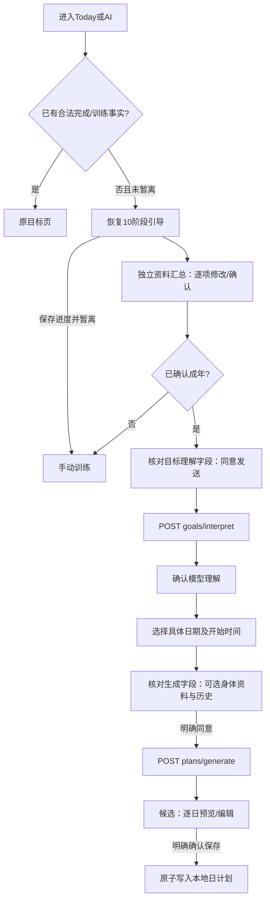

# Fitness V5 UX/UI · UIUX20261008

状态：V5 本地实施和自动化验证完成。411项单元及286个不同浏览器用例有通过证据（首轮加定向复验）；两台真机未验证。尚未提交、发布或修改生产资源。本文取代本聊天的 V4 视觉规范；原文快照位于 `outputs/onboarding-v5/pre-v5/docs/uiux/UIUX20261008.md`。

## 设计输入与代码基线

- 实施目录：`D:/Project/xxgospel/Fitness/.worktrees/fitness-guided`。
- HEAD：`46eccdcff0035a1ec5ce177526cc4ca9453c1980`；分支 `codex/onboarding-v4`。工作树包含本聊天 V4 与 V5 未提交实现，不能把 HEAD 当作最终代码版本。
- V5 完整 HTML：`C:/Users/xxgos/Desktop/Fitness_UX_V5_Ceramic_Icons_Combined_Metrics_20261008.html`。
- SHA256：`AD4FFC081502B71F57C475986CFCEA0B58C87173D04E35ABE5EBFEC67598C4AC`。
- 同附 `fitness-home-05-orbit-20261008.html` SHA256：`6C30562A6584D0AC97CE5A8514BD1646CF9090DB321273B954AD3295217DDBF9`。此首页对照不替代完整 V5 三主题基线。
- 已读取完整原型字节、提取脚本与形状、核对新增 CSS/SVG/JS。六页面×三主题渲染18次，无脚本错误：[原型记录](../../outputs/onboarding-v5/reference-render.json)。原型模拟业务不接入真实应用。
- 主仓库未提交资料、其他工作树和 `docs/productdesign` 均保留。唯一实施计划：[V5计划](../superpowers/plans/2026-10-08-v5-ceramic.md)。

## 三主题与 Soft Ceramic 图标

保持 V3.1 五主导航、Today-first 和现有主题切换状态。视觉差异由 CSS token 驱动，共享组件和业务状态。

|规范|Atlas|Serene|Orbit|
|---|---|---|---|
|材料|冷蓝奶白、清晰釉面|奶油白鼠尾草、柔和釉面|柔紫蜜桃、彩色釉面|
|陶瓷顶部|`#eff8ff`|`#fffdf3`|`#fff1fb`|
|陶瓷底部|`#b5d3f4`|`#d8e4c7`|`#e8d9fa`|
|主体|`#2a73b7`|`#6b9467`|`#8868c8`|
|高光|`#8fcbff`|`#a6c9a0`|`#ffc7b4`|
|深边|`#154e89`|`#40654a`|`#7454a7`|
|页面|淡蓝白、专业|暖白、舒展|淡紫暖白、活泼|

图标采用64×64本地SVG，陶瓷外形占60×60，避免过多透明边距；导航呈现50px，最窄手机48px。同一导航链接包含陶瓷形状与文字，整个链接可点击，不嵌套第二个按钮或背景底板。选中状态在陶瓷轮廓体现，hover有光泽反馈，pressed下移2px，键盘focus外框3px。减少动态效果时不下移。

26个陶瓷语义形状和24个简洁功能路径集中在 `AppIcon.tsx`；渐变ID使用React useId，各实例不冲突。`NavigationIcon`只映射导航语义，`StatusIcon`只呈现状态，不持有业务逻辑。没有新增图标依赖、CDN或位图裁切。

[完整 Icon Inventory](icon-inventory-v5.md) 是本文的组成部分，记录265处基线候选的位置、类型、语义、分类、替换/保留、状态及证据。扫描覆盖139个源码/媒体文件，不将文字按钮当作漏换图标。

|类别|规则|主要应用|
|---|---|---|
|A Navigation|正式陶瓷按钮形状，三主题同语义|Today、Plans、Progress、Exercises、Settings|
|B Action|简洁20px功能SVG＋原文字/aria-label；禁用保留原生语义|日历前后、收藏、计时、增减、菜单、管理刷新|
|C Status|叉/三角/勾/信息图形与文字共同表达|错误、警告、日期完成、资格状态、空状态|
|D Content|教学与数据内容保留，不做成陶瓷按钮|四个动作SVG、真实统计图、原生音视频控制|
|E Decoration|不冒充按钮；关系文字保留|品牌、主题样本、进度环、日期箭头|

## 10阶段流程与输入契约

|阶段|内容|控件/范围|保存字段|
|---|---|---|---|
|1|性别|女/男单选，无额外性别输入|biologicalSex|
|2|年龄|12–70岁整数垂直滚轮|age|
|3|基础身体信息|身高100–230cm、体重30–300kg、腰围40–200cm；同页三滚轮|heightCm / weightKg / waistCm，三个独立答案|
|4|训练目标|多选＋自定义|goal|
|5|训练经验|单选＋补充文本|experience|
|6|训练场地|多选＋其他场地|location|
|7|可用器械|多选＋其他器械|equipment|
|8|动作限制|多选＋手动说明；无已知限制与具体限制互斥|safety|
|9|时间安排|双滚轮：训练启动时间0–23点；每次训练时长|schedule的两个独立位置|
|10|其他偏好说明|独立可选文本|preferences|

时长精确为 **30、40、50、60、70、80、90、100、110、120** 分钟，无重复值。未知答案保存skipped，不推断成0、无器械、无限制或成年人。性别/年龄等未知允许跳过，与原型一致。

三个身体滚轮始终并排，互不绑定。支持触摸拖动、鼠标滚轮、键盘上下/Home/End、加减步进和明确确认。样例170/70/80仅用于未确认的可视位置，辅助说明标记未确认。腰围有独立“跳过腰围”；身高/体重可选择“保持未知”。“跳过未填项”仅补全未知状态，保留已经选择的指标。资料体重不创建身体测量历史。

每次选择写入现有本地事务。上一阶段、下一阶段、暂时退出和重进保留数据；保存失败保留输入、显示错误并阻止前进。双时间滚轮只确认一侧时不能下一步，可整题跳过。第10阶段后进入独立汇总页，12个独立资料字段都可返回所属阶段修改。

### V4兼容方式

**UI采用V5，资料存储继续使用V4契约。** 12个字段身份及备份结构不改，不引入破坏性迁移。

持久位置0、1、2/3/4、5、6、7、8、9、10、11、12分别映射到新UI阶段0、1、2、3、4、5、6、7、8、9、10（最后为汇总）。新保存采用稳定旧位置0、1、2、5、6、7、8、9、10、11、12。因此旧身高、体重或腰围草稿都进入合并页，跳过状态仍是跳过；旧完成用户不强制重填。

已有训练/计划事实或合法完成记录直接进入原页面。未完成引导的用户可暂离做手动训练；进入AI需先确认完整资料。年龄12–17或未知不开放原成人AI，已有服务端V4成人声明检查保留；这不是独立年龄认证。

## 用户跳转、AI同意与候选

AI入口额外检查未完成资料，防止暂离绕过确认。外发两次独立同意，展示实际字段与额度影响；拒绝历史就不附带历史。候选不是已保存计划，明确确认后多日全成或回滚；保存失败不自动再次调用AI；已发生费用不会因本地回滚消失。整库恢复代次、已确认输入变化保护、资格/预算规则沿用V4。AI不可用时本地训练仍可用。

## 适配、双语和可访问性

- 1440px桌面保留介绍与问题卡双列；不大于1180px改为单卡，避免标题挤窄。
- 手机引导隐藏底导航和侧栏，保留主题/语言入口；普通页面保留底导航。320px仍三指标并排，数字与单位分行。
- 正文字体、背景、圆角和密度继承V3.1。功能符号使用currentColor，状态保留具体文字；不把低对比图标作为唯一信息。
- 按钮触控区域至少44px，导航图标48–50px；数字滚轮spinbutton标签、上下界、当前值完整。示例明确未确认，禁用按钮仍有可读文字。
- 主题切换不重新挂载路由或业务状态，保持回答、训练输入、AI候选及当前训练。
- 中英文问题、按钮、单位、未知状态和错误说明均保留；自定义文本不擅自翻译。英文三指标使用Height、Weight、Waist短标签，避免320px标题换行造成错位。

## 设计到真实代码

|设计区域|代码|
|---|---|
|阶段映射/未知补齐|src/domain/onboarding-v5.ts|
|问答/三滚轮/汇总|src/ui/pages/OnboardingV4Page.tsx（保留文件名以复用路由）|
|输入与辅助功能|src/ui/components/guided/V4Wheel.tsx|
|矢量与状态|src/ui/components/AppIcon.tsx、NavigationIcon.tsx|
|三主题材质与布局|src/ui/icons-v5.css、onboarding-v4.css、v31.css|
|资料保存、旧完成、AI|现有application/guided.ts、GuidedDialoguePage.tsx及领域契约|
|全站操作与状态|见Icon Inventory逐项位置|

## 验收证据与差异

本轮结果以[工程报告](../verification/onboarding-v5-local-2026-10-08.md)和日志为准。原型与真实产品的差异：真实事务替代sessionStorage；明确确认数值替代默认推断；三指标未填独立未知；保留真实资格和两次外发；不复制示例训练或模拟成功。

|主题|桌面三指标|手机三指标|手机导航|
|---|---|---|---|
|Atlas|[1440px](../../outputs/onboarding-v5/body-atlas-chromium-1440.png)|[390px](../../outputs/onboarding-v5/body-atlas-webkit-390.png)|[导航](../../outputs/onboarding-v5/nav-atlas-webkit-390.png)|
|Serene|[1440px](../../outputs/onboarding-v5/body-serene-chromium-1440.png)|[390px](../../outputs/onboarding-v5/body-serene-webkit-390.png)|[导航](../../outputs/onboarding-v5/nav-serene-webkit-390.png)|
|Orbit|[1440px](../../outputs/onboarding-v5/body-orbit-chromium-1440.png)|[390px](../../outputs/onboarding-v5/body-orbit-webkit-390.png)|[导航](../../outputs/onboarding-v5/nav-orbit-webkit-390.png)|

iPhone 16 Pro Max/Safari 与一加 Ace 5 至尊版/Chrome **均未真机验证**。桌面Chromium/WebKit窄屏结果不能代替真机。公网、真实AI模型和正式费用未测试或变更；用户已批准发布，线上结果另记。

图标组件深浅背景验收（实际AppIcon、DPR2，非替代产品页面）：[Atlas](../../outputs/onboarding-v5/icon-gallery-atlas.png)、[Serene](../../outputs/onboarding-v5/icon-gallery-serene.png)、[Orbit](../../outputs/onboarding-v5/icon-gallery-orbit.png)。每主题50形状、两种背景，脚本错误0；仅为检查实际组件的本地测试展板，不进入产品路由。
